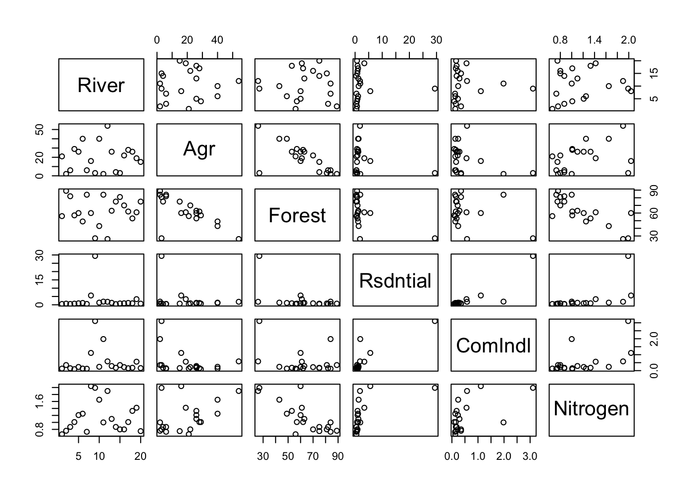
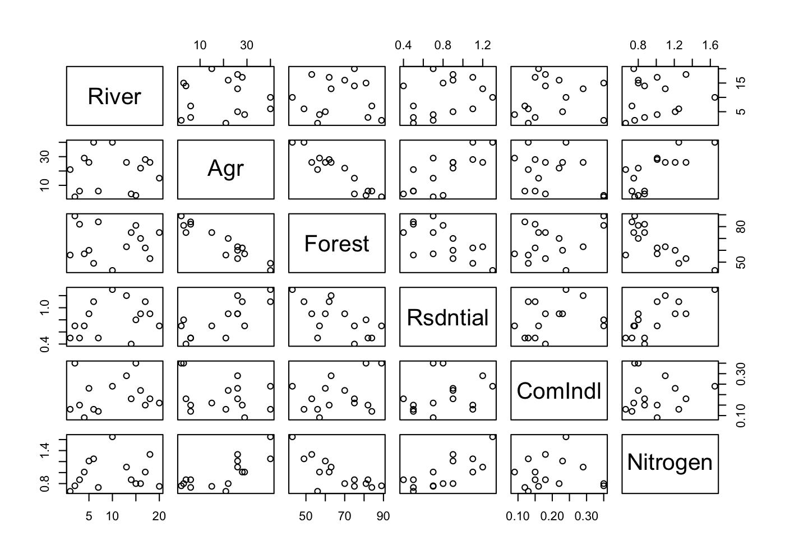
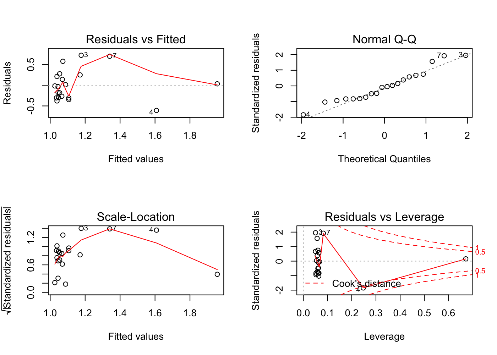
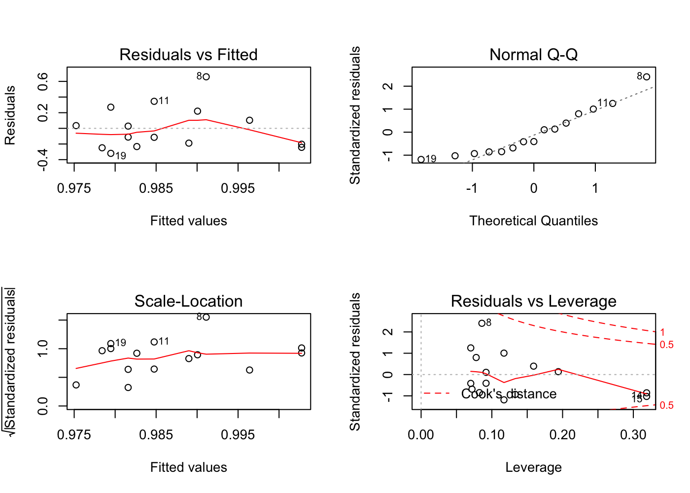
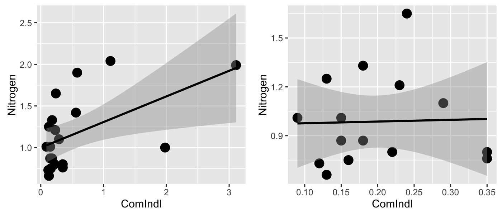

# NY Rivers
Cody Frisby  
March 3, 2016  

Here we repeat the examples from class using the New York Rivers data.  You can find this csv file in the directory "MATH3710/datafiles".  


```r
ny <- read.csv("~/Documents/MATH3710/datafiles/nyriver.csv", header = T)
# get rid of the index var
ny <- ny[,2:7]
ny_reduced <- ny[!(ny$River %in% c("Neversink", "Hackensack", "Fishkill", 
                             "Oatka", "Wappinger")),]
# matrix scatterplot, exploratory step
plot(ny)
```



```r
plot(ny_reduced)
```



In R, when you fit a linear model using lm(y ~ x1+x2+.....+xk) and store it in a variable, you have access to dffits, hatvals, and all sorts of these diagnostic values.  


```r
# fit a linear model
fit <- lm(Nitrogen ~ ComIndl, data = ny)
# store the hatvals
h <- hatvalues(fit)
# hat matrix, define X first
X <- as.matrix(cbind(rep(1), ny$ComIndl))
H <- X %*% solve(t(X) %*% X) %*% t(X)
H <- diag(H)
# diag(H) = h
# get the dfits
d <- dffits(fit)
# you can also do this
influence.measures(fit)
```

```
## Influence measures of
## 	 lm(formula = Nitrogen ~ ComIndl, data = ny) :
## 
##      dfb.1_ dfb.CmIn    dffit cov.r   cook.d    hat inf
## 1   0.00718 -0.00221  0.00755 1.186 3.01e-05 0.0547    
## 2  -0.01165  0.00585 -0.01170 1.201 7.24e-05 0.0667    
## 3   0.37718  0.04298  0.49244 0.733 1.01e-01 0.0504    
## 4   0.16550 -1.02280 -1.14475 0.979 5.62e-01 0.2479   *
## 5  -0.07078  0.20748  0.21567 3.399 2.46e-02 0.6710   *
## 6   0.11910  0.00918  0.15210 1.122 1.19e-02 0.0502    
## 7   0.17425  0.39532  0.62923 0.771 1.67e-01 0.0826    
## 8   0.38970 -0.14107  0.40249 0.887 7.41e-02 0.0570    
## 9  -0.02358  0.01060 -0.02385 1.194 3.01e-04 0.0623    
## 10  0.08915 -0.03319  0.09180 1.170 4.43e-03 0.0575    
## 11  0.18439 -0.07777  0.18753 1.120 1.80e-02 0.0604    
## 12 -0.20300  0.08943 -0.20566 1.109 2.16e-02 0.0617    
## 13 -0.21501  0.10247 -0.21651 1.108 2.39e-02 0.0644    
## 14 -0.17900  0.04244 -0.19351 1.095 1.91e-02 0.0525    
## 15 -0.20349  0.04825 -0.21998 1.071 2.44e-02 0.0525    
## 16 -0.11864  0.05336 -0.11999 1.166 7.53e-03 0.0623    
## 17 -0.17245  0.06596 -0.17708 1.122 1.61e-02 0.0581    
## 18 -0.12209  0.05149 -0.12417 1.160 8.05e-03 0.0604    
## 19 -0.26723  0.12500 -0.26945 1.060 3.62e-02 0.0637    
## 20  0.14584 -0.06822  0.14705 1.154 1.12e-02 0.0637
```

You're probably familiar with the diagnostic plots when you call plot(fit, which = c(1,2)).  When you plot a model, R has 4 built in plots that it returns.  Now, we'd like the other two as well.


```r
par(mfrow=c(2,2))
plot(fit)
```



From the 4th plot and the output above, we can identify observation 4 and 5 as influential points.

The reduced data set, fit.reduced, diagnostic plots:


```r
fit.reduced <- lm(Nitrogen ~ ComIndl, data = ny_reduced)
par(mfrow=c(2,2))
plot(fit.reduced)
```



The scatter plots from the original data set and the reduced one:


```r
library(ggplot2)
g <- ggplot(data=ny, aes(x=ComIndl, y=Nitrogen))
g <- g + geom_point(size = 4, colour = "black")
g <- g + geom_smooth(method = "lm", colour = "black")
gg <- ggplot(data=ny_reduced, aes(x=ComIndl, y=Nitrogen))
gg <- gg + geom_point(size = 4, colour = "black")
gg <- gg + geom_smooth(method = "lm", colour = "black")
gridExtra::grid.arrange(g,gg, ncol=2)
```



And the diagnostic data from the reduced data set.


```r
influence.measures(fit.reduced)
```

```
## Influence measures of
## 	 lm(formula = Nitrogen ~ ComIndl, data = ny_reduced) :
## 
##      dfb.1_ dfb.CmIn   dffit cov.r   cook.d    hat inf
## 1  -0.07809   0.1263  0.1657 1.362 0.014702 0.1590    
## 2   0.06176  -0.0516  0.0637 1.452 0.002198 0.1939    
## 8  -0.11113   0.4503  0.9513 0.395 0.271964 0.0859   *
## 9   0.02543  -0.0166  0.0318 1.290 0.000547 0.0918    
## 10 -0.00289   0.0867  0.2289 1.151 0.026978 0.0778    
## 11  0.19928  -0.0789  0.3517 0.977 0.058966 0.0702    
## 12 -0.18509   0.1098 -0.2512 1.142 0.032281 0.0824    
## 13 -0.33270   0.2563 -0.3628 1.179 0.066555 0.1331    
## 14  0.38254  -0.5160 -0.5802 1.533 0.172052 0.3188   *
## 15  0.46407  -0.6260 -0.7039 1.455 0.246633 0.3188    
## 16 -0.10049   0.0658 -0.1257 1.259 0.008444 0.0918    
## 17 -0.01893  -0.0506 -0.1866 1.175 0.018179 0.0719    
## 18 -0.06255   0.0248 -0.1104 1.229 0.006516 0.0702    
## 19 -0.39036   0.2887 -0.4398 1.057 0.093432 0.1171    
## 20  0.32503  -0.2404  0.3662 1.131 0.067000 0.1171
```
