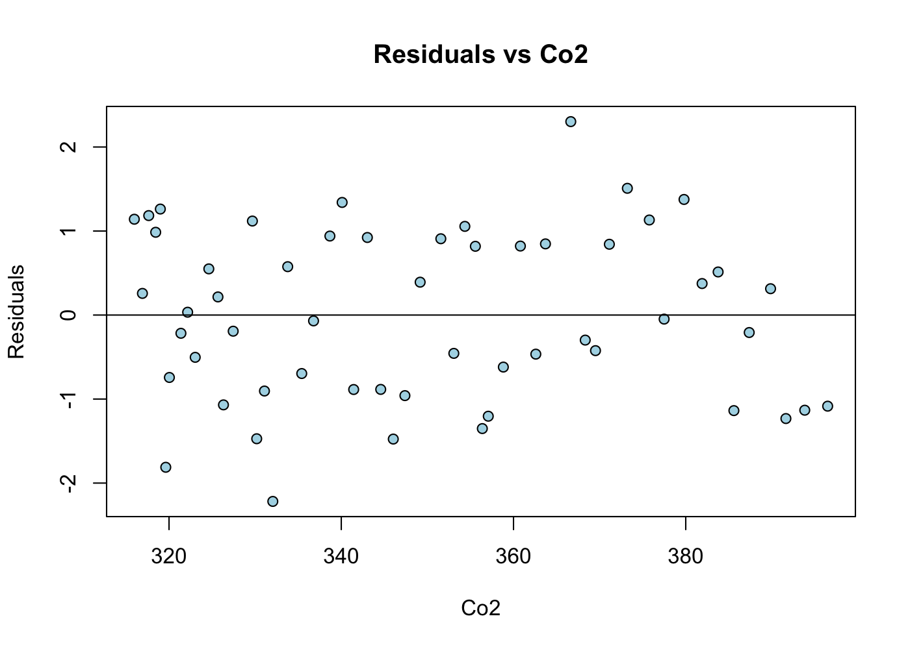

# Climate Change
ccf  
January 20, 2016  

This is an R Markdwon (Rmd) file for the climate change data shared in class.  We will attempt to translate some of the SAS code into R.


```r
climate <- read.table("~/Documents/MATH3710/climate/Climate.txt", header = TRUE)
climate$co2_cent <- climate$co2 - mean(climate$co2)
```


Above are simple summary statistics of the data.

Now let's look at a scatter plot of the data.


```r
x <- climate$co2
y <- climate$globaltemp
plot(globaltemp ~ co2, data = climate, bg = "lightblue", 
     col = "black", cex = 1.5, pch = 21)
text(x=380, y=-0.1, paste0("Cor = ",round(cor(x,y), 4)), cex = 0.7)
```


Now we fit a linear model in R using the lm function. We will store it in a variable for more use.


```r
fit <- lm(globaltemp ~ co2, data = climate)
summary(fit) # displays a summary of the model.
```

```
## 
## Call:
## lm(formula = globaltemp ~ co2, data = climate)
## 
## Residuals:
##       Min        1Q    Median        3Q       Max 
## -0.201240 -0.080707 -0.004359  0.079892  0.208964 
## 
## Coefficients:
##              Estimate Std. Error t value Pr(>|t|)    
## (Intercept) -3.083756   0.182014  -16.94   <2e-16 ***
## co2          0.009532   0.000519   18.37   <2e-16 ***
## ---
## Signif. codes:  0 '***' 0.001 '**' 0.01 '*' 0.05 '.' 0.1 ' ' 1
## 
## Residual standard error: 0.09203 on 53 degrees of freedom
## Multiple R-squared:  0.8642,	Adjusted R-squared:  0.8616 
## F-statistic: 337.3 on 1 and 53 DF,  p-value: < 2.2e-16
```

Here we will plot the data with confidence intervals too.  This is quite involved in R so the code is quite long.


```r
plot(y~x,type="n", xlab = "CO2", ylab = "Global Temp")
m <- lm(y~x)
wx <- par("usr")[1:2]
new.x <- seq(wx[1],wx[2],len=100)
pred <- predict(m, new=data.frame(x=new.x), interval="conf")
lines(new.x,pred[,"fit"],lwd=2)
lines(new.x,pred[,"lwr"],lty=3)
lines(new.x,pred[,"upr"],lty=3)
points(x,y,pch=16,col="steelblue")
# now to add the prediction intervals
predp <- predict(m, new=data.frame(x=new.x), interval = "pred")
lines(new.x, predp[,"lwr"], lty=2)
lines(new.x, predp[,"upr"], lty=2)
title(main="Fit Plot for Temp")
```


Now we will use R to check the assumptions of the model. First we will store the standardized residuals from "fit" and store them in a variable.


```r
e <- rstandard(fit)
summary(e)
```

```
##       Min.    1st Qu.     Median       Mean    3rd Qu.       Max. 
## -2.2180000 -0.8858000 -0.0484100 -0.0007238  0.8774000  2.3020000
```

```r
# plot residuals by co2
plot(climate$co2, e, bg = "lightblue", col = "black", pch = 21,
     xlab = "Co2", ylab = "Residuals", main = "Residuals vs Co2")
abline(h=0)
```



More diagnostic plots of our model residuals:

```r
par(mfrow=c(1,2))
qqnorm(e)
qqline(e)
hist(e, breaks = 25, col = "green", freq = FALSE, xlim = c(-3,3), 
     main = "Hist of rstandard(fit)", xlab = "rstandard")
```


```r
climate$index <- 1:length(climate$co2)
# first lets create an simple random sample of numbers.  We will use this to sample
# and subset the original car mpg data set.
ind <- sample(1:length(climate$co2), 7)
# now we can subset the carmpg data frame into 2 data frames using this index.
test <- climate[climate$index %in% ind, ]
#test <- read.csv("~/Documents/MATH3710/cars/test.csv")
training <- climate[!(climate$index %in% ind), ]
#training <- read.csv("~/Documents/MATH3710/cars/training.csv")
# now to fit a new model with our subsetted training data.
fit2 <- lm(globaltemp ~ co2, data = training)
testing <- predict(fit2, newdata = test, interval = "confidence", se.fit = TRUE)
anova(fit2)
```

```
## Analysis of Variance Table
## 
## Response: globaltemp
##           Df  Sum Sq Mean Sq F value    Pr(>F)    
## co2        1 2.29112 2.29112  271.44 < 2.2e-16 ***
## Residuals 46 0.38827 0.00844                      
## ---
## Signif. codes:  0 '***' 0.001 '**' 0.01 '*' 0.05 '.' 0.1 ' ' 1
```

```r
# SAS proc score is different from R predict() but essetially predict() is testing
# your training model with your test data.
# here is the predicted bias:
predicted_bias <- mean(test$globaltemp - testing$fit[,1])
mean_square_bias <- mean((test$globaltemp - testing$fit[,1])^2)
rpmse <- sqrt(mean_square_bias)
output <- as.data.frame(cbind(predicted_bias, mean_square_bias, rpmse))
output
```

```
##   predicted_bias mean_square_bias      rpmse
## 1    -0.04943149      0.009618152 0.09807218
```
