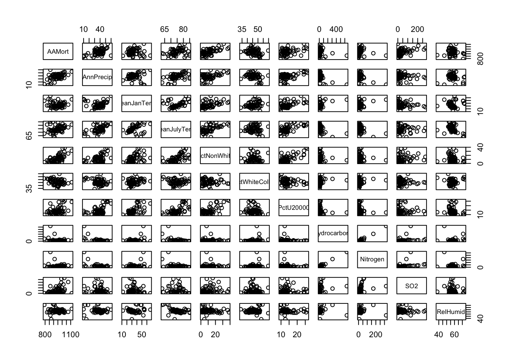
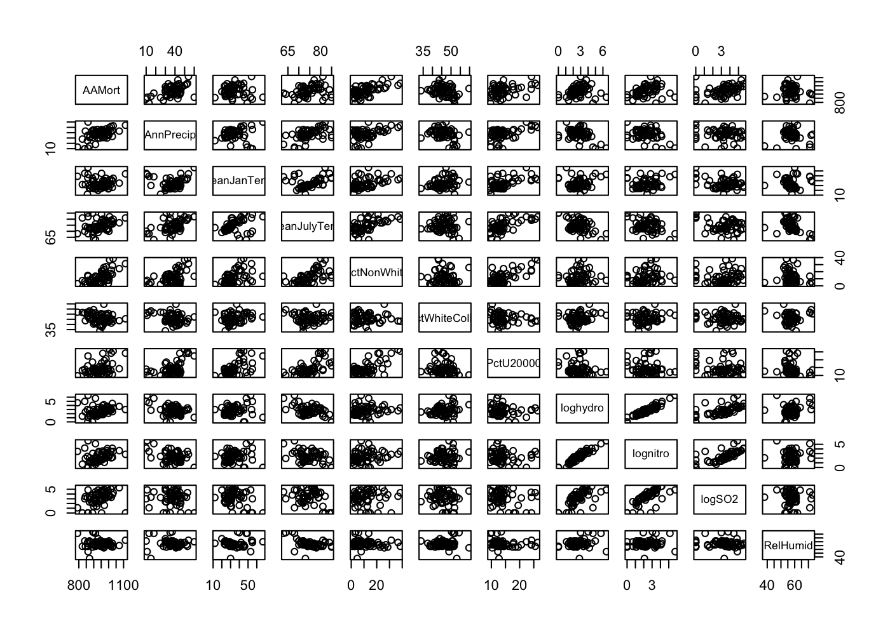
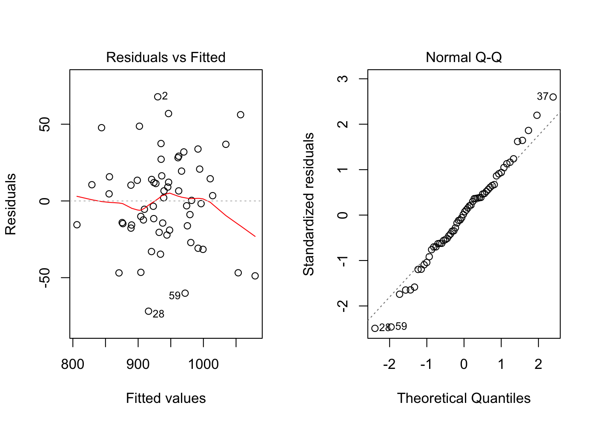
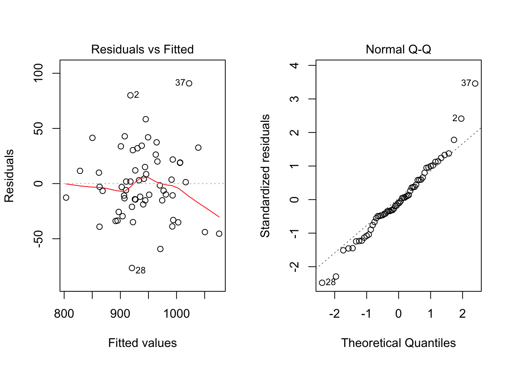
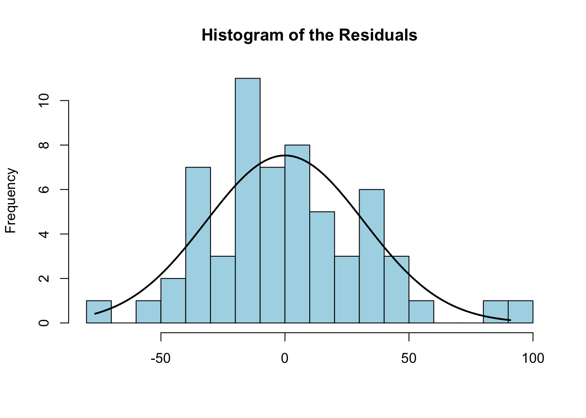
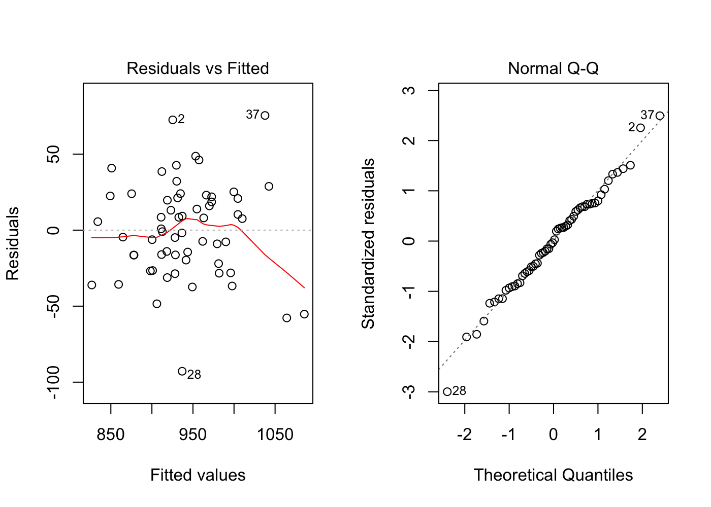
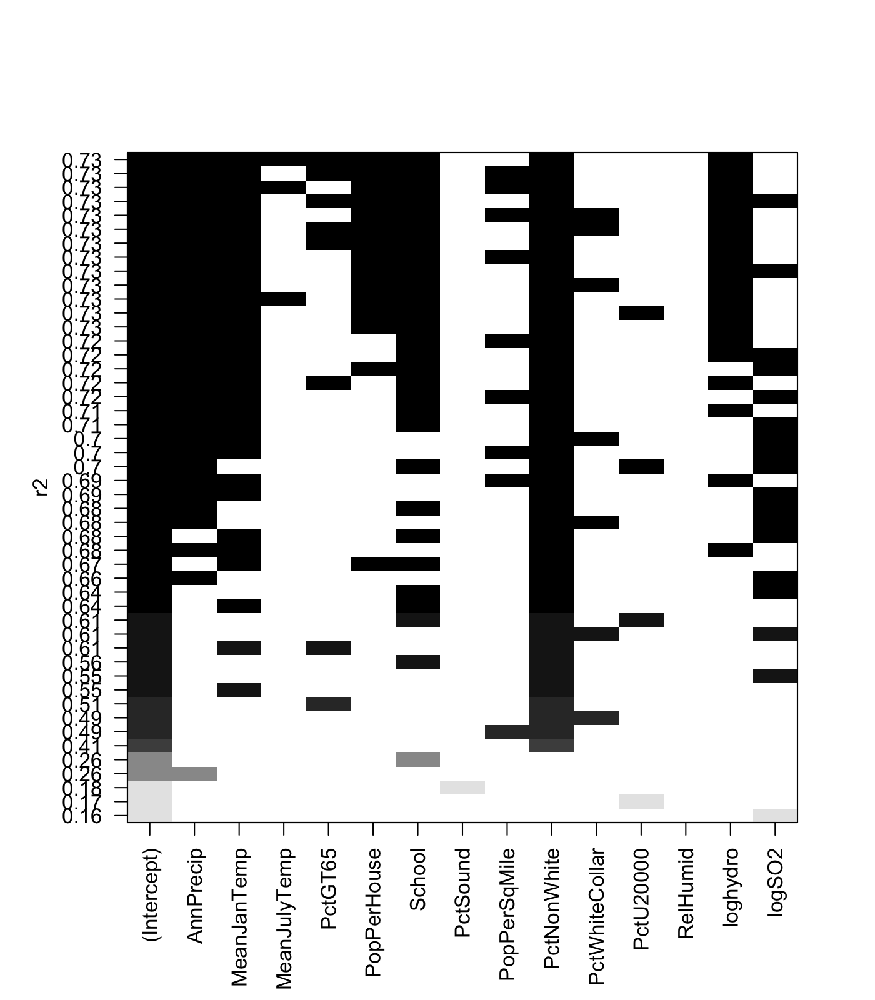

# Enviornmental Impacts
Cody Frisby  
March 29, 2016  

### I apologize for how messy this code is.  It was a work in progress while learning about some R functions.  If you have any questions about it please let me know.  codyfrisby@gmail.com  


```r
df <- read.table("~/Documents/MATH3710/enviornment/EnvironmentalImpacts.txt", header = TRUE)
# log variables
df$loghydro <- log(df$Hydrocarbons)
df$lognitro <- log(df$Nitrogen)
df$logSO2 <- log(df$SO2)
# create a var with a formula of the entire model
f <- formula(AAMort ~ .)
fit.all <- lm(f, data = df[1:16]) #not including log vars
summary(fit.all) # look at model
```

```
## 
## Call:
## lm(formula = f, data = df[1:16])
## 
## Residuals:
##     Min      1Q  Median      3Q     Max 
## -68.068 -18.018   0.912  19.224  86.966 
## 
## Coefficients:
##                  Estimate Std. Error t value Pr(>|t|)    
## (Intercept)     1.781e+03  4.414e+02   4.036 0.000214 ***
## AnnPrecip       1.905e+00  9.237e-01   2.063 0.045078 *  
## MeanJanTemp    -1.938e+00  1.108e+00  -1.748 0.087415 .  
## MeanJulyTemp   -3.100e+00  1.902e+00  -1.630 0.110164    
## PctGT65        -9.065e+00  8.486e+00  -1.068 0.291246    
## PopPerHouse    -1.068e+02  6.978e+01  -1.531 0.132936    
## School         -1.716e+01  1.186e+01  -1.447 0.155095    
## PctSound       -6.511e-01  1.768e+00  -0.368 0.714397    
## PopPerSqMile    3.601e-03  4.027e-03   0.894 0.376132    
## PctNonWhite     4.460e+00  1.327e+00   3.360 0.001618 ** 
## PctWhiteCollar -1.871e-01  1.662e+00  -0.113 0.910840    
## PctU20000      -1.674e-01  3.227e+00  -0.052 0.958865    
## Hydrocarbons   -6.722e-01  4.910e-01  -1.369 0.177980    
## Nitrogen        1.340e+00  1.006e+00   1.333 0.189508    
## SO2             8.626e-02  1.475e-01   0.585 0.561697    
## RelHumid        1.067e-01  1.169e+00   0.091 0.927690    
## ---
## Signif. codes:  0 '***' 0.001 '**' 0.01 '*' 0.05 '.' 0.1 ' ' 1
## 
## Residual standard error: 34.93 on 44 degrees of freedom
## Multiple R-squared:  0.7649,	Adjusted R-squared:  0.6847 
## F-statistic: 9.542 on 15 and 44 DF,  p-value: 2.193e-09
```

```r
car::vif(fit.all) # variance inflation factors, car package needed
```

```
##      AnnPrecip    MeanJanTemp   MeanJulyTemp        PctGT65    PopPerHouse 
##       4.113888       6.143551       3.967774       7.470045       4.307618 
##         School       PctSound   PopPerSqMile    PctNonWhite PctWhiteCollar 
##       4.860538       3.994781       1.658281       6.779599       2.841582 
##      PctU20000   Hydrocarbons       Nitrogen            SO2       RelHumid 
##       8.717068      98.639935     104.982405       4.228929       1.907092
```

For the last function here, you will need the *car* pacakage installed if you don't already.  


```r
n.list <- c("AAMort", "AnnPrecip", "MeanJanTemp", 
            "MeanJulyTemp",
           "PctNonWhite", "PctWhiteCollar", "PctU20000", 
           "Hydrocarbons", "Nitrogen", "SO2", "RelHumid")
plot(df[n.list])
```




Now we will create another scatter plot matrix.


```r
n2 <- c('AAMort', 'AnnPrecip', 'MeanJanTemp', 'MeanJulyTemp', 'PctNonWhite', 'PctWhiteCollar', 'PctU20000', 'loghydro', 'lognitro', 'logSO2', 'RelHumid')
plot(df[n2])
```




Correlation Coefs:


```r
cor(df[1:16]) #I'm not including the added log vars
```

```
##                   AnnPrecip MeanJanTemp MeanJulyTemp     PctGT65
## AnnPrecip       1.000000000  0.09220776   0.50327250  0.10111329
## MeanJanTemp     0.092207765  1.00000000   0.34628186 -0.39809907
## MeanJulyTemp    0.503272500  0.34628186   1.00000000 -0.43403951
## PctGT65         0.101113286 -0.39809907  -0.43403951  1.00000000
## PopPerHouse     0.263444134 -0.20921172   0.26228013 -0.50908735
## School         -0.490425176  0.11628379  -0.23854394 -0.13886244
## PctSound       -0.490759338  0.01485207  -0.41503247  0.06501017
## PopPerSqMile   -0.003515152 -0.10005146  -0.06099400  0.16199051
## PctNonWhite     0.413204493  0.45377412   0.57530905 -0.63782101
## PctWhiteCollar -0.297291333  0.23799188  -0.02141200 -0.11771469
## PctU20000       0.506585428  0.56531378   0.61930778 -0.30977083
## Hydrocarbons   -0.531759777  0.35080939  -0.35649416 -0.02048591
## Nitrogen       -0.487320743  0.32101363  -0.33766801 -0.00208188
## SO2            -0.106923901 -0.10780991  -0.09934813  0.01724820
## RelHumid       -0.077342829  0.06787158  -0.45280915  0.11242622
## AAMort          0.509499860 -0.03002188   0.27701762 -0.17459291
##                 PopPerHouse     School    PctSound PopPerSqMile
## AnnPrecip       0.263444134 -0.4904252 -0.49075934 -0.003515152
## MeanJanTemp    -0.209211721  0.1162838  0.01485207 -0.100051462
## MeanJulyTemp    0.262280134 -0.2385439 -0.41503247 -0.060994000
## PctGT65        -0.509087354 -0.1388624  0.06501017  0.161990508
## PopPerHouse     1.000000000 -0.3950745 -0.41059049 -0.184331973
## School         -0.395074528  1.0000000  0.55223719 -0.243883480
## PctSound       -0.410590488  0.5522372  1.00000000  0.181880938
## PopPerSqMile   -0.184331973 -0.2438835  0.18188094  1.000000000
## PctNonWhite     0.419410064 -0.2087739 -0.41033423 -0.005678491
## PctWhiteCollar -0.425722650  0.7031962  0.33874519 -0.031765387
## PctU20000       0.259904274 -0.4033385 -0.68067982 -0.162945411
## Hydrocarbons   -0.388205145  0.2868347  0.38676658  0.120282246
## Nitrogen       -0.358428886  0.2244019  0.34825003  0.165311829
## SO2            -0.004083565 -0.2343459  0.11795180  0.432086418
## RelHumid       -0.135740273  0.1764915  0.12190079 -0.124975764
## AAMort          0.357306909 -0.5109885 -0.42682123  0.265503400
##                 PctNonWhite PctWhiteCollar   PctU20000 Hydrocarbons
## AnnPrecip       0.413204493   -0.297291333  0.50658543  -0.53175978
## MeanJanTemp     0.453774118    0.237991879  0.56531378   0.35080939
## MeanJulyTemp    0.575309046   -0.021411996  0.61930778  -0.35649416
## PctGT65        -0.637821011   -0.117714691 -0.30977083  -0.02048591
## PopPerHouse     0.419410064   -0.425722650  0.25990427  -0.38820514
## School         -0.208773945    0.703196235 -0.40333845   0.28683470
## PctSound       -0.410334227    0.338745187 -0.68067982   0.38676658
## PopPerSqMile   -0.005678491   -0.031765387 -0.16294541   0.12028225
## PctNonWhite     1.000000000   -0.004387445  0.70491501  -0.02586474
## PctWhiteCollar -0.004387445    1.000000000 -0.18516148   0.20367231
## PctU20000       0.704915008   -0.185161483  1.00000000  -0.12978395
## Hydrocarbons   -0.025864740    0.203672306 -0.12978395   1.00000000
## Nitrogen        0.018385297    0.160034365 -0.10254386   0.98383998
## SO2             0.159293022   -0.068461124 -0.09648317   0.28229626
## RelHumid       -0.117957115    0.060712564 -0.15222258  -0.02017782
## AAMort          0.643741755   -0.284804593  0.41049037  -0.17724211
##                   Nitrogen          SO2    RelHumid      AAMort
## AnnPrecip      -0.48732074 -0.106923901 -0.07734283  0.50949986
## MeanJanTemp     0.32101363 -0.107809912  0.06787158 -0.03002188
## MeanJulyTemp   -0.33766801 -0.099348131 -0.45280915  0.27701762
## PctGT65        -0.00208188  0.017248201  0.11242622 -0.17459291
## PopPerHouse    -0.35842889 -0.004083565 -0.13574027  0.35730691
## School          0.22440191 -0.234345940  0.17649146 -0.51098849
## PctSound        0.34825003  0.117951795  0.12190079 -0.42682123
## PopPerSqMile    0.16531183  0.432086418 -0.12497576  0.26550340
## PctNonWhite     0.01838530  0.159293022 -0.11795711  0.64374176
## PctWhiteCollar  0.16003436 -0.068461124  0.06071256 -0.28480459
## PctU20000      -0.10254386 -0.096483169 -0.15222258  0.41049037
## Hydrocarbons    0.98383998  0.282296257 -0.02017782 -0.17724211
## Nitrogen        1.00000000  0.409393608 -0.04591410 -0.07738243
## SO2             0.40939361  1.000000000 -0.10255392  0.42589789
## RelHumid       -0.04591410 -0.102553922  1.00000000 -0.08850055
## AAMort         -0.07738243  0.425897890 -0.08850055  1.00000000
```


Fitting the model that is in the SAS example:


```r
fit1 <- lm(AAMort ~ ., df[!names(df) %in% 
                            c("Hydrocarbons", "SO2",
                              "Nitrogen", "loghydro")])
# Here we use R's vectorizing abilities to subset the 
# R object df. ! is the negating symbol, ie. "not" in blank.
summary(fit1)
```

```
## 
## Call:
## lm(formula = AAMort ~ ., data = df[!names(df) %in% c("Hydrocarbons", 
##     "SO2", "Nitrogen", "loghydro")])
## 
## Residuals:
##     Min      1Q  Median      3Q     Max 
## -71.864 -16.584   1.204  15.893  67.869 
## 
## Coefficients:
##                  Estimate Std. Error t value Pr(>|t|)    
## (Intercept)     1.797e+03  4.385e+02   4.098 0.000172 ***
## AnnPrecip       3.003e+00  8.902e-01   3.373 0.001537 ** 
## MeanJanTemp    -3.318e+00  1.090e+00  -3.046 0.003872 ** 
## MeanJulyTemp   -1.593e+00  1.903e+00  -0.837 0.406857    
## PctGT65        -1.118e+01  7.948e+00  -1.406 0.166559    
## PopPerHouse    -1.345e+02  6.868e+01  -1.959 0.056362 .  
## School         -1.792e+01  1.087e+01  -1.649 0.106071    
## PctSound       -6.175e-01  1.682e+00  -0.367 0.715313    
## PopPerSqMile    2.918e-03  4.026e-03   0.725 0.472289    
## PctNonWhite     3.649e+00  1.330e+00   2.743 0.008709 ** 
## PctWhiteCollar -4.913e-01  1.529e+00  -0.321 0.749486    
## PctU20000       7.682e-01  3.084e+00   0.249 0.804401    
## RelHumid       -2.309e-01  1.072e+00  -0.215 0.830471    
## lognitro        2.540e+01  9.203e+00   2.760 0.008342 ** 
## logSO2         -7.469e+00  7.344e+00  -1.017 0.314615    
## ---
## Signif. codes:  0 '***' 0.001 '**' 0.01 '*' 0.05 '.' 0.1 ' ' 1
## 
## Residual standard error: 33.96 on 45 degrees of freedom
## Multiple R-squared:  0.7727,	Adjusted R-squared:  0.702 
## F-statistic: 10.93 on 14 and 45 DF,  p-value: 3.254e-10
```

Summary of the model above.  Now we plot the diagnostics.


```r
par(mfrow=c(1,2))
plot(fit1, which = c(1,2))
```



Now, we want to take a look at the variance inflation factors from this model.  


```r
car::vif(fit1)
```

```
##      AnnPrecip    MeanJanTemp   MeanJulyTemp        PctGT65    PopPerHouse 
##       4.041903       6.279346       4.203031       6.931976       4.414201 
##         School       PctSound   PopPerSqMile    PctNonWhite PctWhiteCollar 
##       4.317137       3.827031       1.752837       7.206814       2.546095 
##      PctU20000       RelHumid       lognitro         logSO2 
##       8.418212       1.696296       6.078065       6.188794
```

Now, let's fit the next model from the SAS code example.


```r
# fit the model WITHOUT the 4 terms listed
fit2 <- lm(AAMort ~ ., df[!names(df) %in% 
                            c("Hydrocarbons", "SO2",
                              "Nitrogen", "lognitro")])
summary(fit2) # summary of the model
```

```
## 
## Call:
## lm(formula = AAMort ~ ., data = df[!names(df) %in% c("Hydrocarbons", 
##     "SO2", "Nitrogen", "lognitro")])
## 
## Residuals:
##     Min      1Q  Median      3Q     Max 
## -76.538 -16.139  -3.038  19.327  90.847 
## 
## Coefficients:
##                  Estimate Std. Error t value Pr(>|t|)   
## (Intercept)     1.587e+03  4.646e+02   3.415  0.00136 **
## AnnPrecip       2.197e+00  9.288e-01   2.365  0.02239 * 
## MeanJanTemp    -2.296e+00  1.134e+00  -2.024  0.04895 * 
## MeanJulyTemp   -1.234e+00  2.164e+00  -0.570  0.57137   
## PctGT65        -7.037e+00  8.349e+00  -0.843  0.40376   
## PopPerHouse    -1.004e+02  7.223e+01  -1.390  0.17151   
## School         -1.649e+01  1.163e+01  -1.418  0.16315   
## PctSound       -5.531e-01  1.803e+00  -0.307  0.76043   
## PopPerSqMile    3.244e-03  4.325e-03   0.750  0.45708   
## PctNonWhite     4.317e+00  1.432e+00   3.014  0.00423 **
## PctWhiteCollar -7.009e-01  1.642e+00  -0.427  0.67147   
## PctU20000      -6.366e-02  3.292e+00  -0.019  0.98466   
## RelHumid        1.241e-01  1.146e+00   0.108  0.91419   
## loghydro        8.951e+00  9.958e+00   0.899  0.37349   
## logSO2          3.389e+00  6.992e+00   0.485  0.63022   
## ---
## Signif. codes:  0 '***' 0.001 '**' 0.01 '*' 0.05 '.' 0.1 ' ' 1
## 
## Residual standard error: 36.4 on 45 degrees of freedom
## Multiple R-squared:  0.7389,	Adjusted R-squared:  0.6577 
## F-statistic: 9.097 on 14 and 45 DF,  p-value: 5.709e-09
```

```r
car::vif(fit2) # variance inflation factors
```

```
##      AnnPrecip    MeanJanTemp   MeanJulyTemp        PctGT65    PopPerHouse 
##       3.830622       5.927529       4.732245       6.659278       4.250948 
##         School       PctSound   PopPerSqMile    PctNonWhite PctWhiteCollar 
##       4.306046       3.826703       1.761688       7.272647       2.554260 
##      PctU20000       RelHumid       loghydro         logSO2 
##       8.355741       1.685581       6.106884       4.883251
```

  
Model Diagnostics:  


```r
par(mfrow=c(1,2))
plot(fit2, which = c(1,2))
```



Histogram of the residuals from fit2 model.


```r
# function to draw a hist with a normal curve
draw.hist <- function(x, main = NULL) {
  h <- hist(
    x, breaks = 20, col = "lightblue", xlab = "", 
    main = main) 
  xfit <- seq(min(x),max(x), 0.01)
  yfit <- dnorm(xfit,mean = mean(x),sd = sd(x))
  yfit <- yfit * diff(h$mids[1:2]) * length(x)
  lines(xfit, yfit, col = "black", lwd = 2)
}
# above is a function, below we call the function and give it two 
# arguments.  Here, x is the residuals of the fit2 model.
draw.hist(x = fit2$residuals, main="Histogram of the Residuals")
```




N best models:

```r
# library MASS needed for funciton stepAIC
step.mods <- MASS::stepAIC(fit1, direction = "backward")
```

```
## Start:  AIC=435.76
## AAMort ~ AnnPrecip + MeanJanTemp + MeanJulyTemp + PctGT65 + PopPerHouse + 
##     School + PctSound + PopPerSqMile + PctNonWhite + PctWhiteCollar + 
##     PctU20000 + RelHumid + lognitro + logSO2
## 
##                  Df Sum of Sq   RSS    AIC
## - RelHumid        1      53.5 51952 433.82
## - PctU20000       1      71.6 51970 433.84
## - PctWhiteCollar  1     119.0 52018 433.90
## - PctSound        1     155.4 52054 433.94
## - PopPerSqMile    1     606.0 52504 434.46
## - MeanJulyTemp    1     808.5 52707 434.69
## - logSO2          1    1192.7 53091 435.13
## <none>                        51898 435.76
## - PctGT65         1    2280.2 54179 436.34
## - School          1    3136.8 55035 437.28
## - PopPerHouse     1    4424.7 56323 438.67
## - PctNonWhite     1    8677.6 60576 443.04
## - lognitro        1    8782.3 60681 443.14
## - MeanJanTemp     1   10699.1 62598 445.01
## - AnnPrecip       1   13121.5 65020 447.29
## 
## Step:  AIC=433.82
## AAMort ~ AnnPrecip + MeanJanTemp + MeanJulyTemp + PctGT65 + PopPerHouse + 
##     School + PctSound + PopPerSqMile + PctNonWhite + PctWhiteCollar + 
##     PctU20000 + lognitro + logSO2
## 
##                  Df Sum of Sq   RSS    AIC
## - PctU20000       1      83.7 52036 431.92
## - PctWhiteCollar  1     119.0 52071 431.96
## - PctSound        1     137.2 52089 431.98
## - PopPerSqMile    1     620.7 52573 432.54
## - MeanJulyTemp    1     827.8 52780 432.77
## - logSO2          1    1148.3 53100 433.14
## <none>                        51952 433.82
## - PctGT65         1    2247.4 54199 434.36
## - School          1    3122.1 55074 435.33
## - PopPerHouse     1    4371.2 56323 436.67
## - PctNonWhite     1    8633.3 60585 441.05
## - lognitro        1    8812.3 60764 441.22
## - MeanJanTemp     1   10707.9 62660 443.07
## - AnnPrecip       1   13428.1 65380 445.62
## 
## Step:  AIC=431.92
## AAMort ~ AnnPrecip + MeanJanTemp + MeanJulyTemp + PctGT65 + PopPerHouse + 
##     School + PctSound + PopPerSqMile + PctNonWhite + PctWhiteCollar + 
##     lognitro + logSO2
## 
##                  Df Sum of Sq   RSS    AIC
## - PctWhiteCollar  1     160.6 52196 430.11
## - PctSound        1     488.8 52524 430.48
## - PopPerSqMile    1     583.4 52619 430.59
## - MeanJulyTemp    1     746.3 52782 430.77
## - logSO2          1    1107.3 53143 431.18
## <none>                        52036 431.92
## - PctGT65         1    2232.2 54268 432.44
## - School          1    3142.4 55178 433.44
## - PopPerHouse     1    4290.4 56326 434.67
## - lognitro        1    8755.1 60791 439.25
## - PctNonWhite     1   11993.5 64029 442.36
## - AnnPrecip       1   13597.1 65633 443.85
## - MeanJanTemp     1   15839.8 67875 445.87
## 
## Step:  AIC=430.11
## AAMort ~ AnnPrecip + MeanJanTemp + MeanJulyTemp + PctGT65 + PopPerHouse + 
##     School + PctSound + PopPerSqMile + PctNonWhite + lognitro + 
##     logSO2
## 
##                Df Sum of Sq   RSS    AIC
## - PctSound      1     433.9 52630 428.60
## - PopPerSqMile  1     517.8 52714 428.70
## - MeanJulyTemp  1     876.9 53073 429.10
## - logSO2        1    1178.4 53375 429.44
## <none>                      52196 430.11
## - PctGT65       1    2245.3 54442 430.63
## - PopPerHouse   1    4140.0 56336 432.68
## - School        1    6165.7 58362 434.80
## - lognitro      1    8760.0 60956 437.41
## - PctNonWhite   1   11875.3 64072 440.40
## - AnnPrecip     1   13686.2 65882 442.08
## - MeanJanTemp   1   16082.1 68278 444.22
## 
## Step:  AIC=428.6
## AAMort ~ AnnPrecip + MeanJanTemp + MeanJulyTemp + PctGT65 + PopPerHouse + 
##     School + PopPerSqMile + PctNonWhite + lognitro + logSO2
## 
##                Df Sum of Sq   RSS    AIC
## - PopPerSqMile  1     302.8 52933 426.95
## - MeanJulyTemp  1     754.7 53385 427.46
## - logSO2        1    1196.1 53826 427.95
## <none>                      52630 428.60
## - PctGT65       1    1934.2 54564 428.77
## - PopPerHouse   1    3985.1 56615 430.98
## - lognitro      1    8415.4 61046 435.50
## - School        1    9011.5 61642 436.08
## - AnnPrecip     1   13303.0 65933 440.12
## - PctNonWhite   1   15737.9 68368 442.30
## - MeanJanTemp   1   16625.6 69256 443.07
## 
## Step:  AIC=426.95
## AAMort ~ AnnPrecip + MeanJanTemp + MeanJulyTemp + PctGT65 + PopPerHouse + 
##     School + PctNonWhite + lognitro + logSO2
## 
##                Df Sum of Sq   RSS    AIC
## - MeanJulyTemp  1     662.2 53595 425.69
## - logSO2        1    1027.1 53960 426.10
## <none>                      52933 426.95
## - PctGT65       1    2321.7 55255 427.52
## - PopPerHouse   1    5212.9 58146 430.58
## - lognitro      1    8901.1 61834 434.27
## - School        1   10621.6 63555 435.92
## - AnnPrecip     1   13895.6 66829 438.93
## - PctNonWhite   1   15440.9 68374 440.30
## - MeanJanTemp   1   17516.7 70450 442.10
## 
## Step:  AIC=425.69
## AAMort ~ AnnPrecip + MeanJanTemp + PctGT65 + PopPerHouse + School + 
##     PctNonWhite + lognitro + logSO2
## 
##               Df Sum of Sq   RSS    AIC
## - logSO2       1     920.7 54516 424.71
## - PctGT65      1    1801.5 55397 425.68
## <none>                     53595 425.69
## - PopPerHouse  1    4594.8 58190 428.63
## - School       1    9968.5 63564 433.93
## - lognitro     1   10672.1 64267 434.59
## - AnnPrecip    1   13245.3 66840 436.94
## - PctNonWhite  1   14893.3 68488 438.40
## - MeanJanTemp  1   17296.2 70891 440.47
## 
## Step:  AIC=424.71
## AAMort ~ AnnPrecip + MeanJanTemp + PctGT65 + PopPerHouse + School + 
##     PctNonWhite + lognitro
## 
##               Df Sum of Sq   RSS    AIC
## - PctGT65      1    1808.6 56324 424.67
## <none>                     54516 424.71
## - PopPerHouse  1    3867.8 58384 426.83
## - School       1    9051.7 63568 431.93
## - AnnPrecip    1   12480.8 66997 435.08
## - PctNonWhite  1   14126.3 68642 436.54
## - lognitro     1   18323.9 72840 440.10
## - MeanJanTemp  1   21424.9 75941 442.60
## 
## Step:  AIC=424.67
## AAMort ~ AnnPrecip + MeanJanTemp + PopPerHouse + School + PctNonWhite + 
##     lognitro
## 
##               Df Sum of Sq   RSS    AIC
## <none>                     56324 424.67
## - PopPerHouse  1      2068 58392 424.84
## - School       1      7387 63712 430.07
## - AnnPrecip    1     11450 67774 433.78
## - lognitro     1     16531 72855 438.11
## - MeanJanTemp  1     20401 76725 441.22
## - PctNonWhite  1     33353 89678 450.58
```

Notice, this function/algorithm automatically prints each "step" to the console.  It stops based on AIC criteria.  We can see a summary by


```r
step.mods$anova
```

```
## Stepwise Model Path 
## Analysis of Deviance Table
## 
## Initial Model:
## AAMort ~ AnnPrecip + MeanJanTemp + MeanJulyTemp + PctGT65 + PopPerHouse + 
##     School + PctSound + PopPerSqMile + PctNonWhite + PctWhiteCollar + 
##     PctU20000 + RelHumid + lognitro + logSO2
## 
## Final Model:
## AAMort ~ AnnPrecip + MeanJanTemp + PopPerHouse + School + PctNonWhite + 
##     lognitro
## 
## 
##               Step Df   Deviance Resid. Df Resid. Dev      AIC
## 1                                       45   51898.48 435.7620
## 2       - RelHumid  1   53.48287        46   51951.96 433.8238
## 3      - PctU20000  1   83.69886        47   52035.66 431.9204
## 4 - PctWhiteCollar  1  160.59402        48   52196.25 430.1053
## 5       - PctSound  1  433.94373        49   52630.20 428.6020
## 6   - PopPerSqMile  1  302.82143        50   52933.02 426.9463
## 7   - MeanJulyTemp  1  662.16516        51   53595.18 425.6922
## 8         - logSO2  1  920.66468        52   54515.85 424.7141
## 9        - PctGT65  1 1808.61430        53   56324.46 424.6724
```

Also, the "best" model is now subsetted into a data frame when we run


```r
new.df <- step.mods$model
```


And to fit this new, reduced "best" model


```r
fit3 <- lm(AAMort ~ ., data = new.df)
summary(fit3)
```

```
## 
## Call:
## lm(formula = AAMort ~ ., data = new.df)
## 
## Residuals:
##     Min      1Q  Median      3Q     Max 
## -84.750 -18.536   0.046  17.857  76.036 
## 
## Coefficients:
##              Estimate Std. Error t value Pr(>|t|)    
## (Intercept) 1248.9714   197.0837   6.337 5.24e-08 ***
## AnnPrecip      2.0758     0.6324   3.282 0.001826 ** 
## MeanJanTemp   -2.3816     0.5436  -4.381 5.60e-05 ***
## PopPerHouse  -60.0959    43.0835  -1.395 0.168874    
## School       -16.8820     6.4031  -2.637 0.010965 *  
## PctNonWhite    4.3622     0.7787   5.602 7.72e-07 ***
## lognitro      17.7354     4.4968   3.944 0.000237 ***
## ---
## Signif. codes:  0 '***' 0.001 '**' 0.01 '*' 0.05 '.' 0.1 ' ' 1
## 
## Residual standard error: 32.6 on 53 degrees of freedom
## Multiple R-squared:  0.7533,	Adjusted R-squared:  0.7254 
## F-statistic: 26.97 on 6 and 53 DF,  p-value: 1.778e-14
```

```r
# remove PopPerHouse, fit model, and compare to the one with it
fit4 <- lm(AAMort ~ ., data = new.df[!names(new.df) %in% "PopPerHouse"])
anova(fit4, fit3)
```

```
## Analysis of Variance Table
## 
## Model 1: AAMort ~ AnnPrecip + MeanJanTemp + School + PctNonWhite + lognitro
## Model 2: AAMort ~ AnnPrecip + MeanJanTemp + PopPerHouse + School + PctNonWhite + 
##     lognitro
##   Res.Df   RSS Df Sum of Sq      F Pr(>F)
## 1     54 58392                           
## 2     53 56324  1    2067.7 1.9457 0.1689
```

So, our algorithm didn't remove PopPerHouse, but there are no adverse effects if we exclude it.  So, we will go with model **fit4**.


```r
summary(fit4)
```

```
## 
## Call:
## lm(formula = AAMort ~ ., data = new.df[!names(new.df) %in% "PopPerHouse"])
## 
## Residuals:
##     Min      1Q  Median      3Q     Max 
## -92.805 -20.280  -0.061  21.391  75.406 
## 
## Coefficients:
##              Estimate Std. Error t value Pr(>|t|)    
## (Intercept) 1002.2638    87.7046  11.428 4.93e-16 ***
## AnnPrecip      2.2616     0.6236   3.626 0.000637 ***
## MeanJanTemp   -2.0340     0.4873  -4.174 0.000110 ***
## School       -13.9333     6.0968  -2.285 0.026244 *  
## PctNonWhite    3.7287     0.6380   5.844 3.02e-07 ***
## lognitro      19.4866     4.3556   4.474 4.00e-05 ***
## ---
## Signif. codes:  0 '***' 0.001 '**' 0.01 '*' 0.05 '.' 0.1 ' ' 1
## 
## Residual standard error: 32.88 on 54 degrees of freedom
## Multiple R-squared:  0.7442,	Adjusted R-squared:  0.7206 
## F-statistic: 31.43 on 5 and 54 DF,  p-value: 7.582e-15
```

Our new, reduced model diagnostic plots.  


```r
par(mfrow=c(1,2))
plot(fit4, which = c(1,2))
```



Now try to use the leaps package

## All Subsets  

Here is some code to select your TOP 30 models....You have to supply the x values (your predictors) in the form of a subsetted data frame or a matrix. 


```r
# here we get the top 30 models based on Cp.
# we could use adj.r2 or r2 as well
# we need to tell the leaps function what our x (predictors) are
# and our response, y, is.
mods.cp <- leaps::leaps(x = df[,c(1:11,15,17,19)], y = df[,16], 
            method="Cp", names = names(df[,c(1:11,15,17,19)]), nbest=30)
# number of models the above line genterated
length(mods.cp$Cp)
```

```
## [1] 359
```

```r
ord <- order(mods.cp$Cp) # orders the Cp values smallest to largest
top30 <- ord[1:30] # creates an indexing vector of length 30
mods30.cp <- mods.cp$which[top30, ]
# here we only used Cp, we could do the same for adjusted r square.
regs <- leaps::regsubsets(AAMort ~ AnnPrecip+MeanJanTemp+MeanJulyTemp+
                            PctGT65+PopPerHouse+School+PctSound+
                            PopPerSqMile+PctNonWhite+PctWhiteCollar+
                            PctU20000+RelHumid+loghydro+lognitro
                          +logSO2, data=df, 
                          nbest = 30)
tmp <- summary(regs)$outmat # matrix of our models
regs.data <- as.matrix(cbind(summary(regs)$rsq, summary(regs)$adjr2, 
                   summary(regs)$cp, summary(regs)$bic))
colnames(regs.data) <- c("r2", "adjr2", "cp", "bic")
# now we have a matrix with the above values
bic.ord <- order(regs.data[,4])
tmp30 <- cbind(1:30, tmp[bic.ord[1:30], ])
tmp30
```

```
##                AnnPrecip MeanJanTemp MeanJulyTemp PctGT65 PopPerHouse
## 5  ( 1 )  "1"  "*"       "*"         " "          " "     " "        
## 4  ( 1 )  "2"  "*"       "*"         " "          " "     " "        
## 5  ( 2 )  "3"  "*"       "*"         " "          " "     " "        
## 6  ( 1 )  "4"  "*"       "*"         " "          " "     " "        
## 6  ( 2 )  "5"  "*"       "*"         " "          " "     "*"        
## 6  ( 3 )  "6"  "*"       "*"         " "          " "     " "        
## 5  ( 3 )  "7"  "*"       "*"         " "          " "     " "        
## 5  ( 4 )  "8"  "*"       "*"         " "          " "     " "        
## 7  ( 1 )  "9"  "*"       "*"         " "          " "     "*"        
## 6  ( 4 )  "10" "*"       "*"         " "          " "     " "        
## 6  ( 5 )  "11" "*"       "*"         " "          " "     " "        
## 6  ( 6 )  "12" "*"       "*"         " "          " "     " "        
## 6  ( 7 )  "13" "*"       "*"         "*"          " "     " "        
## 7  ( 2 )  "14" "*"       "*"         " "          "*"     "*"        
## 6  ( 8 )  "15" "*"       "*"         " "          " "     " "        
## 6  ( 9 )  "16" "*"       "*"         " "          " "     " "        
## 6  ( 10 ) "17" "*"       "*"         " "          "*"     " "        
## 6  ( 11 ) "18" "*"       "*"         " "          " "     " "        
## 5  ( 5 )  "19" "*"       "*"         " "          " "     " "        
## 6  ( 12 ) "20" "*"       "*"         " "          " "     " "        
## 5  ( 6 )  "21" "*"       "*"         " "          " "     " "        
## 7  ( 3 )  "22" "*"       "*"         " "          " "     " "        
## 7  ( 4 )  "23" "*"       "*"         "*"          " "     " "        
## 6  ( 13 ) "24" "*"       "*"         " "          " "     " "        
## 7  ( 5 )  "25" "*"       "*"         " "          " "     "*"        
## 6  ( 14 ) "26" "*"       "*"         "*"          " "     " "        
## 6  ( 15 ) "27" "*"       "*"         " "          " "     " "        
## 5  ( 7 )  "28" "*"       "*"         " "          " "     "*"        
## 6  ( 16 ) "29" "*"       "*"         " "          " "     "*"        
## 6  ( 17 ) "30" "*"       "*"         " "          " "     " "        
##           School PctSound PopPerSqMile PctNonWhite PctWhiteCollar
## 5  ( 1 )  "*"    " "      " "          "*"         " "           
## 4  ( 1 )  " "    " "      " "          "*"         " "           
## 5  ( 2 )  " "    " "      " "          "*"         " "           
## 6  ( 1 )  "*"    " "      " "          "*"         " "           
## 6  ( 2 )  "*"    " "      " "          "*"         " "           
## 6  ( 3 )  "*"    " "      "*"          "*"         " "           
## 5  ( 3 )  " "    " "      " "          "*"         "*"           
## 5  ( 4 )  " "    " "      "*"          "*"         " "           
## 7  ( 1 )  "*"    " "      " "          "*"         " "           
## 6  ( 4 )  " "    " "      "*"          "*"         " "           
## 6  ( 5 )  "*"    " "      " "          "*"         " "           
## 6  ( 6 )  "*"    " "      " "          "*"         " "           
## 6  ( 7 )  "*"    " "      " "          "*"         " "           
## 7  ( 2 )  "*"    " "      " "          "*"         " "           
## 6  ( 8 )  "*"    " "      " "          "*"         " "           
## 6  ( 9 )  "*"    "*"      " "          "*"         " "           
## 6  ( 10 ) "*"    " "      " "          "*"         " "           
## 6  ( 11 ) "*"    " "      " "          "*"         "*"           
## 5  ( 5 )  " "    "*"      " "          "*"         " "           
## 6  ( 12 ) " "    " "      " "          "*"         "*"           
## 5  ( 6 )  " "    " "      " "          "*"         " "           
## 7  ( 3 )  "*"    " "      "*"          "*"         " "           
## 7  ( 4 )  "*"    " "      " "          "*"         " "           
## 6  ( 13 ) " "    " "      "*"          "*"         "*"           
## 7  ( 5 )  "*"    " "      " "          "*"         " "           
## 6  ( 14 ) " "    " "      " "          "*"         " "           
## 6  ( 15 ) " "    "*"      " "          "*"         " "           
## 5  ( 7 )  " "    " "      " "          "*"         " "           
## 6  ( 16 ) " "    " "      " "          "*"         " "           
## 6  ( 17 ) " "    "*"      "*"          "*"         " "           
##           PctU20000 RelHumid loghydro lognitro logSO2
## 5  ( 1 )  " "       " "      " "      "*"      " "   
## 4  ( 1 )  " "       " "      " "      "*"      " "   
## 5  ( 2 )  " "       " "      "*"      "*"      " "   
## 6  ( 1 )  " "       " "      "*"      "*"      " "   
## 6  ( 2 )  " "       " "      " "      "*"      " "   
## 6  ( 3 )  " "       " "      " "      "*"      " "   
## 5  ( 3 )  " "       " "      " "      "*"      " "   
## 5  ( 4 )  " "       " "      " "      "*"      " "   
## 7  ( 1 )  " "       " "      "*"      "*"      " "   
## 6  ( 4 )  " "       " "      "*"      "*"      " "   
## 6  ( 5 )  " "       " "      " "      "*"      "*"   
## 6  ( 6 )  " "       "*"      " "      "*"      " "   
## 6  ( 7 )  " "       " "      " "      "*"      " "   
## 7  ( 2 )  " "       " "      " "      "*"      " "   
## 6  ( 8 )  "*"       " "      " "      "*"      " "   
## 6  ( 9 )  " "       " "      " "      "*"      " "   
## 6  ( 10 ) " "       " "      " "      "*"      " "   
## 6  ( 11 ) " "       " "      " "      "*"      " "   
## 5  ( 5 )  " "       " "      " "      "*"      " "   
## 6  ( 12 ) " "       " "      "*"      "*"      " "   
## 5  ( 6 )  "*"       " "      " "      "*"      " "   
## 7  ( 3 )  " "       " "      "*"      "*"      " "   
## 7  ( 4 )  " "       " "      "*"      "*"      " "   
## 6  ( 13 ) " "       " "      " "      "*"      " "   
## 7  ( 5 )  " "       " "      " "      "*"      "*"   
## 6  ( 14 ) " "       " "      "*"      "*"      " "   
## 6  ( 15 ) " "       " "      "*"      "*"      " "   
## 5  ( 7 )  " "       " "      " "      "*"      " "   
## 6  ( 16 ) " "       " "      "*"      "*"      " "   
## 6  ( 17 ) " "       " "      " "      "*"      " "
```

And if we just want to look at the best model based on BICs and using the leaps package  


```r
tmp[bic.ord[1],]
```

```
##      AnnPrecip    MeanJanTemp   MeanJulyTemp        PctGT65    PopPerHouse 
##            "*"            "*"            " "            " "            " " 
##         School       PctSound   PopPerSqMile    PctNonWhite PctWhiteCollar 
##            "*"            " "            " "            "*"            " " 
##      PctU20000       RelHumid       loghydro       lognitro         logSO2 
##            " "            " "            " "            "*"            " "
```

Cool thing about this is we didn't need to exclude one of the log vars due to VIF.  BICs and other criteria selection methods take care of this for us.  


```r
library(leaps)
df.sub1 <- df[!names(df) %in% 
                c("Hydrocarbons", "SO2", "Nitrogen", "lognitro")]
leaps <- regsubsets(AAMort ~ ., data = df.sub1, nbest = 6)
#summary(leaps) #this produces very large output
```

Plot the model subsets  


```r
plot(leaps, scale = "r2")
```




Plot statistic by subset size 


```r
# can't knit this line.  Exclude it
#car::subsets(leaps, statistic="rsq")
```


Another way:


```r
fit.0 <- lm(AAMort ~ 1, data = df) # fit a model with no predictors
step(fit.0, scope = list(upper=fit1), data = df, direction = "both")
```

```
## Start:  AIC=496.65
## AAMort ~ 1
## 
##                  Df Sum of Sq    RSS    AIC
## + PctNonWhite     1     94613 133698 466.54
## + School          1     59614 168697 480.49
## + AnnPrecip       1     59267 169043 480.61
## + PctSound        1     41593 186718 486.58
## + PctU20000       1     38471 189840 487.58
## + logSO2          1     37087 191223 488.01
## + PopPerHouse     1     29148 199163 490.45
## + lognitro        1     19465 208846 493.30
## + PctWhiteCollar  1     18519 209792 493.57
## + MeanJulyTemp    1     17520 210790 493.86
## + PopPerSqMile    1     16094 212217 494.26
## <none>                        228311 496.65
## + PctGT65         1      6960 221351 496.79
## + RelHumid        1      1788 226522 498.18
## + MeanJanTemp     1       206 228105 498.59
## 
## Step:  AIC=466.54
## AAMort ~ PctNonWhite
## 
##                  Df Sum of Sq    RSS    AIC
## + School          1     33855  99843 451.02
## + logSO2          1     31224 102474 452.58
## + MeanJanTemp     1     29836 103862 453.39
## + PctGT65         1     21437 112261 458.05
## + PctWhiteCollar  1     18154 115544 459.78
## + PopPerSqMile    1     16541 117157 460.62
## + AnnPrecip       1     16325 117373 460.73
## + PctSound        1      7265 126433 465.19
## + lognitro        1      6836 126862 465.39
## <none>                        133698 466.54
## + MeanJulyTemp    1      2973 130725 467.19
## + PopPerHouse     1      2112 131586 467.58
## + PctU20000       1       851 132847 468.16
## + RelHumid        1        37 133661 468.52
## - PctNonWhite     1     94613 228311 496.65
## 
## Step:  AIC=451.02
## AAMort ~ PctNonWhite + School
## 
##                  Df Sum of Sq    RSS    AIC
## + logSO2          1     18177  81666 440.96
## + MeanJanTemp     1     17452  82390 441.49
## + PctU20000       1     10921  88922 446.07
## + lognitro        1      8814  91029 447.48
## + PctGT65         1      7353  92490 448.43
## + PopPerSqMile    1      7263  92580 448.49
## + MeanJulyTemp    1      6835  93008 448.77
## <none>                         99843 451.02
## + AnnPrecip       1      2468  97375 451.52
## + RelHumid        1       529  99313 452.70
## + PopPerHouse     1       359  99484 452.80
## + PctSound        1       167  99676 452.92
## + PctWhiteCollar  1        14  99829 453.01
## - School          1     33855 133698 466.54
## - PctNonWhite     1     68854 168697 480.49
## 
## Step:  AIC=440.96
## AAMort ~ PctNonWhite + School + logSO2
## 
##                  Df Sum of Sq    RSS    AIC
## + AnnPrecip       1      9399  72267 435.63
## + MeanJanTemp     1      7884  73781 436.87
## + PctGT65         1      2770  78896 440.89
## <none>                         81666 440.96
## + PctU20000       1      2236  79430 441.30
## + PopPerSqMile    1       794  80872 442.38
## + RelHumid        1       691  80974 442.45
## + PctSound        1       538  81128 442.57
## + lognitro        1       312  81354 442.73
## + PctWhiteCollar  1       281  81385 442.76
## + MeanJulyTemp    1       132  81534 442.87
## + PopPerHouse     1         3  81663 442.96
## - logSO2          1     18177  99843 451.02
## - School          1     20808 102474 452.58
## - PctNonWhite     1     68934 150600 475.68
## 
## Step:  AIC=435.63
## AAMort ~ PctNonWhite + School + logSO2 + AnnPrecip
## 
##                  Df Sum of Sq    RSS    AIC
## + MeanJanTemp     1      5764  66503 432.64
## + PctU20000       1      2878  69390 435.19
## <none>                         72267 435.63
## + lognitro        1      1089  71178 436.72
## + MeanJulyTemp    1       981  71287 436.81
## + PopPerSqMile    1       753  71515 437.00
## + RelHumid        1       508  71760 437.20
## + PctWhiteCollar  1       405  71863 437.29
## + PctSound        1       125  72142 437.52
## + PopPerHouse     1        70  72197 437.57
## + PctGT65         1         2  72265 437.62
## - School          1      5408  77676 437.96
## - AnnPrecip       1      9399  81666 440.96
## - logSO2          1     25108  97375 451.52
## - PctNonWhite     1     42352 114620 461.30
## 
## Step:  AIC=432.64
## AAMort ~ PctNonWhite + School + logSO2 + AnnPrecip + MeanJanTemp
## 
##                  Df Sum of Sq    RSS    AIC
## + lognitro        1      8313  58190 426.63
## <none>                         66503 432.64
## + PopPerHouse     1      1724  64779 433.06
## + PopPerSqMile    1      1455  65048 433.31
## + MeanJulyTemp    1      1097  65407 433.64
## + RelHumid        1       958  65546 433.77
## + PctU20000       1       474  66030 434.21
## + PctSound        1        74  66429 434.57
## + PctGT65         1        56  66448 434.59
## + PctWhiteCollar  1        27  66476 434.62
## - School          1      4680  71183 434.72
## - MeanJanTemp     1      5764  72267 435.63
## - AnnPrecip       1      7278  73781 436.87
## - logSO2          1     13532  80036 441.75
## - PctNonWhite     1     46169 112673 462.27
## 
## Step:  AIC=426.63
## AAMort ~ PctNonWhite + School + logSO2 + AnnPrecip + MeanJanTemp + 
##     lognitro
## 
##                  Df Sum of Sq   RSS    AIC
## - logSO2          1       202 58392 424.84
## + PopPerHouse     1      2793 55397 425.68
## <none>                        58190 426.63
## + PopPerSqMile    1      1379 56811 427.19
## + MeanJulyTemp    1        43 58147 428.58
## + PctU20000       1        25 58165 428.60
## + RelHumid        1        16 58174 428.61
## + PctSound        1         8 58182 428.62
## + PctWhiteCollar  1         6 58184 428.62
## + PctGT65         1         0 58190 428.63
## - School          1      5830 64020 430.36
## - lognitro        1      8313 66503 432.64
## - MeanJanTemp     1     12988 71178 436.72
## - AnnPrecip       1     14159 72349 437.69
## - PctNonWhite     1     36859 95049 454.07
## 
## Step:  AIC=424.84
## AAMort ~ PctNonWhite + School + AnnPrecip + MeanJanTemp + lognitro
## 
##                  Df Sum of Sq   RSS    AIC
## + PopPerHouse     1      2068 56324 424.67
## <none>                        58392 424.84
## + PopPerSqMile    1      1052 57341 425.75
## + logSO2          1       202 58190 426.63
## + RelHumid        1        53 58339 426.78
## + MeanJulyTemp    1        36 58356 426.80
## + PctU20000       1        24 58368 426.81
## + PctSound        1        14 58378 426.82
## + PctGT65         1         8 58384 426.83
## + PctWhiteCollar  1         0 58392 426.84
## - School          1      5648 64040 428.37
## - AnnPrecip       1     14221 72613 435.91
## - MeanJanTemp     1     18839 77232 439.61
## - lognitro        1     21644 80036 441.75
## - PctNonWhite     1     36936 95328 452.24
## 
## Step:  AIC=424.67
## AAMort ~ PctNonWhite + School + AnnPrecip + MeanJanTemp + lognitro + 
##     PopPerHouse
## 
##                  Df Sum of Sq   RSS    AIC
## <none>                        56324 424.67
## + PctGT65         1      1809 54516 424.71
## - PopPerHouse     1      2068 58392 424.84
## + logSO2          1       928 55397 425.68
## + PopPerSqMile    1       348 55976 426.30
## + PctWhiteCollar  1       187 56137 426.47
## + RelHumid        1       102 56223 426.56
## + MeanJulyTemp    1        97 56227 426.57
## + PctU20000       1        46 56278 426.62
## + PctSound        1        15 56309 426.66
## - School          1      7387 63712 430.07
## - AnnPrecip       1     11450 67774 433.78
## - lognitro        1     16531 72855 438.11
## - MeanJanTemp     1     20401 76725 441.22
## - PctNonWhite     1     33353 89678 450.58
```

```
## 
## Call:
## lm(formula = AAMort ~ PctNonWhite + School + AnnPrecip + MeanJanTemp + 
##     lognitro + PopPerHouse, data = df)
## 
## Coefficients:
## (Intercept)  PctNonWhite       School    AnnPrecip  MeanJanTemp  
##    1248.971        4.362      -16.882        2.076       -2.382  
##    lognitro  PopPerHouse  
##      17.735      -60.096
```

This way concludes a model with 6 terms, just like above.

