# Multiple Linear Regression Examples
Cody Frisby  
February 12, 2016  

Supervisor performance example shared in class:  Companies are continually evaluating supervisors to, not only determine adequate performance, but also gauge employee morale (an important indicator for employee productivity).  In an effort to understand the important aspects of a satisfactory supervisor, employees at a certain company were asked to provide an overall rating and scores on 6 characteristics of their immediate managers.  Namely, employees were asked to rate the following statements on a scale from 0 to 100.

|Variable | Description |
|:------|:------|
|Rating | Overall rating of the supervisor performance |
|Complaints | Score for "Your supervisor handles employee complaints appropriately." |
|Privileges | Score for "Your supervisor allows special privileges."
|Learn | Score for "Your supervisor provides opportunities to learn new things."
|Raises | Score for "Your supervisor bases raises on performance." |
|Critical | Score for "Your supervisor is too critical of poor performance." |
|Advance | Score for "I am not satisfied with the rate I am advancing in the company." |

If we are going to get started doing multiple linear regression we are going to need to review some linear algebra concepts.  Chapter 1 section 8 in the Graybill book reviews the concepts.  Review matrices and vector operations.   

**A note for doing linear algebra operations in R.  There is an excellent library that mimics a lot of the same syntax as matlab.  Install the pracma library by typing in install.packages("pracma") and after that finishes installing call the library by library(pracma).**  

Rendering matrices using knitr and R markdown.    

$$\mathbf{A} = \left[\begin{array}
{rrr}
a_{11} & a_{12} & a_{13} \\
a_{21} & a_{22} & a_{23} \\
a_{31} & a_{32} & a_{33} 
\end{array}\right]$$


  
There is an example on page 225 (4.2.1) in the Graybill book.  The PLASTICS.DAT file in the datafiles directory contains the data.  


```r
plastic <- read.table("~/Documents/MATH3710/datafiles/PLASTIC.DAT", header = FALSE)
# we need the column names added.  
plastic <- plastic[,2:4] # drops the column not needed.
colnames(plastic) <- c("strength", "temp", "pressure")

# snap shot of the data 
(head(plastic))
```

```
##   strength temp pressure
## 1     30.7  240       16
## 2     24.7  250       18
## 3     30.6  260       16
## 4     32.8  240       10
## 5     20.7  240       20
## 6     34.5  260       16
```


```r
fit.plastic <- lm(strength ~ temp + pressure, data = plastic)
# load this library, run install.packages("dplyr") if you do not have it.
library(dplyr)
plastic.summary <- plastic %>%
  group_by(temp, pressure) %>%
  summarise_each(funs(mean, sd), strength)
plastic.summary
```

```
## Source: local data frame [66 x 4]
## Groups: temp [?]
## 
##     temp pressure  mean       sd
##    (int)    (int) (dbl)    (dbl)
## 1    200       10    25 1.742843
## 2    200       12    23 1.742843
## 3    200       14    21 1.742843
## 4    200       16    19 1.742843
## 5    200       18    17 1.742843
## 6    200       20    15 1.742843
## 7    210       10    27 1.742843
## 8    210       12    25 1.742843
## 9    210       14    23 1.742843
## 10   210       16    21 1.742843
## ..   ...      ...   ...      ...
```
**Note, the difference between the text's standard deviation and this one is due to a sample and population calculation.  R default is to calculate the sample standard devidation.**

Playing around with R 3d plotting library:

Image of a 3D plot of the three variables:  

\begin{center}
\includegraphics[width=75mm]{figures/3dplot.png}
\end{center}


Back to the Supervisor data.  Let's get it loaded into R first, and repeat some of the steps shared in the SAS code from class:

```r
sups <- read.table("~/Documents/MATH3710/multLR/Supervisor.txt", header = TRUE)
sups.pre <- sups
# SAS code :
# w = Complaints + Learn;
# v = Complaints - Learn;
# yprime = Ratings - Learn;
sups$w <- sups$Complaints + sups$Learn
sups$v <- sups$Complaints - sups$Learn
sups$yprime <- sups$Rating - sups$Learn
# SAS:
# proc reg data = supervisor;
# model yprime = v;
fit1 <- lm(Rating ~ Complaints+Privileges+Critical, data = sups)
fit2 <- lm(Rating ~ Learn+Raises+Advance, data = sups)
fit3 <- lm(Rating ~ w, data = sups)
fit4 <- lm(yprime ~ v, data = sups)
fit5 <- lm(Rating ~ Complaints+Learn, data=sups)
# here is the model with all variables before adding v and w
fit6 <- lm(Rating ~ ., data = sups.pre)
```

## Diagnostics of all the above models:

### Fit model 1  

```r
# summary(fit1)$r.squared # just print r squared value
# summary(fit1)$coeff # just print the model coefficients
summary(fit1) # prints summary of model
```

```
## 
## Call:
## lm(formula = Rating ~ Complaints + Privileges + Critical, data = sups)
## 
## Residuals:
##     Min      1Q  Median      3Q     Max 
## -12.676  -5.689  -0.003   6.246  10.002 
## 
## Coefficients:
##              Estimate Std. Error t value Pr(>|t|)    
## (Intercept) 15.027624  11.535858   1.303    0.204    
## Complaints   0.779814   0.122678   6.357 9.88e-07 ***
## Privileges  -0.050392   0.132571  -0.380    0.707    
## Critical     0.004649   0.138465   0.034    0.973    
## ---
## Signif. codes:  0 '***' 0.001 '**' 0.01 '*' 0.05 '.' 0.1 ' ' 1
## 
## Residual standard error: 7.237 on 26 degrees of freedom
## Multiple R-squared:  0.6831,	Adjusted R-squared:  0.6465 
## F-statistic: 18.68 on 3 and 26 DF,  p-value: 1.144e-06
```

```r
par(mfrow = c(1,2)) # sets up side by side plots
plot(fit1, which = c(1,2))
```

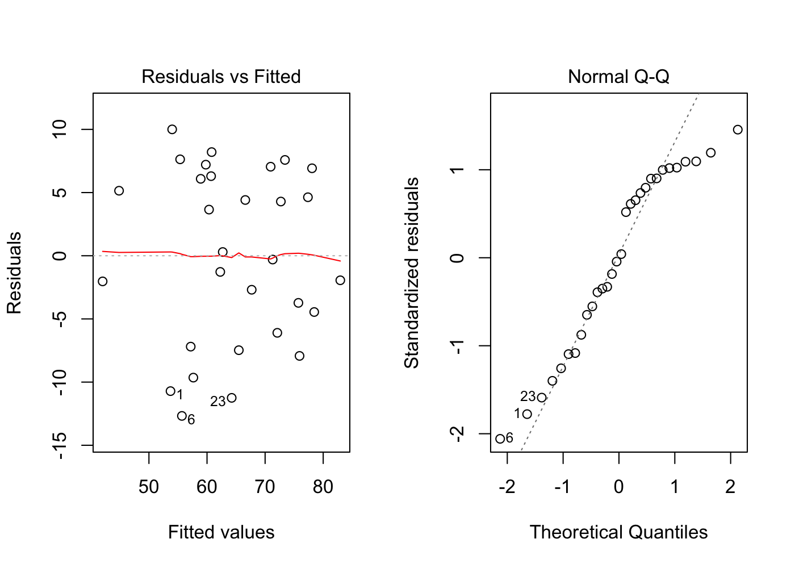

```r
e <- residuals(fit1)
# plot residuals by all predictors
par(mfrow = c(2,2))
plot(sups$Complaints, e, col = "blue", pch = 16); abline(h=0, lty = 3)
plot(sups$Privileges, e, col = "blue", pch = 16); abline(h=0, lty = 3)
plot(sups$Critical, e, col = "blue", pch = 16); abline(h=0, lty = 3)
```


### Fit model 2  

```r
summary(fit2) # prints summary of model
```

```
## 
## Call:
## lm(formula = Rating ~ Learn + Raises + Advance, data = sups)
## 
## Residuals:
##     Min      1Q  Median      3Q     Max 
## -14.354  -5.324  -1.828   6.612  14.403 
## 
## Coefficients:
##             Estimate Std. Error t value Pr(>|t|)   
## (Intercept)  17.6511    10.2245   1.726  0.09615 . 
## Learn         0.5484     0.1835   2.988  0.00606 **
## Raises        0.5658     0.2143   2.640  0.01383 * 
## Advance      -0.4774     0.1964  -2.431  0.02228 * 
## ---
## Signif. codes:  0 '***' 0.001 '**' 0.01 '*' 0.05 '.' 0.1 ' ' 1
## 
## Residual standard error: 8.601 on 26 degrees of freedom
## Multiple R-squared:  0.5524,	Adjusted R-squared:  0.5007 
## F-statistic: 10.69 on 3 and 26 DF,  p-value: 9.262e-05
```

```r
par(mfrow = c(1,2)) # sets up side by side plots
plot(fit2, which = c(1,2))
```

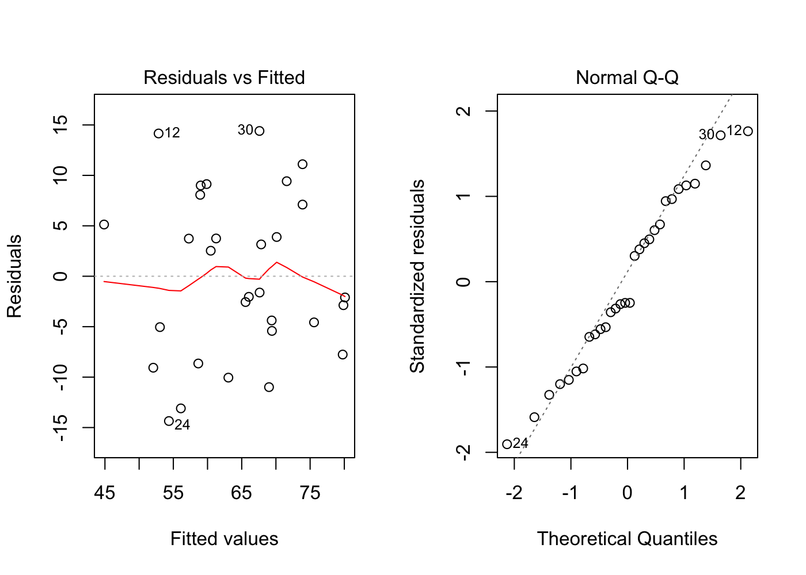

```r
e <- residuals(fit2)
# plot residuals by all predictors
par(mfrow = c(2,2))
plot(sups$Learn, e, col = "blue", pch = 16); abline(h=0, lty = 3)
plot(sups$Raises, e, col = "blue", pch = 16); abline(h=0, lty = 3)
plot(sups$Advance, e, col = "blue", pch = 16); abline(h=0, lty = 3)
```

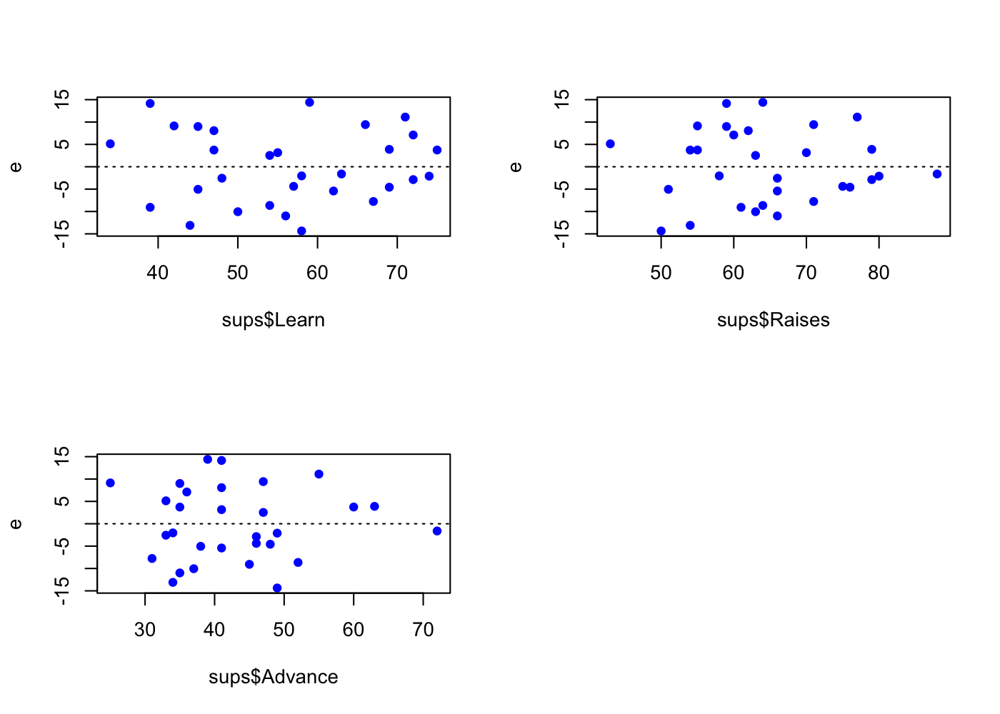

### Fit model 3  

```r
summary(fit3) # prints summary of model
```

```
## 
## Call:
## lm(formula = Rating ~ w, data = sups)
## 
## Residuals:
##      Min       1Q   Median       3Q      Max 
## -12.2052  -5.8973  -0.0372   5.4364  13.0172 
## 
## Coefficients:
##             Estimate Std. Error t value Pr(>|t|)    
## (Intercept)  9.98821    7.38841   1.352    0.187    
## w            0.44439    0.05914   7.514 3.49e-08 ***
## ---
## Signif. codes:  0 '***' 0.001 '**' 0.01 '*' 0.05 '.' 0.1 ' ' 1
## 
## Residual standard error: 7.133 on 28 degrees of freedom
## Multiple R-squared:  0.6685,	Adjusted R-squared:  0.6566 
## F-statistic: 56.46 on 1 and 28 DF,  p-value: 3.487e-08
```

```r
par(mfrow = c(1,2)) # sets up side by side plots
plot(fit3, which = c(1,2))
```

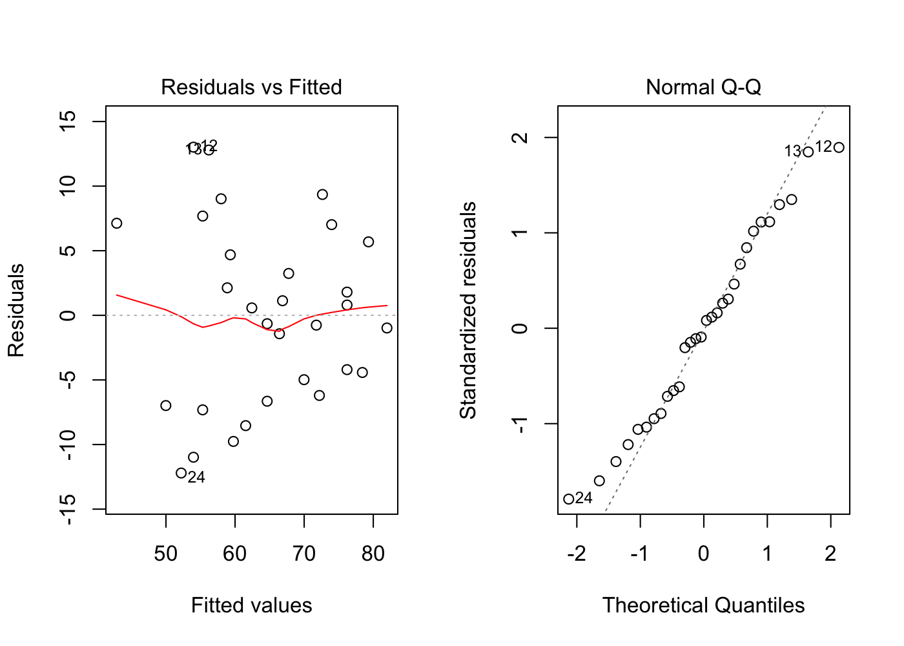

```r
e <- residuals(fit3)
# plot residuals by all predictors
# redundant plot below as above
#plot(sups$w, e, col = "blue", pch = 16); abline(h=0, lty = 3)
```

#### Fit Plot for model 3  

```r
library(ggplot2)
g <- ggplot(sups, aes(x = Rating, y = w))
g <- g + geom_point()
g <- g + stat_smooth(method = "lm", formula = y ~ x)
g
```

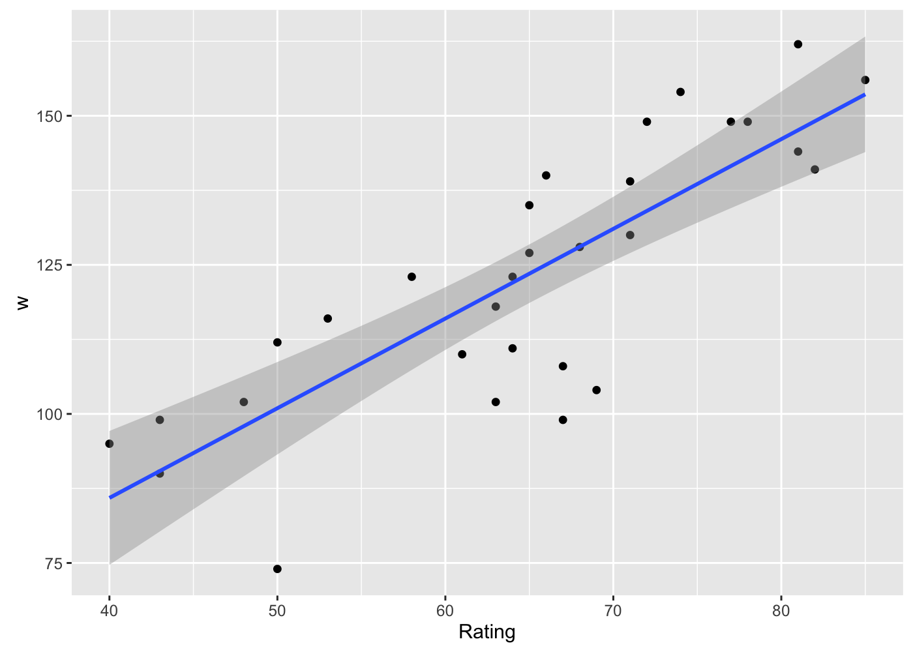
*Note, ggplot automatically adds confidence bands to the plot.*

### Fit model 4  

```r
summary(fit4) # prints summary of model
```

```
## 
## Call:
## lm(formula = yprime ~ v, data = sups)
## 
## Residuals:
##    Min     1Q Median     3Q    Max 
## -9.799 -6.242  0.252  4.911 12.263 
## 
## Coefficients:
##             Estimate Std. Error t value Pr(>|t|)    
## (Intercept)   1.1665     1.7079   0.683      0.5    
## v             0.6938     0.1129   6.147 1.23e-06 ***
## ---
## Signif. codes:  0 '***' 0.001 '**' 0.01 '*' 0.05 '.' 0.1 ' ' 1
## 
## Residual standard error: 6.891 on 28 degrees of freedom
## Multiple R-squared:  0.5744,	Adjusted R-squared:  0.5592 
## F-statistic: 37.79 on 1 and 28 DF,  p-value: 1.233e-06
```

```r
par(mfrow = c(1,2)) # sets up side by side plots
plot(fit4, which = c(1,2))
```

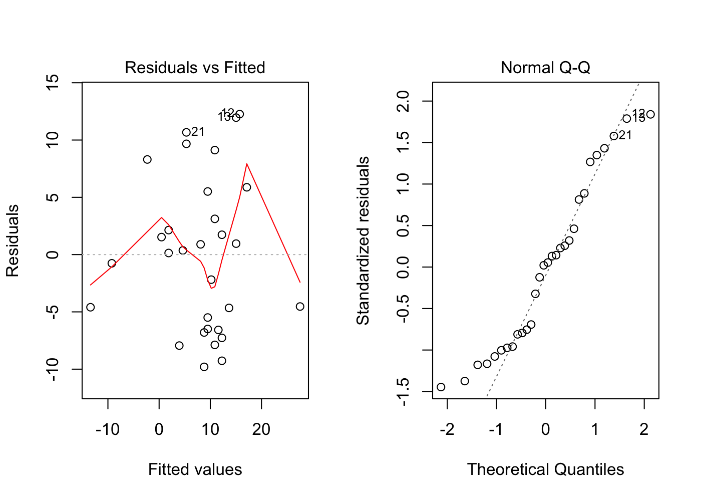

```r
e <- residuals(fit4)
# plot residuals by all predictors
# redundant plot below as above
#plot(sups$w, e, col = "blue", pch = 16); abline(h=0, lty = 3)
```

#### Fit Plot for model 4  

```r
library(ggplot2)
g <- ggplot(sups, aes(x = yprime, y = v))
g <- g + geom_point()
g <- g + stat_smooth(method = "lm", formula = y ~ x)
g
```

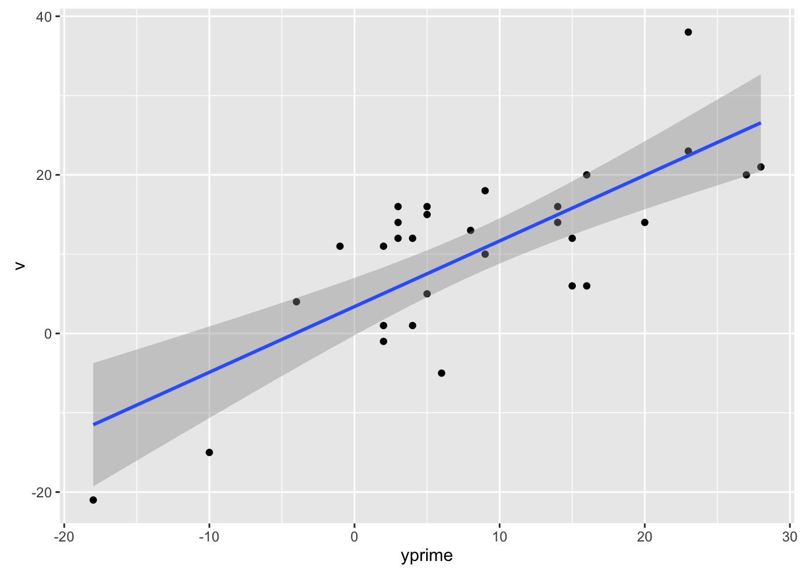

### Fit model 5

```r
summary(fit5) # prints summary of model
```

```
## 
## Call:
## lm(formula = Rating ~ Complaints + Learn, data = sups)
## 
## Residuals:
##      Min       1Q   Median       3Q      Max 
## -11.5568  -5.7331   0.6701   6.5341  10.3610 
## 
## Coefficients:
##             Estimate Std. Error t value Pr(>|t|)    
## (Intercept)   9.8709     7.0612   1.398    0.174    
## Complaints    0.6435     0.1185   5.432 9.57e-06 ***
## Learn         0.2112     0.1344   1.571    0.128    
## ---
## Signif. codes:  0 '***' 0.001 '**' 0.01 '*' 0.05 '.' 0.1 ' ' 1
## 
## Residual standard error: 6.817 on 27 degrees of freedom
## Multiple R-squared:  0.708,	Adjusted R-squared:  0.6864 
## F-statistic: 32.74 on 2 and 27 DF,  p-value: 6.058e-08
```

```r
par(mfrow = c(1,2)) # sets up side by side plots
plot(fit5, which = c(1,2))
```

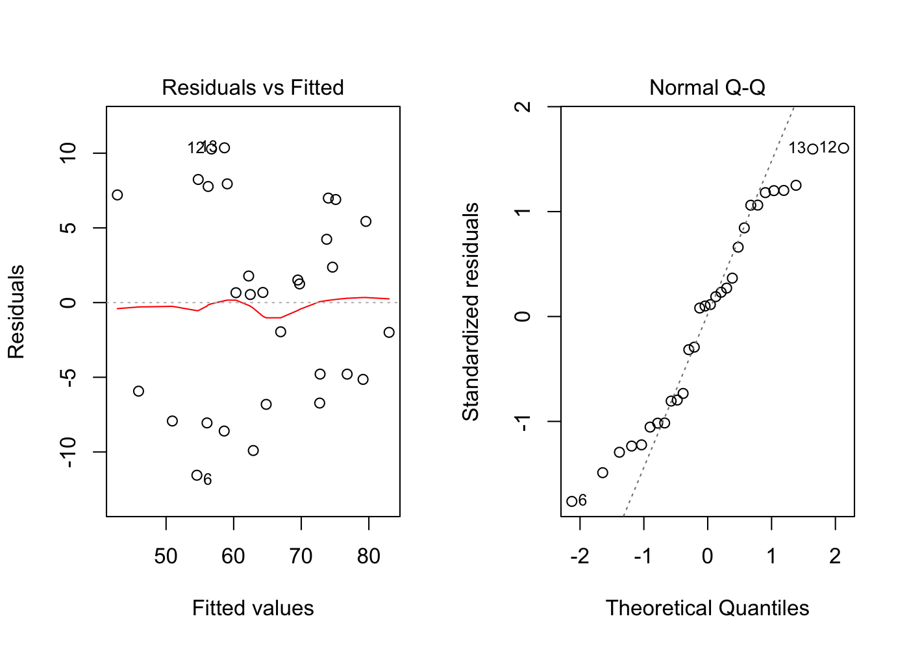

```r
e <- residuals(fit5)
# plot residuals by all predictors
par(mfrow = c(1,2))
plot(sups$Complaints, e, col = "blue", pch = 16); abline(h=0, lty = 3)
plot(sups$Learn, e, col = "blue", pch = 16); abline(h=0, lty = 3)
```

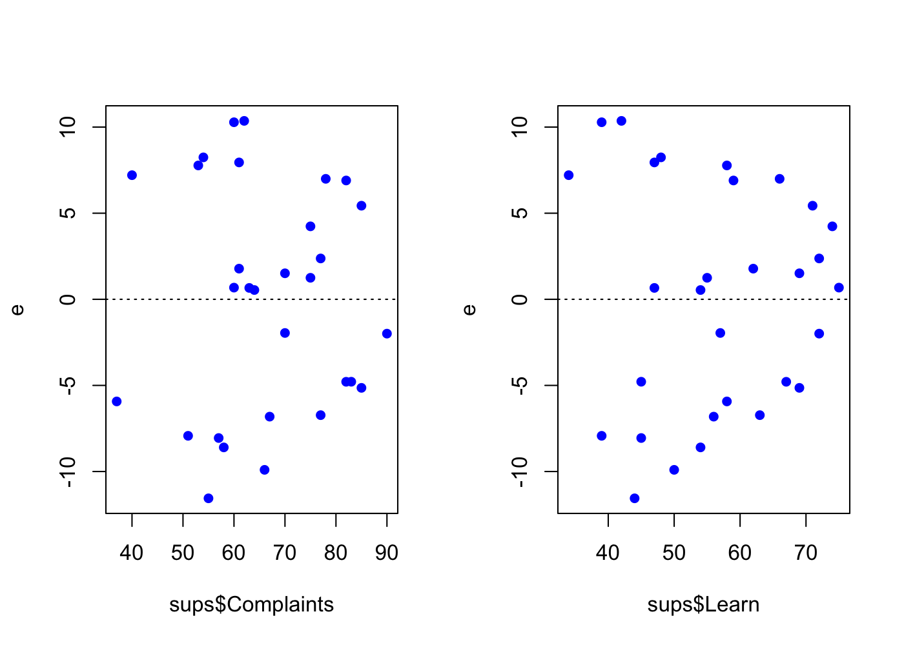

### Fit model 6

```r
summary(fit6) # prints summary of model
```

```
## 
## Call:
## lm(formula = Rating ~ ., data = sups.pre)
## 
## Residuals:
##      Min       1Q   Median       3Q      Max 
## -10.9418  -4.3555   0.3158   5.5425  11.5990 
## 
## Coefficients:
##             Estimate Std. Error t value Pr(>|t|)    
## (Intercept) 10.78708   11.58926   0.931 0.361634    
## Complaints   0.61319    0.16098   3.809 0.000903 ***
## Privileges  -0.07305    0.13572  -0.538 0.595594    
## Learn        0.32033    0.16852   1.901 0.069925 .  
## Raises       0.08173    0.22148   0.369 0.715480    
## Critical     0.03838    0.14700   0.261 0.796334    
## Advance     -0.21706    0.17821  -1.218 0.235577    
## ---
## Signif. codes:  0 '***' 0.001 '**' 0.01 '*' 0.05 '.' 0.1 ' ' 1
## 
## Residual standard error: 7.068 on 23 degrees of freedom
## Multiple R-squared:  0.7326,	Adjusted R-squared:  0.6628 
## F-statistic:  10.5 on 6 and 23 DF,  p-value: 1.24e-05
```

```r
par(mfrow = c(1,2)) # sets up side by side plots
plot(fit6, which = c(1,2))
```


```r
e <- residuals(fit6)
# plot residuals by all predictors
par(mfrow = c(2,3))
plot(sups$Complaints, e, col = "blue", pch = 16); abline(h=0, lty = 3)
plot(sups$Privileges, e, col = "blue", pch = 16); abline(h=0, lty = 3)
plot(sups$Learn, e, col = "blue", pch = 16); abline(h=0, lty = 3)
plot(sups$Raises, e, col = "blue", pch = 16); abline(h=0, lty = 3)
plot(sups$Critical, e, col = "blue", pch = 16); abline(h=0, lty = 3)
plot(sups$Advance, e, col = "blue", pch = 16); abline(h=0, lty = 3)
```

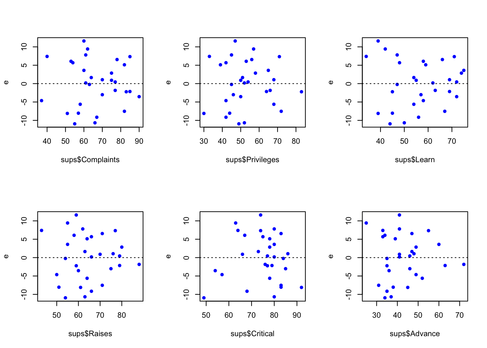

Here's a scatterplot matrix of the supervisor data without the added variables


```r
# note, I created this variable before adding all the additional vars.
plot(sups.pre, main = "Scatterplot Matrix")
```

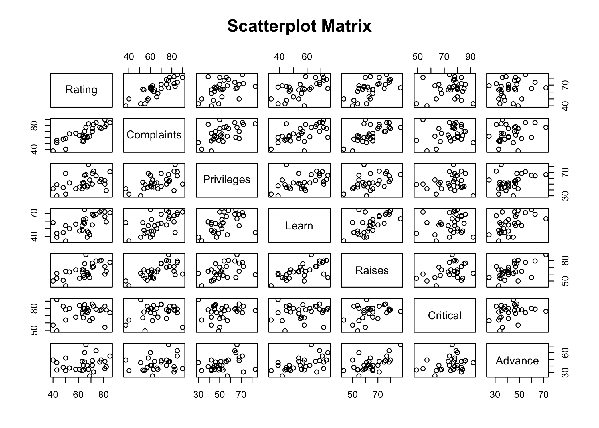

Notice the multi-colinearity of a few of the x variables with each other.  Particularly Learn vs Raises.

Here, I'd reccomend installing the GGally package.  It is a companion package to ggplot2.  This next plot is slow but very informative for multi linear regression.  


```r
library(GGally)
gsups <- ggpairs(sups.pre, lower = list(continuous = "smooth"))
gsups
```

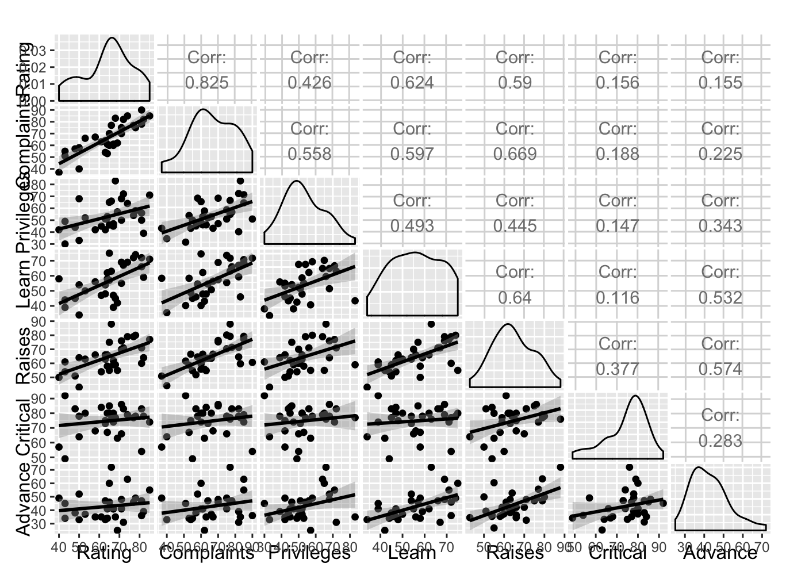

Correlation coefficients for our supervisor data.  Note that this is a part of the above plot.  I do this below just to show you how its done in R.


```r
cor(sups.pre)
```

```
##               Rating Complaints Privileges     Learn    Raises  Critical
## Rating     1.0000000  0.8254176  0.4261169 0.6236782 0.5901390 0.1564392
## Complaints 0.8254176  1.0000000  0.5582882 0.5967358 0.6691975 0.1877143
## Privileges 0.4261169  0.5582882  1.0000000 0.4933310 0.4454779 0.1472331
## Learn      0.6236782  0.5967358  0.4933310 1.0000000 0.6403144 0.1159652
## Raises     0.5901390  0.6691975  0.4454779 0.6403144 1.0000000 0.3768830
## Critical   0.1564392  0.1877143  0.1472331 0.1159652 0.3768830 1.0000000
## Advance    0.1550863  0.2245796  0.3432934 0.5316198 0.5741862 0.2833432
##              Advance
## Rating     0.1550863
## Complaints 0.2245796
## Privileges 0.3432934
## Learn      0.5316198
## Raises     0.5741862
## Critical   0.2833432
## Advance    1.0000000
```

Now, using the model to make predictions:


```r
# test the glm model
test <- data.frame(Complaints = c(61,71,61), Privileges = c(45,45,45), 
Learn = c(56,56,56), Raises = c(71,71,81), Critical = c(57,57,57), Advance = c(25,25,25))
fit.all <- glm(Rating ~ ., data = sups.pre)
sup.pred <- predict.glm(fit.all, newdata = test, interval =
                           "confidence", se.fit = TRUE)
preds <- cbind(sup.pred$fit, sup.pred$se.fit)
colnames(preds) <- c("estimate", "std error")
preds
```

```
##   estimate std error
## 1 65.40717  5.257481
## 2 71.53905  4.712535
## 3 66.22449  7.059975
```

```r
summary(fit.all)$coeff # print the coefficients from the glm model.
```

```
##                Estimate Std. Error    t value     Pr(>|t|)
## (Intercept) 10.78707639 11.5892572  0.9307824 0.3616337210
## Complaints   0.61318761  0.1609831  3.8090182 0.0009028679
## Privileges  -0.07305014  0.1357247 -0.5382229 0.5955939205
## Learn        0.32033212  0.1685203  1.9008516 0.0699253459
## Raises       0.08173213  0.2214777  0.3690310 0.7154800884
## Critical     0.03838145  0.1469954  0.2611064 0.7963342642
## Advance     -0.21705668  0.1782095 -1.2179862 0.2355770486
```

Summary of the glm model from above


```r
summary(fit.all) # prints summary of model
```

```
## 
## Call:
## glm(formula = Rating ~ ., data = sups.pre)
## 
## Deviance Residuals: 
##      Min        1Q    Median        3Q       Max  
## -10.9418   -4.3555    0.3158    5.5425   11.5990  
## 
## Coefficients:
##             Estimate Std. Error t value Pr(>|t|)    
## (Intercept) 10.78708   11.58926   0.931 0.361634    
## Complaints   0.61319    0.16098   3.809 0.000903 ***
## Privileges  -0.07305    0.13572  -0.538 0.595594    
## Learn        0.32033    0.16852   1.901 0.069925 .  
## Raises       0.08173    0.22148   0.369 0.715480    
## Critical     0.03838    0.14700   0.261 0.796334    
## Advance     -0.21706    0.17821  -1.218 0.235577    
## ---
## Signif. codes:  0 '***' 0.001 '**' 0.01 '*' 0.05 '.' 0.1 ' ' 1
## 
## (Dispersion parameter for gaussian family taken to be 49.95654)
## 
##     Null deviance: 4297  on 29  degrees of freedom
## Residual deviance: 1149  on 23  degrees of freedom
## AIC: 210.5
## 
## Number of Fisher Scoring iterations: 2
```

```r
par(mfrow = c(1,2)) # sets up side by side plots
plot(fit.all, which = c(1,2))
```

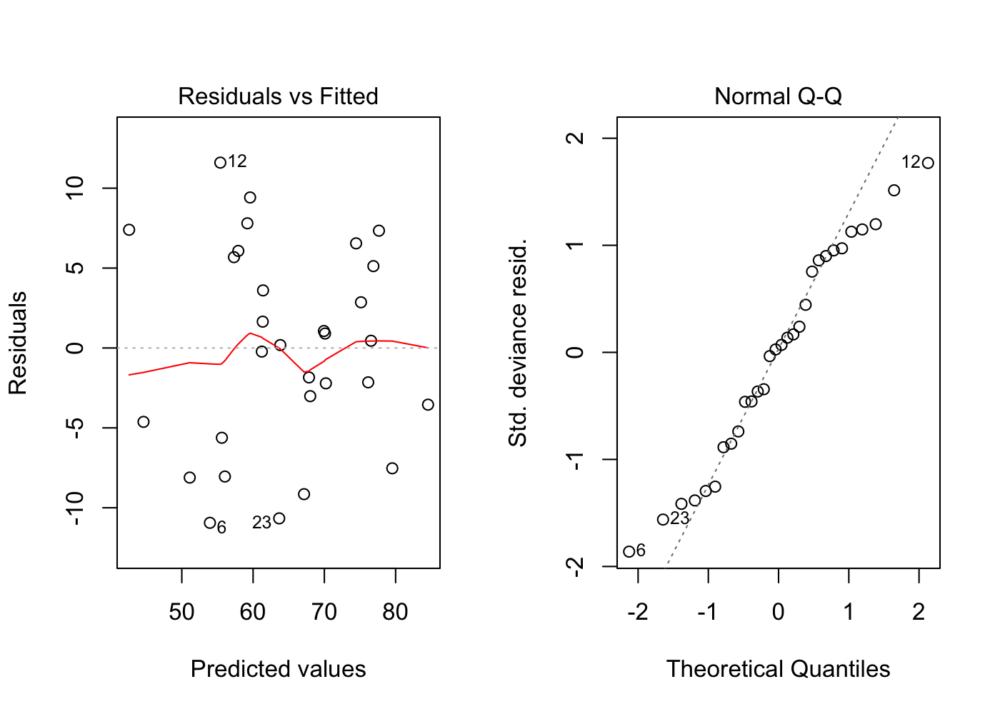

```r
e <- residuals(fit.all)
# plot residuals by all predictors
par(mfrow = c(2,3))
plot(sups$Complaints, e, col = "blue", pch = 16); abline(h=0, lty = 3)
plot(sups$Privileges, e, col = "blue", pch = 16); abline(h=0, lty = 3)
plot(sups$Learn, e, col = "blue", pch = 16); abline(h=0, lty = 3)
plot(sups$Raises, e, col = "blue", pch = 16); abline(h=0, lty = 3)
plot(sups$Critical, e, col = "blue", pch = 16); abline(h=0, lty = 3)
plot(sups$Advance, e, col = "blue", pch = 16); abline(h=0, lty = 3)
```


Now we need to add the 10,000 iterations like professor did using SAS.
I don't yet know how to do this without a for loop in R so this is a slow block of code.  


```r
bias <- vector()
sups$index <- 1:30
for (i in 1:10000) {
  ind <- sample(1:dim(sups)[1], 10)
  # now we can subset the carmpg data frame into 2 data frames using this index.
  test <- sups[sups$index %in% ind, ]
  training <- sups[!(sups$index %in% ind), ]
  # now to fit a new model with our subsetted training data.
  fit.train <- lm(Rating ~      
                  Complaints+Privileges+Learn+Raises+Critical+Advance,
                  data = training)
  testing <- predict.lm(fit.train, newdata = test)
  e <- test$Rating - testing
  e.squared <- e^2
  p.i <- c(mean(e), mean(e.squared), sqrt(mean(e.squared)))
  bias <- rbind(bias, p.i)
}
colnames(bias) <- c("pbias", "pmse", "rpmse")
#mean(bias)
apply(bias, 2, mean) # takes the means of the columns of our matrix
```

```
##      pbias       pmse      rpmse 
## -0.4800221 79.2031859  8.7208245
```

```r
hist(bias[,1], col = "green", breaks = 20, main = "Histogram of Model Bias", xlab = "observed - predicted")
```

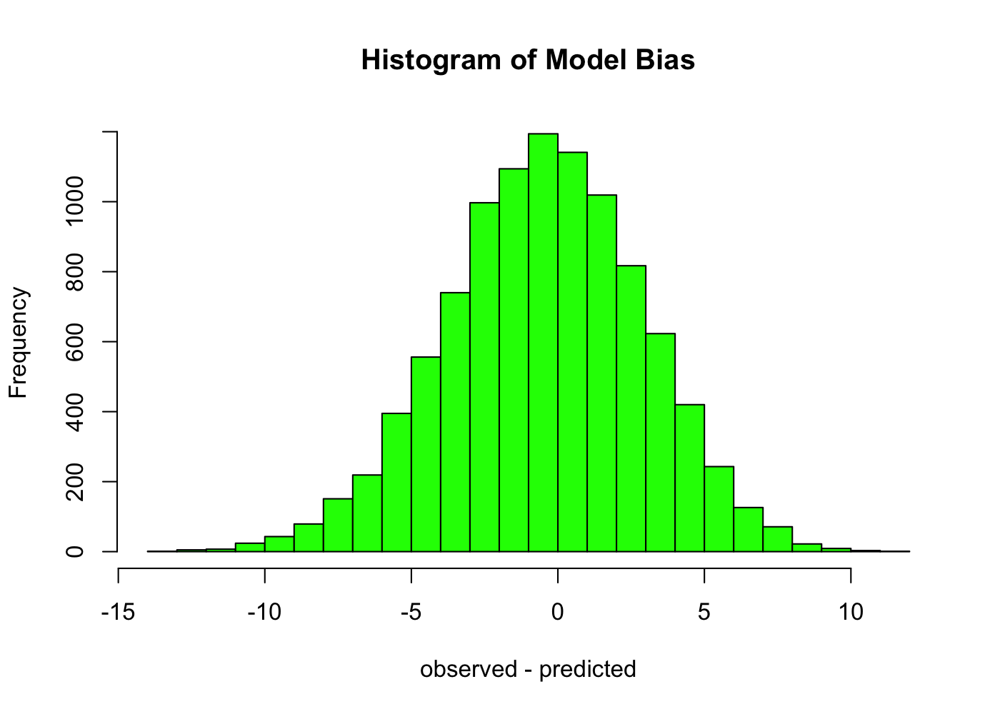
