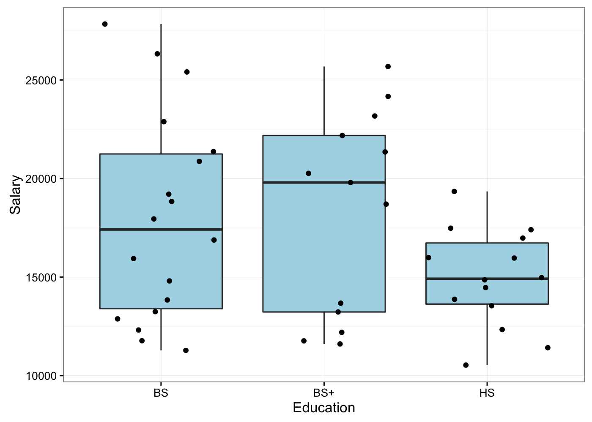
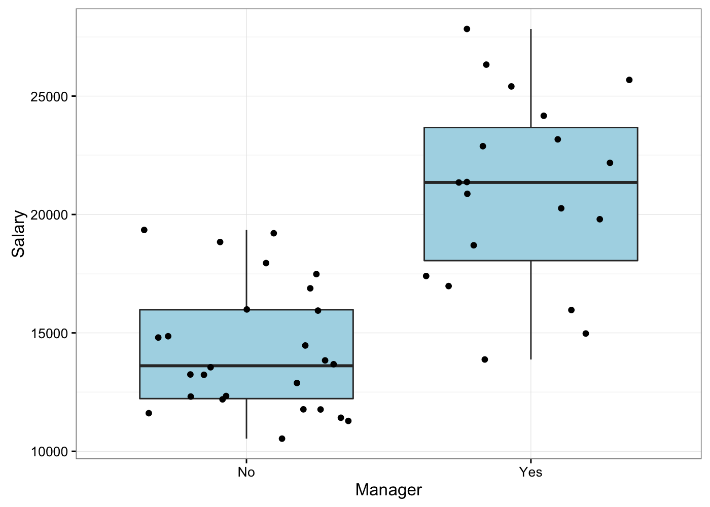
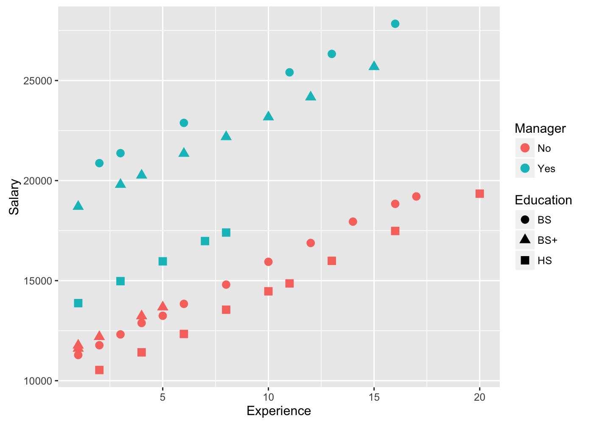
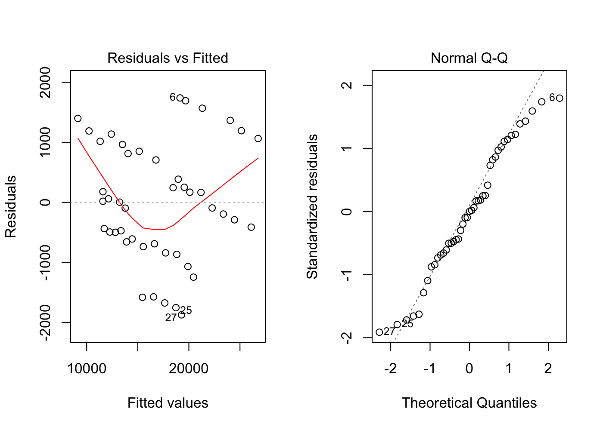
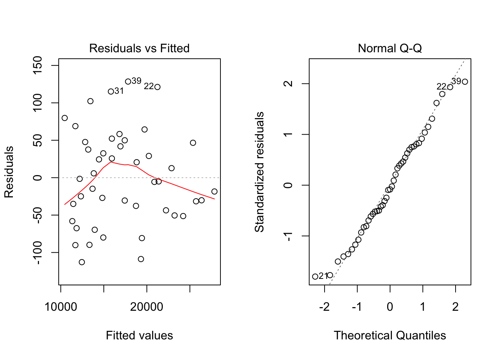

# Indicator Variables
Cody Frisby  
March 10, 2016  

Salary example shared in class.  


```r
library(xlsx) # read excel files
sal <- read.xlsx("~/Documents/MATH3710/salaryIV/Salary.xlsx", 
                 sheetIndex = 1)
sal <- sal[1:45,] # remove NA lines from bottom of sal
```

We need to recode some of these vars.  Here's one, simple, way to do it in R.


```r
sal$bachelors <- 0 #create a new var with zeros
sal$grad_deg <- 0 # ditto
# we need statement to fill in our new vars with 1s
sal[sal$Education == "BS", "bachelors"] <- 1
sal[sal$Education == "BS+", "grad_deg"] <- 1
# now one for manager
sal$mgr <- 0
sal[sal$Manager == "Yes", "mgr"] <- 1
sal$EM1 <- sal$bachelors*sal$mgr
sal$EM2 <- sal$grad_deg*sal$mgr
head(sal) # look at the data
```

```
##   Salary Experience Education Manager category bachelors grad_deg mgr EM1
## 1  13876          1        HS     Yes    HSYes         0        0   1   0
## 2  11608          1       BS+      No    BS+No         0        1   0   0
## 3  18701          1       BS+     Yes   BS+Yes         0        1   1   0
## 4  11283          1        BS      No     BSNo         1        0   0   0
## 5  11767          1       BS+      No    BS+No         0        1   0   0
## 6  20872          2        BS     Yes    BSYes         1        0   1   1
##   EM2
## 1   0
## 2   0
## 3   1
## 4   0
## 5   0
## 6   0
```

Now, for ease, I'm going to subset our data table. Sal2 is a new data frame that contains the variables we are interested in.


```r
sal2 <- sal[,c(1:2,6:8)]
head(sal2)
```

```
##   Salary Experience bachelors grad_deg mgr
## 1  13876          1         0        0   1
## 2  11608          1         0        1   0
## 3  18701          1         0        1   1
## 4  11283          1         1        0   0
## 5  11767          1         0        1   0
## 6  20872          2         1        0   1
```

### Box plot of Salary by Education level


```r
library(ggplot2)
bx <- ggplot(sal, aes(Education, Salary))
bx <- bx + geom_boxplot(fill = "lightblue") + geom_jitter() + theme_bw()
bx
```



### Box plot of Salary by Manager


```r
library(ggplot2)
bx <- ggplot(sal, aes(Manager, Salary))
bx <- bx + geom_boxplot(fill = "lightblue") + geom_jitter() + theme_bw()
bx
```




###More Plotting, scatter plots with color and shape as dimensions


```r
g <- ggplot(data = sal, aes(x=Experience, y=Salary))
g <- g + geom_point(aes(shape=Education, colour=Manager), size = 3)
g
```



Now, let's fit the model, using indicator variables


```r
fit <- lm(Salary ~ ., sal2) #data frame with only the vars we want
summary(fit)
```

```
## 
## Call:
## lm(formula = Salary ~ ., data = sal2)
## 
## Residuals:
##      Min       1Q   Median       3Q      Max 
## -1874.02  -658.21     3.66   850.04  1739.16 
## 
## Coefficients:
##             Estimate Std. Error t value Pr(>|t|)    
## (Intercept)  8044.75     392.78  20.482  < 2e-16 ***
## Experience    545.79      30.91  17.656  < 2e-16 ***
## bachelors    3129.53     370.47   8.447 1.98e-10 ***
## grad_deg     2999.45     416.71   7.198 9.96e-09 ***
## mgr          6866.99     323.99  21.195  < 2e-16 ***
## ---
## Signif. codes:  0 '***' 0.001 '**' 0.01 '*' 0.05 '.' 0.1 ' ' 1
## 
## Residual standard error: 1039 on 40 degrees of freedom
## Multiple R-squared:  0.9549,	Adjusted R-squared:  0.9504 
## F-statistic: 211.7 on 4 and 40 DF,  p-value: < 2.2e-16
```

### Residual Diagnostics


```r
par(mfrow=c(1,2))
plot(fit, which = c(1,2))
```



By the looks of it, we have an issue with "clustering" possibly due to th catagories.  There may be an interaction we are not accounting for in our model. 

### Model with interaction


```r
fit2 <- lm(Salary ~ . + grad_deg*mgr+bachelors*mgr, sal2)
summary(fit2)
```

```
## 
## Call:
## lm(formula = Salary ~ . + grad_deg * mgr + bachelors * mgr, data = sal2)
## 
## Residuals:
##      Min       1Q   Median       3Q      Max 
## -112.884  -43.636   -5.036   46.622  128.480 
## 
## Coefficients:
##               Estimate Std. Error t value Pr(>|t|)    
## (Intercept)   9458.378     31.041  304.71   <2e-16 ***
## Experience     498.418      2.152  231.64   <2e-16 ***
## bachelors     1384.294     29.858   46.36   <2e-16 ***
## grad_deg      1741.336     40.683   42.80   <2e-16 ***
## mgr           3988.817     39.073  102.08   <2e-16 ***
## grad_deg:mgr  3051.763     57.674   52.91   <2e-16 ***
## bachelors:mgr 5049.294     51.668   97.73   <2e-16 ***
## ---
## Signif. codes:  0 '***' 0.001 '**' 0.01 '*' 0.05 '.' 0.1 ' ' 1
## 
## Residual standard error: 67.12 on 38 degrees of freedom
## Multiple R-squared:  0.9998,	Adjusted R-squared:  0.9998 
## F-statistic: 3.543e+04 on 6 and 38 DF,  p-value: < 2.2e-16
```

### Model Diagnostics  


```r
par(mfrow=c(1,2))
plot(fit2, which = c(1,2))
```



Looking much better now.

