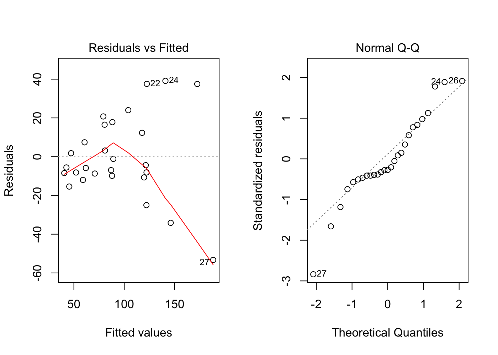
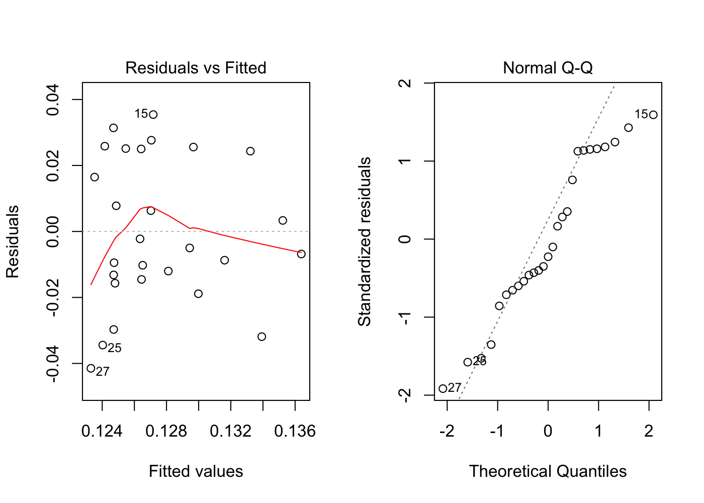
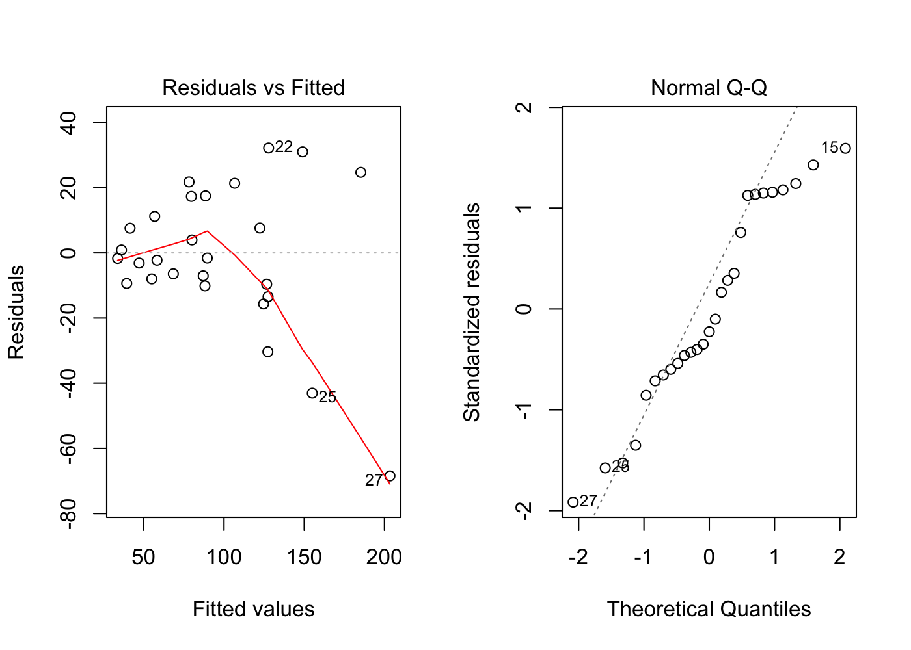

# Work WLS
Cody Frisby  
March 31, 2016  


```r
work <- read.table("~/Documents/MATH3710/supervisorWLS/work.txt", header = T)
fit <- lm(y~x, work)
summary(fit)
```

```
## 
## Call:
## lm(formula = y ~ x, data = work)
## 
## Residuals:
##     Min      1Q  Median      3Q     Max 
## -53.294  -9.298  -5.579  14.394  39.119 
## 
## Coefficients:
##             Estimate Std. Error t value Pr(>|t|)    
## (Intercept) 14.44806    9.56201   1.511    0.143    
## x            0.10536    0.01133   9.303 1.35e-09 ***
## ---
## Signif. codes:  0 '***' 0.001 '**' 0.01 '*' 0.05 '.' 0.1 ' ' 1
## 
## Residual standard error: 21.73 on 25 degrees of freedom
## Multiple R-squared:  0.7759,	Adjusted R-squared:  0.7669 
## F-statistic: 86.54 on 1 and 25 DF,  p-value: 1.35e-09
```

Fit model without weights or transformation.  


```r
par(mfrow=c(1,2))
plot(fit, which = c(1,2))
```




## Add weights to our data table


```r
work$w <- 1/work$x^2
work$yt <- work$y/work$x
work$xt <- 1/work$x
```

Now fit the model with the transformed x & y


```r
fit.t <- lm(yt ~ xt,data = work)
summary(fit.t)
```

```
## 
## Call:
## lm(formula = yt ~ xt, data = work)
## 
## Residuals:
##       Min        1Q    Median        3Q       Max 
## -0.041477 -0.013852 -0.004998  0.024671  0.035427 
## 
## Coefficients:
##             Estimate Std. Error t value Pr(>|t|)    
## (Intercept) 0.120990   0.008999  13.445 6.04e-13 ***
## xt          3.803296   4.569745   0.832    0.413    
## ---
## Signif. codes:  0 '***' 0.001 '**' 0.01 '*' 0.05 '.' 0.1 ' ' 1
## 
## Residual standard error: 0.02266 on 25 degrees of freedom
## Multiple R-squared:  0.02696,	Adjusted R-squared:  -0.01196 
## F-statistic: 0.6927 on 1 and 25 DF,  p-value: 0.4131
```


```r
par(mfrow=c(1,2))
plot(fit.t, which = c(1,2))
```



Now fit the model with weights


```r
# not using yt and xt
fit.w <- lm(y ~ x, weights = work$w, data = work)
summary(fit.w)
```

```
## 
## Call:
## lm(formula = y ~ x, data = work, weights = work$w)
## 
## Weighted Residuals:
##       Min        1Q    Median        3Q       Max 
## -0.041477 -0.013852 -0.004998  0.024671  0.035427 
## 
## Coefficients:
##             Estimate Std. Error t value Pr(>|t|)    
## (Intercept) 3.803296   4.569745   0.832    0.413    
## x           0.120990   0.008999  13.445 6.04e-13 ***
## ---
## Signif. codes:  0 '***' 0.001 '**' 0.01 '*' 0.05 '.' 0.1 ' ' 1
## 
## Residual standard error: 0.02266 on 25 degrees of freedom
## Multiple R-squared:  0.8785,	Adjusted R-squared:  0.8737 
## F-statistic: 180.8 on 1 and 25 DF,  p-value: 6.044e-13
```


```r
par(mfrow=c(1,2))
plot(fit.w, which = c(1,2))
```




```r
# Here, we calculate the WLS estimates for B_i
X <- cbind(1, work$x)
Y <- matrix(work$y, nrow = length(work$y))
W <- matrix(diag(work$w), nrow = length(work$w))
B <- solve(t(X)%*%W%*%X) %*% t(X)%*%W%*%Y
B # intercept and slope WLS
```

```
##           [,1]
## [1,] 3.8032958
## [2,] 0.1209903
```

```r
coef(fit.w) # same as above
```

```
## (Intercept)           x 
##   3.8032958   0.1209903
```


```r
# WSSE(X)
WSSE.x <- sum(work$w*(work$y-(B[1] + B[2]*work$x))^2)
WSSE.x
```

```
## [1] 0.01284232
```

```r
WMSE.x <- WSSE.x/(length(work$x) - 2)
WMSE.x
```

```
## [1] 0.0005136927
```

```r
sigma0 <- sqrt(WMSE.x)
sigma0 # sigma calculated "by hand"
```

```
## [1] 0.02266479
```

```r
summary(fit.w)$sigma; summary(fit.t)$sigma #WLS and transformed sigma
```

```
## [1] 0.02266479
```

```
## [1] 0.02266479
```


```r
# C matrix
C <- solve(t(X) %*% W %*% X)
C
```

```
##             [,1]        [,2]
## [1,] 40651.87971 -70.0178241
## [2,]   -70.01782   0.1576341
```


```r
# confidence intervals for B
confint(fit.w) # B1 is Significant
```

```
##                  2.5 %     97.5 %
## (Intercept) -5.6082710 13.2148626
## x            0.1024573  0.1395233
```


### Graybill book example pg 576


```r
co <- read.table("~/Documents/MATH3710/datafiles/CARBMON.DAT", header = F)
colnames(co) <- c("y", "x")
co$w <- 1/co$x
# using R lm function with weights argument
fit.w <- lm(y ~ x, data = co, weights = w)
y <- co$y; X <- cbind(1, co$x)
# note : w_i = (1/G(x_i)^2) = 1/x_i
W <- matrix(diag(1/co$x), nrow = length(co$x))
B <- solve(t(X)%*%W%*%X) %*% t(X)%*%W%*%y
B; coef(fit.w) # intercept and slope WLS
```

```
##            [,1]
## [1,] 371.620892
## [2,]   5.466208
```

```
## (Intercept)           x 
##  371.620892    5.466208
```

```r
C <- solve(t(X) %*% W %*% X)
C
```

```
##             [,1]          [,2]
## [1,] 114.5957124 -0.1794224089
## [2,]  -0.1794224  0.0004013599
```


```r
WSSE.x <- sum(co$w*(co$y-(B[1] + B[2]*co$x))^2)
WMSE.x <- WSSE.x/(length(co$x) - 2)
sigma0 <- sqrt(WMSE.x)
sigma0
```

```
## [1] 27.79584
```

```r
summary(fit.w)$sigma
```

```
## [1] 27.79584
```

### Confidence Intervals "By Hand"

```r
# SE of B
SE.b0 <- sigma0*sqrt(C[1,1])
SE.b1 <- sigma0*sqrt(C[2,2])
# calculate confidence intervals
cv0 <- qt(0.95, 11)*SE.b0; cv1 <- qt(0.95, 11)*SE.b1
b0 <- B[1] + c(-cv0, cv0)
b1 <- B[2] + c(-cv1, cv1)
rbind(b0,b1)
```

```
##          [,1]       [,2]
## b0 -162.74951 905.991297
## b1    4.46615   6.466266
```

```r
confint(fit.w, level = 0.90) #compare to R's built in function
```

```
##                    5 %       95 %
## (Intercept) -162.74951 905.991297
## x              4.46615   6.466266
```


Confidence interval for sigma and then Y(300)


```r
# alpha = 0.2
chi.cv <- qchisq(c(0.9, 0.1), 11)
sqrt(WSSE.x/chi.cv)*sqrt(300) # note, sqrt(300) is the g(y) value
```

```
## [1] 384.1736 676.0920
```

Confidence interval for x = 500  


```r
# using R "predict"
predict(fit.w, data.frame(x = 500), interval = "confidence")
```

```
##        fit      lwr      upr
## 1 3104.725 2740.146 3469.305
```

```r
predict(fit.w, data.frame(x = 500), se.fit = TRUE)$se.fit #SE
```

```
## [1] 165.6438
```

```r
# "By hand"
test <- rbind(1,500)
sigma0*sqrt(t(test)%*%C%*%test)
```

```
##          [,1]
## [1,] 165.6438
```

```r
predict(fit.w, data.frame(x=500)) +
  c(-sigma0*sqrt(t(test)%*%C%*%test)*qt(0.975,11),
    sigma0*sqrt(t(test)%*%C%*%test)*qt(0.975,11))
```

```
## [1] 2740.146 3469.305
```


Prediction interval for x = 300, pg. 579 in Graybill book 


```r
# "By hand"
test <- rbind(1,300)
sigma0*sqrt(sqrt(300)^2 + t(test)%*%C%*%test)
```

```
##          [,1]
## [1,] 514.8346
```

```r
predict(fit.w, data.frame(x=300)) +
  c(-sigma0*sqrt(sqrt(300)^2 + t(test)%*%C%*%test)*qt(0.975,11),
    sigma0*sqrt(sqrt(300)^2 + t(test)%*%C%*%test)*qt(0.975,11))
```

```
## [1]  878.3401 3144.6267
```


I'm going to try to go further with this and define *w* as a function of *x* using R code to do all the computations for me.


```r
# now to attempt the computation using the books notation
# for thw WSSE(X) using R's functionioal programming.
# wwse is a function that takes an 1xn x argument, 1xn y argument
# and an f argument that is a function of x
wls <- function(x, y, w){
  X <- cbind(1, x) # create matrix for computations
  W <- matrix(diag(w), nrow = length(x)) # weight matrix
  B <- solve(t(X) %*% W %*% X) %*% t(X) %*% W %*% y #Betas
  sse <- sum(w*(y-(B[1] + B[2]*x))^2)
  mse <- sse/(length(x) - 2)
  sigma0 <- sqrt(mse)
  z <- list(betas = B, sse = sse, mse = mse, sigma = sigma0) # weighted sum of squares
  z
}
wls(work$x, work$y, 1/work$x^2)
```

```
## $betas
##        [,1]
##   3.8032958
## x 0.1209903
## 
## $sse
## [1] 0.01284232
## 
## $mse
## [1] 0.0005136927
## 
## $sigma
## [1] 0.02266479
```
