# Time Series
Cody Frisby  
April 4, 2016  


```r
library(tseries)
# read a time series file
z <- read.ts("~/Documents/MATH3710/timeseries/data/papertowels1.txt")
t <- 1:length(z)
# we may not need the above line when using R.
w <- diff(z, lag = 1)
tw <- 1:length(w)
# we can create a time series object by using ts(x)
# more computations from class example
# sample auto correlation at lag k=3
r3 <- sum((z - mean(z))*(z[-(1:3)]-mean(z)))
var.z <- sum((z-mean(z))^2)
r3/var.z # this doesn't work... see acf below for the correct values
```

```
## [1] 0.8746037
```


```r
par(mfrow=c(1,2))
plot(as.numeric(z), xlab = "Week", ylab = "z")
plot(as.numeric(w), xlab = "Week", ylab = "w")
```

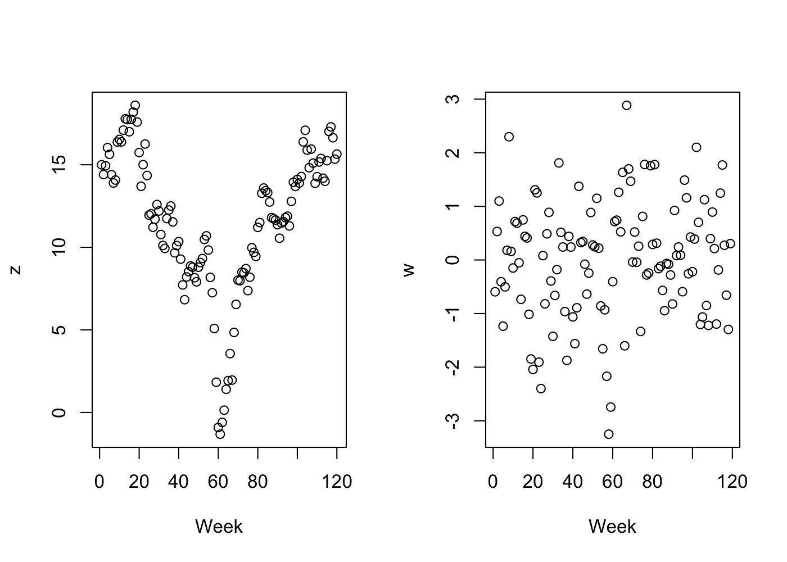

z and w are of class "ts" (time series).  When you plot an object of this class in R you get  


```r
par(mfrow=c(1,2))
plot(z, xlab = "Week")
plot(w, xlab = "Week")
```

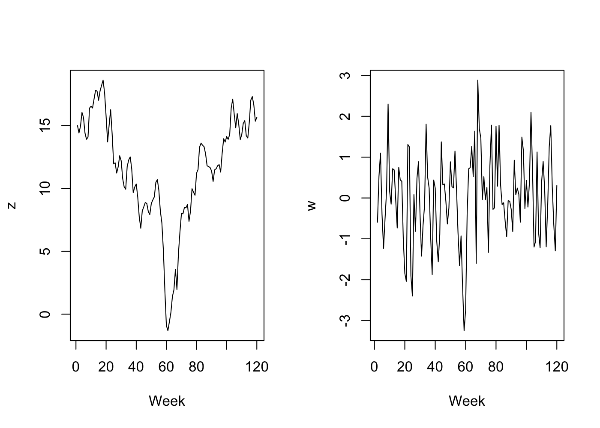

###PROC ARIMA in SAS, here we run the same analysis in R  

```r
fit.ts <- arima(z) # fit a univariate time series
fit.ts
```

```
## 
## Call:
## arima(x = z)
## 
## Coefficients:
##       intercept
##         11.5839
## s.e.     0.3996
## 
## sigma^2 estimated as 19.16:  log likelihood = -347.45,  aic = 698.9
```

```r
a <- acf(z) # autocorrelations plot
```

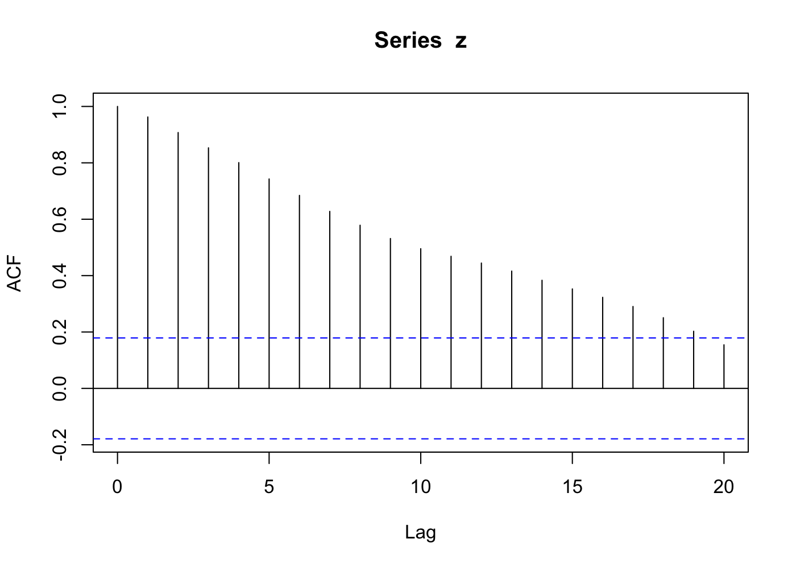

```r
matrix(a$acf[-1]) #autocorelations table
```

```
##            [,1]
##  [1,] 0.9625990
##  [2,] 0.9074333
##  [3,] 0.8532344
##  [4,] 0.8007231
##  [5,] 0.7427556
##  [6,] 0.6844865
##  [7,] 0.6277354
##  [8,] 0.5786812
##  [9,] 0.5315496
## [10,] 0.4954358
## [11,] 0.4685241
## [12,] 0.4444865
## [13,] 0.4159708
## [14,] 0.3834492
## [15,] 0.3527991
## [16,] 0.3229551
## [17,] 0.2904874
## [18,] 0.2506632
## [19,] 0.2026225
## [20,] 0.1545287
```

```r
#adf.test(z) # don't include yet
```


```r
par(mfrow=c(2,2))
ts.plot(z)
acf(z)
pacf(z)
```

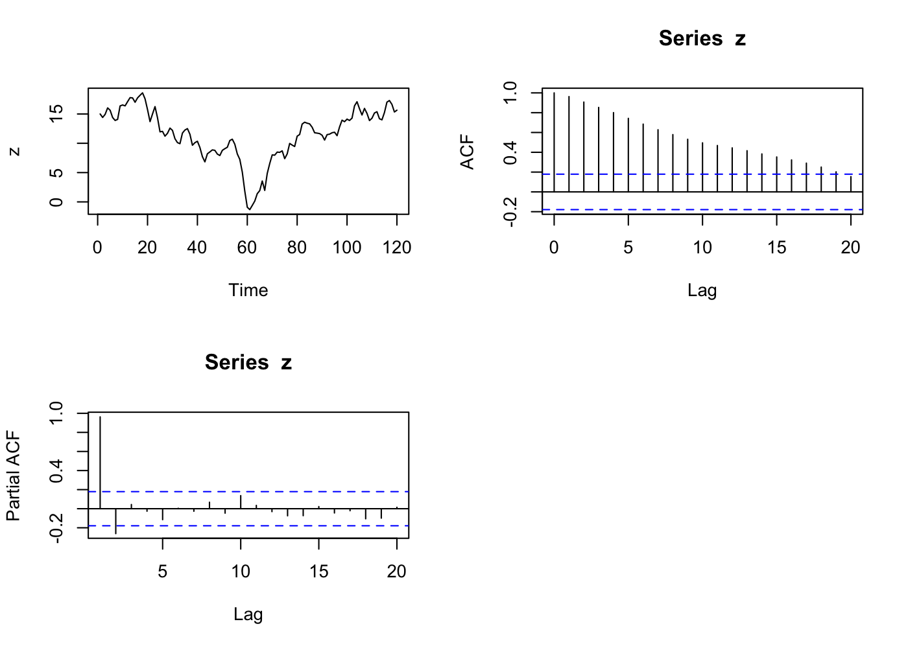

Trend and correlation analysis for W


```r
sac <- acf(w, plot = FALSE)
matrix(sac$acf[-1])
```

```
##               [,1]
##  [1,]  0.306654627
##  [2,] -0.064737090
##  [3,] -0.071661754
##  [4,]  0.104566778
##  [5,]  0.084131514
##  [6,]  0.022840739
##  [7,] -0.132613812
##  [8,] -0.119044653
##  [9,] -0.173838661
## [10,] -0.118232806
## [11,] -0.051621690
## [12,]  0.020891240
## [13,]  0.041352960
## [14,]  0.019373300
## [15,] -0.060599555
## [16,] -0.002420983
## [17,]  0.127737723
## [18,]  0.214889906
## [19,]  0.055802104
## [20,] -0.045369383
```

```r
par(mfrow=c(2,2))
ts.plot(w)
acf(w)
spac <- pacf(w, plot = FALSE)
matrix(spac$acf)
```

```
##                [,1]
##  [1,]  0.3066546267
##  [2,] -0.1752545756
##  [3,]  0.0061629809
##  [4,]  0.1333461102
##  [5,] -0.0095259390
##  [6,]  0.0199152323
##  [7,] -0.1396540267
##  [8,] -0.0407626561
##  [9,] -0.1775551934
## [10,] -0.0527012314
## [11,] -0.0109178606
## [12,]  0.0320749436
## [13,]  0.0721751935
## [14,]  0.0099152835
## [15,] -0.0577619376
## [16,]  0.0017999997
## [17,]  0.0785070836
## [18,]  0.1132151371
## [19,] -0.0459233427
## [20,]  0.0000723227
```

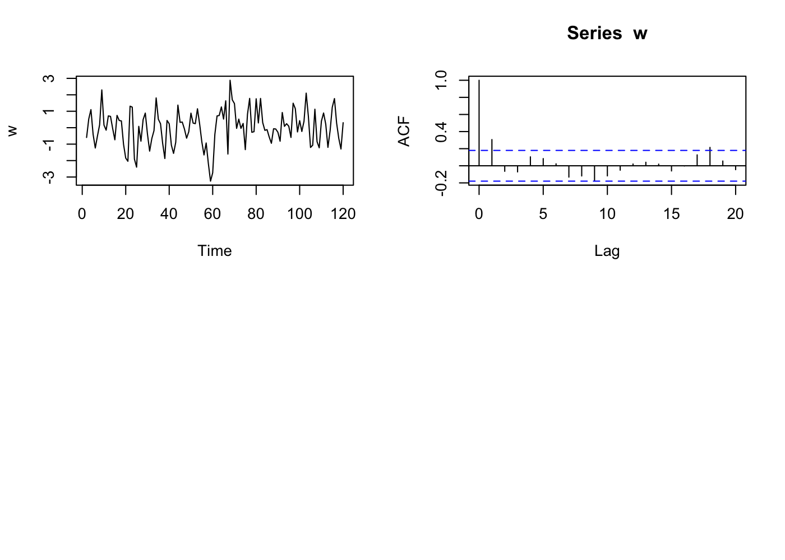


```r
library(forecast)
accuracy(fit.ts) #accuracy test of our above time series
```

```
##                         ME     RMSE      MAE       MPE    MAPE     MASE
## Training set -9.078371e-13 4.377476 3.402407 -53.11161 147.684 3.944774
##                  ACF1
## Training set 0.962599
```

You may need to install the R package *tseries* by


```r
install.packages("tseries")
```


#Problem Set  

## Toothpaste example  


```r
library(tseries)
# I saved the data in the SAS program to a txt file.
z <- read.ts("~/Documents/MATH3710/datafiles/toothpaste.txt")
w <- diff(z, lag = 1) # first differences
ts <- arima(z) # no fit yet
plot(z) #is this stationary?  NO!
```

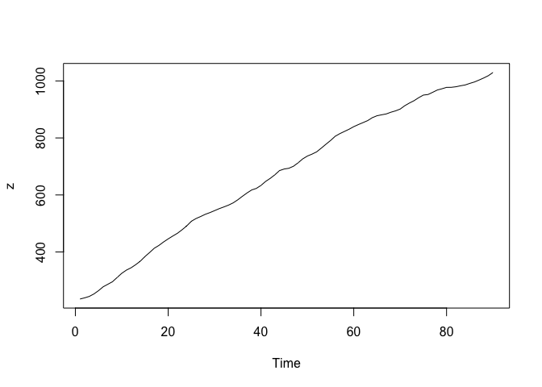\

```r
plot(w) # much more "stationary", Yes
```

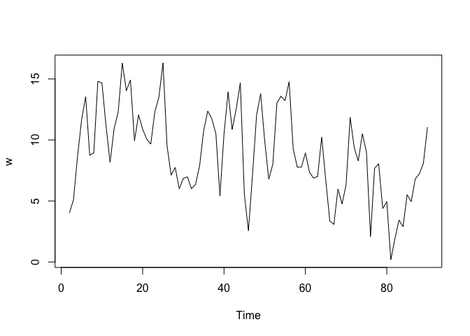\

```r
# r_2 calculation, using first 10 z_i
z.8 <- z[1:8]; z.10 <- z[1:10]
nume <- sum((z.8 - mean(z.10))*(z.10[3:10] - mean(z.10)))
denom <- sum((z.10 - mean(z.10))^2)
nume/denom
```

```
## [1] 0.4135903
```

```r
# fit an AR1 model
ar1 <- arima(w, c(1,0,0))
```


## Viscosity Example  


```r
# the txt file is in the datafiles directory
z <- read.ts("~/Documents/MATH3710/datafiles/viscosity.txt")
ar0 <- arima(z)
```


## Shampoo Example


```r
z <- read.ts("~/Documents/MATH3710/datafiles/time.txt")
e <- cbind(acf(z)$acf[-1], pacf(z)$acf)[1:7,]
```

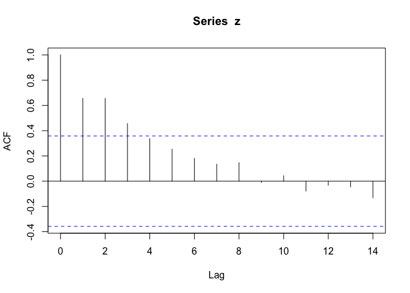\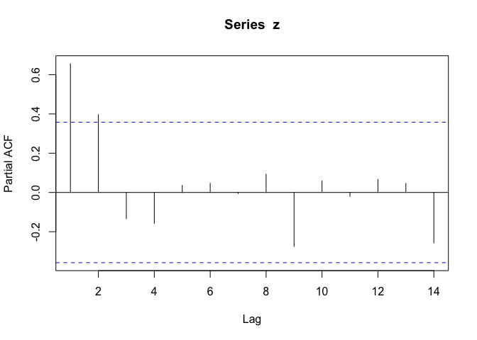\

```r
colnames(e) <- c("r_k", "r_kk")
e
```

```
##            r_k         r_kk
## [1,] 0.6558947  0.655894651
## [2,] 0.6561780  0.396594115
## [3,] 0.4556832 -0.133568221
## [4,] 0.3375957 -0.157344468
## [5,] 0.2533419  0.035706257
## [6,] 0.1806711  0.046849533
## [7,] 0.1347042 -0.005401437
```

```r
arima(z) # original model
```

```
## 
## Call:
## arima(x = z)
## 
## Coefficients:
##       intercept
##        402.5333
## s.e.     6.7780
## 
## sigma^2 estimated as 1378:  log likelihood = -151,  aic = 305.99
```

```r
# first differences model
w <- diff(z, lag = 1)
arima(w)
```

```
## 
## Call:
## arima(x = w)
## 
## Coefficients:
##       intercept
##          2.6897
## s.e.     5.3421
## 
## sigma^2 estimated as 827.6:  log likelihood = -138.57,  aic = 281.14
```

```r
e <- cbind(acf(w, plot = FALSE)$acf[-1], pacf(w, plot = FALSE)$acf)[1:7,]
colnames(e) <- c("r_k", "r_kk")
e
```

```
##              r_k        r_kk
## [1,] -0.64181314 -0.64181314
## [2,]  0.39066389 -0.03615215
## [3,] -0.17276486  0.10868242
## [4,]  0.02702251 -0.05435909
## [5,]  0.02120820 -0.03078666
## [6,] -0.07237834 -0.06471119
## [7,] -0.10027866 -0.30601684
```


## Example of Time Series using R  

###Air Passengers Example:


```r
air <- AirPassengers
par(mfrow=c(2,2))
ts.plot(air)
acf(air)
pacf(air)
```

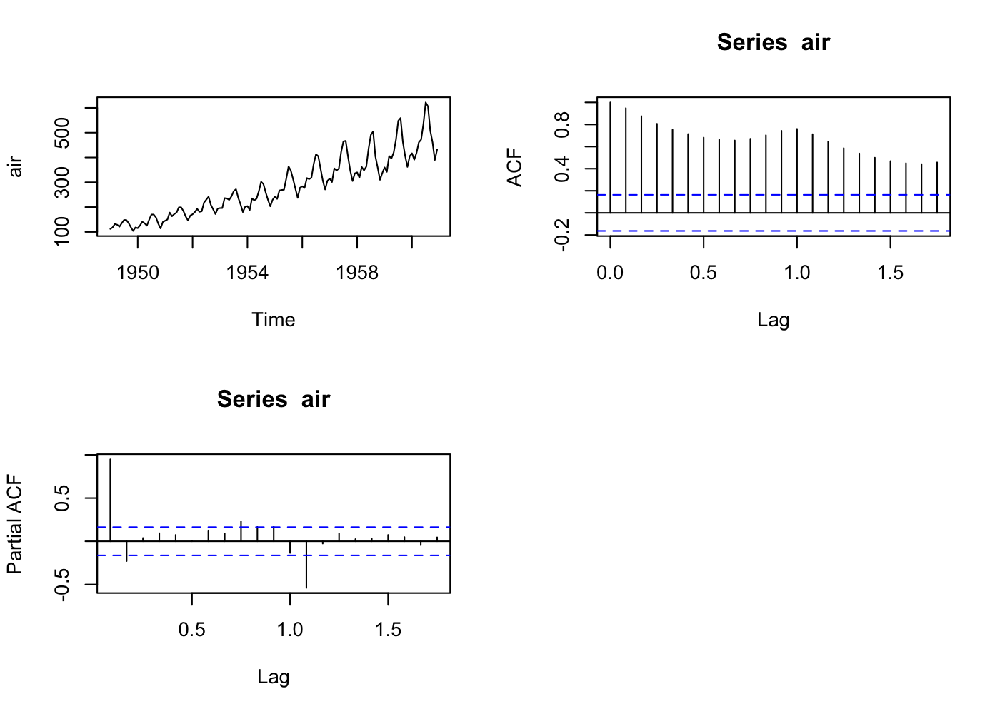


```r
plot(decompose(air))
```

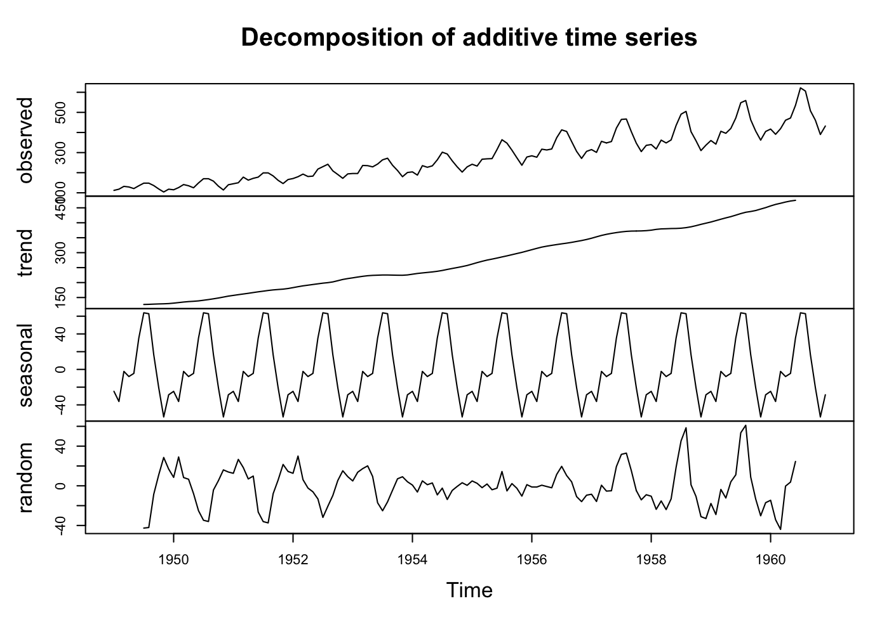

### ARIMA model

```r
air.fit <- arima(air,order=c(0,1,1), seasonal=list(order=c(0,1,1),
                                                   period=12))
tsdiag(air.fit)
```

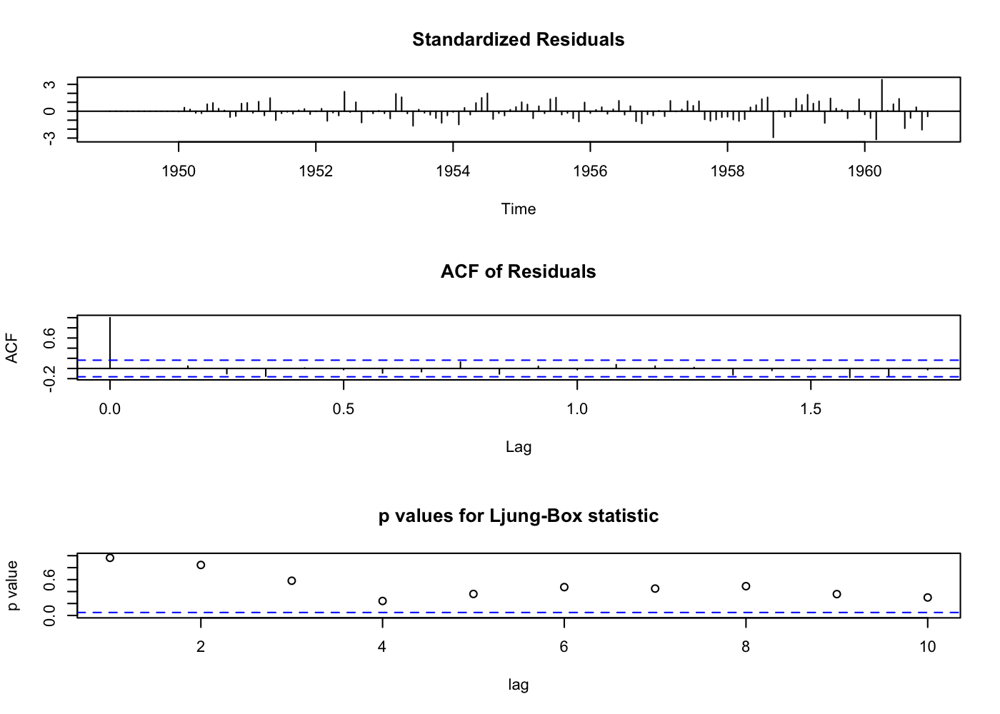\

```r
library(forecast)
air.forecast <- forecast(air.fit)
plot.forecast(air.forecast)
```

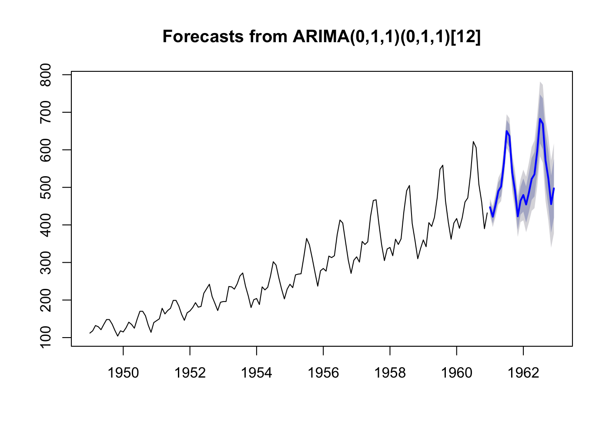\
