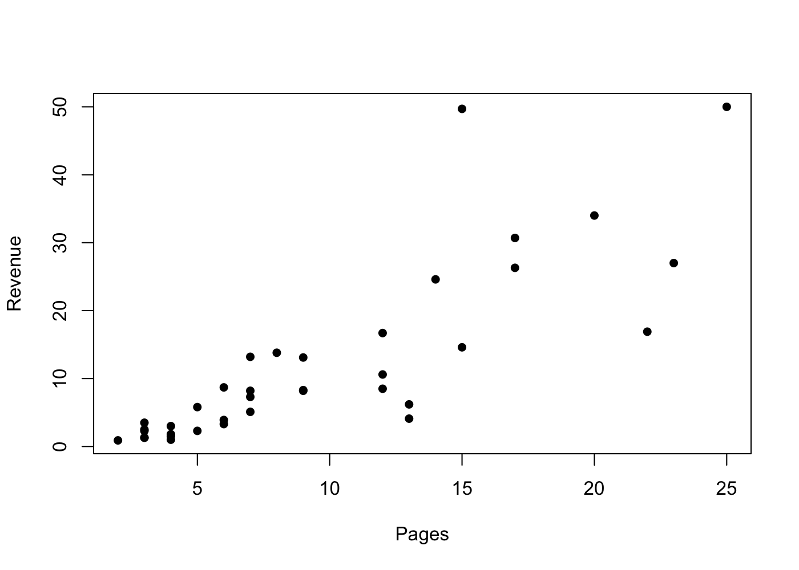
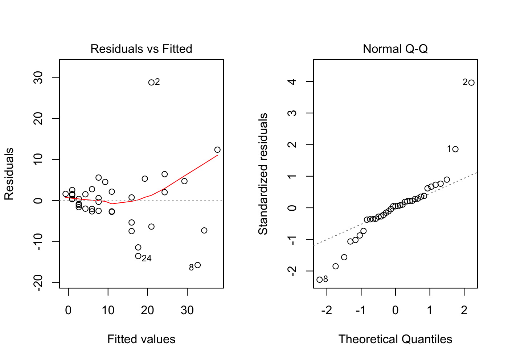
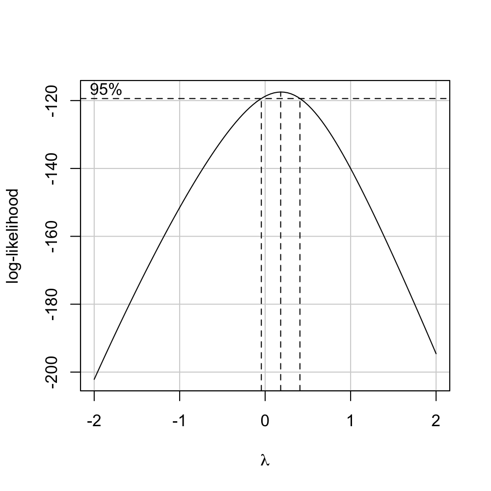
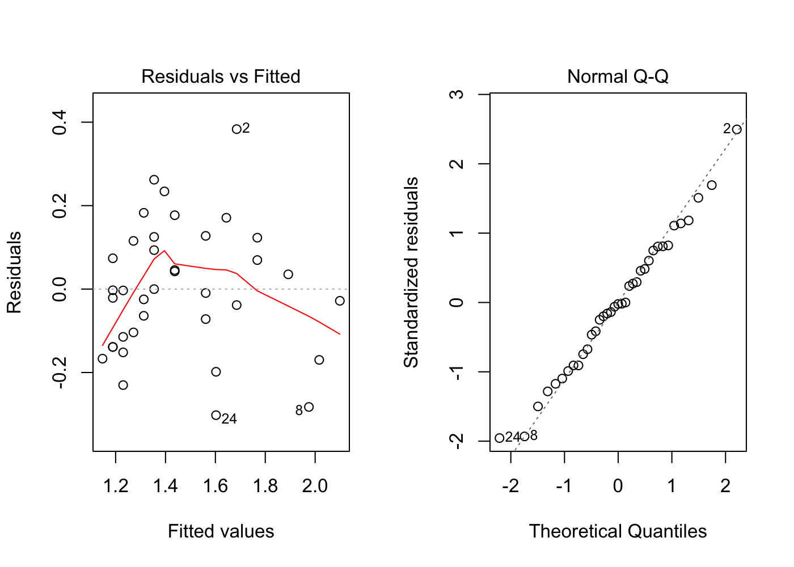
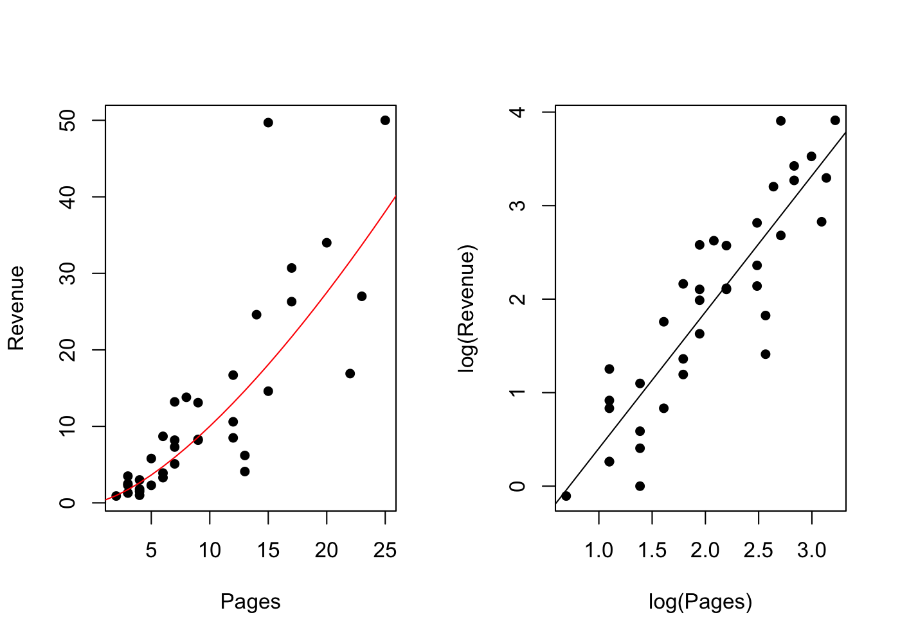
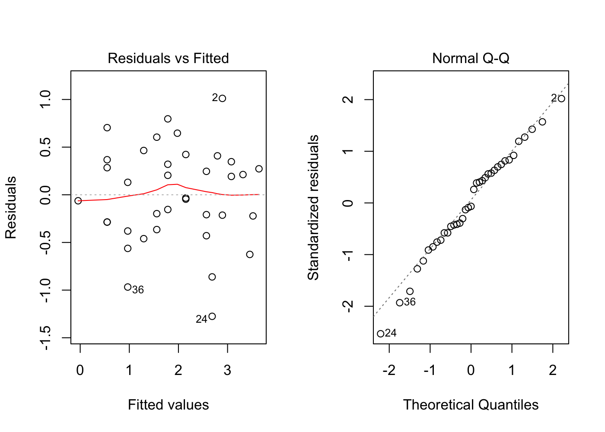

# Advertising
Cody Frisby  
February 12, 2016  

Advertising data shared in class


```r
# read the data file
ads <- read.csv("~/Documents/MATH3710/transformations/Advertising.csv")
# scatter plot
plot(Revenue ~ Pages, data = ads, pch = 16)
```



Linearity assumption from scatter plot isn't looking very good here.  Let's fit a linear model and look at some residual plots.


```r
fit <- lm(Revenue ~ Pages, data = ads)
par(mfrow=c(1,2))
plot(fit, which = c(1,2))
```



Residuals do not look good for assumptions of linearity or equality of variances.  We will want to look into transforming the data.


```r
# you need to install this library if you don't have it
library(car)
boxCox(fit)
```



This plot visullay shows us what powers of lambda may be optimal to raise Revenue to for a best fit model.  Note, zero is inside the vertical dotted lines.  This would correspond to taking the log of y as the transformation.


```r
# also this function from the same package will explicitly print out the 
# best power of lambda.
lam <- powerTransform(fit)
lam <- lam$lambda
lam
```

```
##        Y1 
## 0.1860923
```

Now we can try to fit a model using this value of lambda.  Note: I've already stored this value in a variable called lam.


```r
fit1 <- lm(Revenue^lam ~ Pages, data = ads)
par(mfrow = c(1,2))
plot(fit1, which = c(1,2))
```



This algorithm gives us the "best" number for lambda.  But for purposes of repeating the example from class I am going to do the same transformation as in class.


```r
fit3 <- lm(log(Revenue) ~ log(Pages), data = ads)
par(mfrow = c(1,2))
plot(Revenue ~ Pages, data = ads, pch = 16)
lines(1:50, exp(fit3$coefficients[1] + fit3$coefficients[2]*log(1:50)), col=2)
plot(log(Revenue) ~ log(Pages), data = ads, pch=16)
abline(fit3)
```




Let's look at the residual plots from this model:


```r
par(mfrow = c(1,2))
plot(fit3, which = c(1,2))
```



These look even better than our residual plots from the transformation above where we raised our data to the recommended value of lambda from the powerTransform function.  This may be because we are making two transformations.  We took the log of both x and y.  

**Use the transformed model to predict Revenue when pages is 2 with confidence intervals.**

```r
predict(fit3, newdata = data.frame(Pages = 2), interval = "confidence", se.fit = T)$fit
```

```
##           fit        lwr       upr
## 1 -0.04264882 -0.4260982 0.3408006
```

```r
# note, fit3 is the linear model where we did log(y) ~ log(x)
```

**Now use this to back calculate like the notes show**


```r
p.2 <- predict(fit3, newdata = data.frame(Pages = 2), interval = "confidence", se.fit = T)
exp(p.2$fit)
```

```
##         fit       lwr      upr
## 1 0.9582479 0.6530522 1.406073
```

**Now when pages is 7**

```r
p.7 <- predict(fit3, newdata = data.frame(Pages = 7), interval = "confidence", se.fit = T)
p.7$fit
```

```
##        fit      lwr      upr
## 1 1.783617 1.610136 1.957098
```

```r
exp(p.7$fit) # exp() is e raised to some power.  try it, exp(1) = 2.718282
```

```
##        fit      lwr      upr
## 1 5.951343 5.003489 7.078757
```
