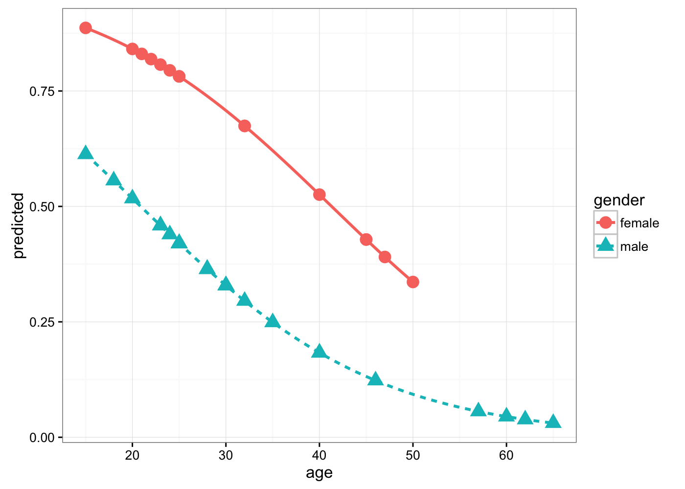

# Logistic Regression
Cody Frisby  
April 2, 2016  

###DONNER PARTY  
In 1846, the Donner party (Donner and Reed families) left Springfield, Illinois for California in covered wagons.  After reaching Fort Bridger, Wyoming, the leaders decided to find a new route to Sacramento.  They became stranded in the eastern Sierra Nevada mountains at a place now called Donner Pass when the region was hit by heavy snows in late October.  By the time the survivors were rescued on April 21, 1847, 40 out of the 87 had died.  We will analyze a data set containing the 45 adults (age 18 and over) for this party.

|Variable|Description|
|:------|:------|
|age|Age of individual|
|sex|	1 – male, 0 - female|
|survive|	1 – survived, 0 - died|

####RQ1:  What is the relationship between survival and gender?  
####RQ2:  Predict the probability of survival as a function of age.  
####RQ3:  After taking into account age, are women more likely to survive harsh conditions than men?  

  First, we get the data into R and take a look at some summarys.  


```r
don <- read.table("~/Documents/MATH3710/donnerparty/donner.txt")
names(don) <- c("age", "sex", "survive")
summary(don) # look at a summary of the data frame
```

```
##       age            sex            survive      
##  Min.   :15.0   Min.   :0.0000   Min.   :0.0000  
##  1st Qu.:24.0   1st Qu.:0.0000   1st Qu.:0.0000  
##  Median :28.0   Median :1.0000   Median :0.0000  
##  Mean   :31.8   Mean   :0.6667   Mean   :0.4444  
##  3rd Qu.:40.0   3rd Qu.:1.0000   3rd Qu.:1.0000  
##  Max.   :65.0   Max.   :1.0000   Max.   :1.0000
```

```r
attach(don) # this "attaches" the data frame to our session
table(sex, survive) # table of sex vs. survive
```

```
##    survive
## sex  0  1
##   0  5 10
##   1 20 10
```

```r
tmp <- chisq.test(sex, survive, correct = F) 
# chi square test for the same
tmp$expected
```

```
##    survive
## sex         0         1
##   0  8.333333  6.666667
##   1 16.666667 13.333333
```

```r
tmp
```

```
## 
## 	Pearson's Chi-squared test
## 
## data:  sex and survive
## X-squared = 4.5, df = 1, p-value = 0.03389
```

##Start Logistic Regression  

The logistic regression function is $$\pi(x) = P[Y = 1 | X = x] = \frac{e^{\beta_0 + \beta_1x}}{1 + e^{\beta_0 + \beta_1x}}$$  and is NOT linear.  
 Here we fit the donner data to a logistic model using R.


```r
fit <- glm(survive ~ age, family = binomial(), data = don)
summary(fit)$coef # betas
```

```
##                Estimate Std. Error   z value   Pr(>|z|)
## (Intercept)  1.81851831 0.99937233  1.819660 0.06881073
## age         -0.06647028 0.03222003 -2.063011 0.03911155
```

```r
# or
#anova(fit, test = "Chisq")
# use our model to predict
age <- c(10,20,30,40,50,60)
# odds ratio
exp(predict(fit, data.frame(age)))
```

```
##         1         2         3         4         5         6 
## 3.1702660 1.6308685 0.8389618 0.4315841 0.2220183 0.1142121
```

```r
odds <- exp(predict(fit, data.frame(age)))
p <- odds/(1+odds)
# odds go down with age. 
knitr::kable(cbind(age,odds,p))
```


 age        odds           p
----  ----------  ----------
  10   3.1702660   0.7602071
  20   1.6308685   0.6198974
  30   0.8389618   0.4562149
  40   0.4315841   0.3014731
  50   0.2220183   0.1816816
  60   0.1142121   0.1025048

Look at a plot of the predicted values vs. age  


```r
plot(don$age, fit$fitted.values, ylab = "Predicted", xlab = "age",
     pch=16, ylim = c(0,1))
```


And to see the odds Ratio:


```r
exp(summary(fit)$coef) # odds ratio
```

```
##              Estimate Std. Error   z value Pr(>|z|)
## (Intercept) 6.1627204   2.716576 6.1697632 1.071233
## age         0.9356907   1.032745 0.1270707 1.039886
```

```r
exp(confint(fit)) #confidence interval
```

```
## Waiting for profiling to be done...
```

```
##                 2.5 %     97.5 %
## (Intercept) 0.9940306 54.0635442
## age         0.8695861  0.9898905
```

So the logit model can be written as $$ln(\frac{\pi}{1 - \pi}) = \beta_0 + \beta_1x_1 + ... + \beta_kx_k$$

Notes:  
1. The logarithm of the odds ratio is called a logit.  
2. $0 \leq \pi \leq 1$ but $- \infty < ln(\frac{\pi}{1 - \pi}) < \infty$ which makes the logit more appropriate for an unbounded linear function.  
We use MLE (maximum liklihood estimation) to estimate the values for $\beta_i$.  

## Playing around with the class notes and R functions. 

This is the logistic regression function shared in class and in the notes.  

```r
# here we define a function 
logit <- function(x){
  -2*log(2) + log(2)*x
}
# here we use the function above on some inputs
gpa <- c(0,1,2,3,4)
logit(gpa)
```

```
## [1] -1.3862944 -0.6931472  0.0000000  0.6931472  1.3862944
```

```r
# and we raise this here to get the odds
exp(logit(gpa))
```

```
## [1] 0.25 0.50 1.00 2.00 4.00
```

```r
odds <- exp(logit(gpa))
# and to go back to probabilities
odds/(1+odds)
```

```
## [1] 0.2000000 0.3333333 0.5000000 0.6666667 0.8000000
```

```r
p <- odds/(1+odds)
knitr::kable(cbind(gpa,odds,p))
```


 gpa   odds           p
----  -----  ----------
   0   0.25   0.2000000
   1   0.50   0.3333333
   2   1.00   0.5000000
   3   2.00   0.6666667
   4   4.00   0.8000000


Here's how you would do a table of the values using R.  Remeber, we have already attached the data frame donner.  


```r
with(don, table(age, survive))
```

```
##     survive
## age  0 1
##   15 1 1
##   18 0 1
##   20 0 2
##   21 0 1
##   22 0 1
##   23 2 2
##   24 1 1
##   25 6 2
##   28 2 2
##   30 3 1
##   32 0 3
##   35 1 0
##   40 1 2
##   45 2 0
##   46 0 1
##   47 1 0
##   50 1 0
##   57 1 0
##   60 1 0
##   62 1 0
##   65 1 0
```

```r
with(don, chisq.test(age, survive))
```

```
## Warning in chisq.test(age, survive): Chi-squared approximation may be
## incorrect
```

```
## 
## 	Pearson's Chi-squared test
## 
## data:  age and survive
## X-squared = 21.038, df = 20, p-value = 0.3949
```


```r
fit2 <- glm(survive ~ age+sex, family = binomial(link = "logit"), 
            data = don)
summary(fit2)
```

```
## 
## Call:
## glm(formula = survive ~ age + sex, family = binomial(link = "logit"), 
##     data = don)
## 
## Deviance Residuals: 
##     Min       1Q   Median       3Q      Max  
## -1.7445  -1.0441  -0.3029   0.8877   2.0472  
## 
## Coefficients:
##             Estimate Std. Error z value Pr(>|z|)  
## (Intercept)  3.23041    1.38686   2.329   0.0198 *
## age         -0.07820    0.03728  -2.097   0.0359 *
## sex         -1.59729    0.75547  -2.114   0.0345 *
## ---
## Signif. codes:  0 '***' 0.001 '**' 0.01 '*' 0.05 '.' 0.1 ' ' 1
## 
## (Dispersion parameter for binomial family taken to be 1)
## 
##     Null deviance: 61.827  on 44  degrees of freedom
## Residual deviance: 51.256  on 42  degrees of freedom
## AIC: 57.256
## 
## Number of Fisher Scoring iterations: 4
```

### Performing the Hosmer -  Lemeshow Goodness of Fit Test  

Install the package "ResourceSelection" by typing in install.packages("ResourceSelection").  


```r
library(ResourceSelection)
```

```
## ResourceSelection 0.2-6 	 2016-02-15
```

```r
hl <- hoslem.test(fit$y, fit$fitted.values, g = 8)
hl
```

```
## 
## 	Hosmer and Lemeshow goodness of fit (GOF) test
## 
## data:  fit$y, fit$fitted.values
## X-squared = 6.3529, df = 6, p-value = 0.3848
```

```r
# we can also look at some tables
cbind(hl$observed, hl$expected)
```

```
##                y0 y1     yhat0     yhat1
## [0.0757,0.219]  6  0 5.2136098 0.7863902
## (0.219,0.301]   3  3 4.3982358 1.6017642
## (0.301,0.456]   4  4 4.5290438 3.4709562
## (0.456,0.489]   2  2 2.0426431 1.9573569
## (0.489,0.539]   6  2 3.6871178 4.3128822
## (0.539,0.556]   1  1 0.8888454 1.1111546
## (0.556,0.596]   2  3 2.1241939 2.8758061
## (0.596,0.695]   1  5 2.1163104 3.8836896
```


## Concordance  
thanks to 
http://shashiasrblog.blogspot.com/2014/01/binary-logistic-regression-on-r.html
for this function


```r
###########################################################
# Function OptimisedConc : for concordance, discordance, ties
# The function returns Concordance, discordance, and ties
# by taking a glm binomial model result as input.
# Although it still uses two-for loops, it optimises the code
# by creating initial zero matrices
###########################################################
OptimisedConc=function(model)
{
  Data = cbind(model$y, model$fitted.values) 
  ones = Data[Data[,1] == 1,]
  zeros = Data[Data[,1] == 0,]
  conc=matrix(0, dim(zeros)[1], dim(ones)[1])
  disc=matrix(0, dim(zeros)[1], dim(ones)[1])
  ties=matrix(0, dim(zeros)[1], dim(ones)[1])
  for (j in 1:dim(zeros)[1])
  {
    for (i in 1:dim(ones)[1])
    {
      if (ones[i,2]>zeros[j,2])
      {conc[j,i]=1}
      else if (ones[i,2]<zeros[j,2])
      {disc[j,i]=1}
      else if (ones[i,2]==zeros[j,2])
      {ties[j,i]=1}
    }
  }
  Pairs=dim(zeros)[1]*dim(ones)[1]
  PercentConcordance=(sum(conc)/Pairs)*100
  PercentDiscordance=(sum(disc)/Pairs)*100
  PercentTied=(sum(ties)/Pairs)*100
  return(list("Percent Concordance"=PercentConcordance,"Percent Discordance"=PercentDiscordance,"Percent Tied"=PercentTied,"Pairs"=Pairs))
}
```

This function, OptimisedConc, takes one input, your logistic model and returns a list of values. 


```r
OptimisedConc(fit2)
```

```
## $`Percent Concordance`
## [1] 73
## 
## $`Percent Discordance`
## [1] 23.8
## 
## $`Percent Tied`
## [1] 3.2
## 
## $Pairs
## [1] 500
```

## ROC curves in R  

Let's install another package for this job, pROC, by calling install.packages("pROC"). 


```r
library(pROC)
```

```
## Type 'citation("pROC")' for a citation.
```

```
## 
## Attaching package: 'pROC'
```

```
## The following objects are masked from 'package:stats':
## 
##     cov, smooth, var
```

```r
roc(fit2$y, fit2$fitted.values)
```

```
## 
## Call:
## roc.default(response = fit2$y, predictor = fit2$fitted.values)
## 
## Data: fit2$fitted.values in 25 controls (fit2$y 0) < 20 cases (fit2$y 1).
## Area under the curve: 0.746
```

```r
plot(roc(fit2$y, fit2$fitted.values))
```


```
## 
## Call:
## roc.default(response = fit2$y, predictor = fit2$fitted.values)
## 
## Data: fit2$fitted.values in 25 controls (fit2$y 0) < 20 cases (fit2$y 1).
## Area under the curve: 0.746
```

```r
# this is why I love R
```


## Classification Table  

We can create our own classification table using R and a logical statement for the value of pi we'd like to classify on, for example $\pi > 0.5$.  


```r
theprobs <- fit$fitted.values
table(fit$y, 1*(theprobs > .5))
```

```
##    
##      0  1
##   0 15 10
##   1  9 11
```


- Plot of predicted vs age by sex.


```r
# adding a new column to sore
don$gender <- 0
don$predicted <- fit2$fitted.values
don[don$sex == 1, "gender"] <- "male"
don[don$sex == 0, "gender"] <- "female"
don$gender <- factor(don$gender)
library(ggplot2) # using ggplot2 to create this plot
g <- ggplot(data = don, aes(x = age, y = predicted))
g <- g + geom_point(aes(shape = gender, colour = gender), size = 4) + theme_bw()
g <- g + geom_smooth(aes(group=gender, linetype = gender, color = gender), 
                     method = "glm", 
          method.args = list(family = "binomial"), se = F) 
g
```



## Interaction Term, Our third model for Donner Party Data


```r
fit3 <- glm(survive ~ age*sex, family = binomial(link = "logit"), 
            data = don)
summary(fit3)
```

```
## 
## Call:
## glm(formula = survive ~ age * sex, family = binomial(link = "logit"), 
##     data = don)
## 
## Deviance Residuals: 
##     Min       1Q   Median       3Q      Max  
## -2.2279  -0.9388  -0.5550   0.7794   1.6998  
## 
## Coefficients:
##             Estimate Std. Error z value Pr(>|z|)  
## (Intercept)  7.24638    3.20517   2.261   0.0238 *
## age         -0.19407    0.08742  -2.220   0.0264 *
## sex         -6.92805    3.39887  -2.038   0.0415 *
## age:sex      0.16160    0.09426   1.714   0.0865 .
## ---
## Signif. codes:  0 '***' 0.001 '**' 0.01 '*' 0.05 '.' 0.1 ' ' 1
## 
## (Dispersion parameter for binomial family taken to be 1)
## 
##     Null deviance: 61.827  on 44  degrees of freedom
## Residual deviance: 47.346  on 41  degrees of freedom
## AIC: 55.346
## 
## Number of Fisher Scoring iterations: 5
```

```r
# let's predict for females
age <- c(20,30,40,50,60)
# odds ratio
exp(predict(fit3, data.frame(age, sex = (rep(0,5)))))
```

```
##           1           2           3           4           5 
## 28.93066590  4.15437010  0.59655699  0.08566407  0.01230114
```

```r
odds <- exp(predict(fit3, data.frame(age, sex = rep(0,5))))
p <- odds/(1+odds)
p
```

```
##          1          2          3          4          5 
## 0.96658945 0.80598987 0.37365217 0.07890476 0.01215166
```

```r
# and now for males
exp(predict(fit3, data.frame(age, sex = (rep(1,5)))))
```

```
##         1         2         3         4         5 
## 0.7180543 0.5189318 0.3750277 0.2710294 0.1958706
```

```r
odds <- exp(predict(fit3, data.frame(age, sex = rep(1,5))))
p <- odds/(1+odds)
p
```

```
##         1         2         3         4         5 
## 0.4179462 0.3416426 0.2727419 0.2132361 0.1637892
```

```r
# do we want to get this interaction term in??? Yes!
anova(fit2, fit3, test = "LRT")
```

```
## Analysis of Deviance Table
## 
## Model 1: survive ~ age + sex
## Model 2: survive ~ age * sex
##   Resid. Df Resid. Dev Df Deviance Pr(>Chi)  
## 1        42     51.256                       
## 2        41     47.346  1   3.9099    0.048 *
## ---
## Signif. codes:  0 '***' 0.001 '**' 0.01 '*' 0.05 '.' 0.1 ' ' 1
```
