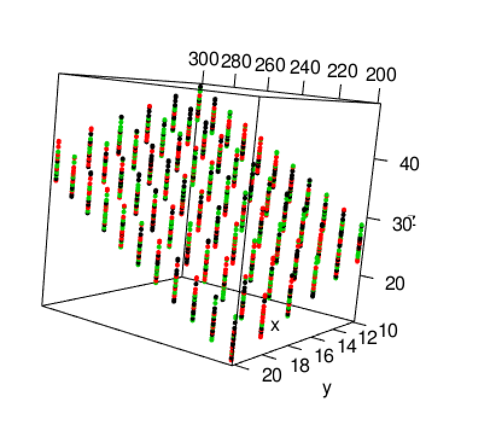

Supervisor performance example shared in class:  Companies are continually evaluating supervisors to, not only determine adequate performance, but also gauge employee morale (an important indicator for employee productivity).  In an effort to understand the important aspects of a satisfactory supervisor, employees at a certain company were asked to provide an overall rating and scores on 6 characteristics of their immediate managers.  Namely, employees were asked to rate the following statements on a scale from 0 to 100.

|Variable | Description |
|:------|:------|
|Rating | Overall rating of the supervisor performance |
|Complaints | Score for "Your supervisor handles employee complaints appropriately." |
|Privileges | Score for "Your supervisor allows special privileges."
|Learn | Score for "Your supervisor provides opportunities to learn new things."
|Raises | Score for "Your supervisor bases raises on performance." |
|Critical | Score for "Your supervisor is too critical of poor performance." |
|Advance | Score for "I am not satisfied with the rate I am advancing in the company." |

If we are going to get started doing multiple linear regression we are going to need to review some linear algebra concepts.  Chapter 1 section 8 in the Graybill book reviews the concepts.  Review matrices and vector operations.   

**A note for doing linear algebra operations in R.  There is an excellent library that mimics a lot of the same syntax as matlab.  Install the pracma library by typing in install.packages("pracma") and after that finishes installing call the library by library(pracma).**  

Rendering matrices using knitr and R markdown.    

$$\mathbf{A} = \left[\begin{array}
{rrr}
a_{11} & a_{12} & a_{13} \\
a_{21} & a_{22} & a_{23} \\
a_{31} & a_{32} & a_{33} 
\end{array}\right]$$


  
There is an example on page 225 (4.2.1) in the Graybill book.  The PLASTICS.DAT file in the datafiles directory contains the data.  


```{r}
plastic <- read.table("~/Documents/MATH3710/datafiles/PLASTIC.DAT", header = FALSE)
# we need the column names added.  
plastic <- plastic[,2:4] # drops the column not needed.
colnames(plastic) <- c("strength", "temp", "pressure")

# snap shot of the data 
(head(plastic))
```


```{r, message=FALSE}
fit.plastic <- lm(strength ~ temp + pressure, data = plastic)
# load this library, run install.packages("dplyr") if you do not have it.
library(dplyr)
plastic.summary <- plastic %>%
  group_by(temp, pressure) %>%
  summarise_each(funs(mean, sd), strength)
plastic.summary
```
**Note, the difference between the text's standard deviation and this one is due to a sample and population calculation.  R default is to calculate the sample standard devidation.**

Playing around with R 3d plotting library:

Image of a 3D plot of the three variables:  

\begin{center}
\includegraphics[width=75mm]{figures/3dplot.png}
\end{center}




Back to the Supervisor data.  Let's get it loaded into R first, and repeat some of the steps shared in the SAS code from class:
```{r, warning=FALSE}
sups <- read.table("~/Documents/MATH3710/multLR/Supervisor.txt", header = TRUE)
sups.pre <- sups
# SAS code :
# w = Complaints + Learn;
# v = Complaints - Learn;
# yprime = Ratings - Learn;
sups$w <- sups$Complaints + sups$Learn
sups$v <- sups$Complaints - sups$Learn
sups$yprime <- sups$Rating - sups$Learn
# SAS:
# proc reg data = supervisor;
# model yprime = v;
fit1 <- lm(Rating ~ Complaints+Privileges+Critical, data = sups)
fit2 <- lm(Rating ~ Learn+Raises+Advance, data = sups)
fit3 <- lm(Rating ~ w, data = sups)
fit4 <- lm(yprime ~ v, data = sups)
fit5 <- lm(Rating ~ Complaints+Learn, data=sups)
# here is the model with all variables before adding v and w
fit6 <- lm(Rating ~ ., data = sups.pre)
```

## Diagnostics of all the above models:

### Fit model 1  
```{r, dpi=200, fig.align='center', warning=F, message=F}
# summary(fit1)$r.squared # just print r squared value
# summary(fit1)$coeff # just print the model coefficients
summary(fit1) # prints summary of model
par(mfrow = c(1,2)) # sets up side by side plots
plot(fit1, which = c(1,2))

e <- residuals(fit1)
# plot residuals by all predictors
par(mfrow = c(2,2))
plot(sups$Complaints, e, col = "blue", pch = 16); abline(h=0, lty = 3)
plot(sups$Privileges, e, col = "blue", pch = 16); abline(h=0, lty = 3)
plot(sups$Critical, e, col = "blue", pch = 16); abline(h=0, lty = 3)
```

### Fit model 2  
```{r, dpi=200, fig.align='center', warning=F, message=F}
summary(fit2) # prints summary of model
par(mfrow = c(1,2)) # sets up side by side plots
plot(fit2, which = c(1,2))

e <- residuals(fit2)
# plot residuals by all predictors
par(mfrow = c(2,2))
plot(sups$Learn, e, col = "blue", pch = 16); abline(h=0, lty = 3)
plot(sups$Raises, e, col = "blue", pch = 16); abline(h=0, lty = 3)
plot(sups$Advance, e, col = "blue", pch = 16); abline(h=0, lty = 3)
```

### Fit model 3  
```{r, dpi=200, fig.align='center', warning=F, message=F}
summary(fit3) # prints summary of model
par(mfrow = c(1,2)) # sets up side by side plots
plot(fit3, which = c(1,2))
e <- residuals(fit3)
# plot residuals by all predictors
# redundant plot below as above
#plot(sups$w, e, col = "blue", pch = 16); abline(h=0, lty = 3)
```

#### Fit Plot for model 3  
```{r, dpi=200, fig.align='center', message = FALSE, warning=FALSE}
library(ggplot2)
g <- ggplot(sups, aes(x = Rating, y = w))
g <- g + geom_point()
g <- g + stat_smooth(method = "lm", formula = y ~ x)
g
```
*Note, ggplot automatically adds confidence bands to the plot.*

### Fit model 4  
```{r, dpi=200, fig.align='center', warning=F, message=F}
summary(fit4) # prints summary of model
par(mfrow = c(1,2)) # sets up side by side plots
plot(fit4, which = c(1,2))

e <- residuals(fit4)
# plot residuals by all predictors
# redundant plot below as above
#plot(sups$w, e, col = "blue", pch = 16); abline(h=0, lty = 3)
```

#### Fit Plot for model 4  
```{r, dpi=200, fig.align='center', message = FALSE, warning=FALSE}
library(ggplot2)
g <- ggplot(sups, aes(x = yprime, y = v))
g <- g + geom_point()
g <- g + stat_smooth(method = "lm", formula = y ~ x)
g
```

### Fit model 5
```{r, dpi=200, fig.align='center', warning=F, message=F}
summary(fit5) # prints summary of model
par(mfrow = c(1,2)) # sets up side by side plots
plot(fit5, which = c(1,2))

e <- residuals(fit5)
# plot residuals by all predictors
par(mfrow = c(1,2))
plot(sups$Complaints, e, col = "blue", pch = 16); abline(h=0, lty = 3)
plot(sups$Learn, e, col = "blue", pch = 16); abline(h=0, lty = 3)
```

### Fit model 6
```{r, dpi=200, fig.align='center', warning=F, message=F}
summary(fit6) # prints summary of model
par(mfrow = c(1,2)) # sets up side by side plots
plot(fit6, which = c(1,2))

e <- residuals(fit6)
# plot residuals by all predictors
par(mfrow = c(2,3))
plot(sups$Complaints, e, col = "blue", pch = 16); abline(h=0, lty = 3)
plot(sups$Privileges, e, col = "blue", pch = 16); abline(h=0, lty = 3)
plot(sups$Learn, e, col = "blue", pch = 16); abline(h=0, lty = 3)
plot(sups$Raises, e, col = "blue", pch = 16); abline(h=0, lty = 3)
plot(sups$Critical, e, col = "blue", pch = 16); abline(h=0, lty = 3)
plot(sups$Advance, e, col = "blue", pch = 16); abline(h=0, lty = 3)
```

Here's a scatterplot matrix of the supervisor data without the added variables

```{r, dpi=300, fig.align='center'}
# note, I created this variable before adding all the additional vars.
plot(sups.pre, main = "Scatterplot Matrix")
```

Notice the multi-colinearity of a few of the x variables with each other.  Particularly Learn vs Raises.

Here, I'd reccomend installing the GGally package.  It is a companion package to ggplot2.  This next plot is slow but very informative for multi linear regression.  

```{r, dpi=200, fig.align='center', cache=TRUE, message=FALSE, warning=FALSE}
library(GGally)
gsups <- ggpairs(sups.pre, lower = list(continuous = "smooth"))
gsups
```

Correlation coefficients for our supervisor data.  Note that this is a part of the above plot.  I do this below just to show you how its done in R.

```{r}
cor(sups.pre)
```

Now, using the model to make predictions:

```{r}
# test the glm model
test <- data.frame(Complaints = c(61,71,61), Privileges = c(45,45,45), 
Learn = c(56,56,56), Raises = c(71,71,81), Critical = c(57,57,57), Advance = c(25,25,25))
fit.all <- glm(Rating ~ ., data = sups.pre)
sup.pred <- predict.glm(fit.all, newdata = test, interval =
                           "confidence", se.fit = TRUE)
preds <- cbind(sup.pred$fit, sup.pred$se.fit)
colnames(preds) <- c("estimate", "std error")
preds
summary(fit.all)$coeff # print the coefficients from the glm model.
```

Summary of the glm model from above

```{r, dpi=200, fig.align='center', warning=F, message=F}
summary(fit.all) # prints summary of model
par(mfrow = c(1,2)) # sets up side by side plots
plot(fit.all, which = c(1,2))
e <- residuals(fit.all)
# plot residuals by all predictors
par(mfrow = c(2,3))
plot(sups$Complaints, e, col = "blue", pch = 16); abline(h=0, lty = 3)
plot(sups$Privileges, e, col = "blue", pch = 16); abline(h=0, lty = 3)
plot(sups$Learn, e, col = "blue", pch = 16); abline(h=0, lty = 3)
plot(sups$Raises, e, col = "blue", pch = 16); abline(h=0, lty = 3)
plot(sups$Critical, e, col = "blue", pch = 16); abline(h=0, lty = 3)
plot(sups$Advance, e, col = "blue", pch = 16); abline(h=0, lty = 3)
```

Now we need to add the 10,000 iterations like professor did using SAS.
I don't yet know how to do this without a for loop in R so this is a slow block of code.  

```{r, fig.align='center', dpi=200, cache=T}
bias <- vector()
sups$index <- 1:30
for (i in 1:10000) {
  ind <- sample(1:dim(sups)[1], 10)
  # now we can subset the carmpg data frame into 2 data frames using this index.
  test <- sups[sups$index %in% ind, ]
  training <- sups[!(sups$index %in% ind), ]
  # now to fit a new model with our subsetted training data.
  fit.train <- lm(Rating ~      
                  Complaints+Privileges+Learn+Raises+Critical+Advance,
                  data = training)
  testing <- predict.lm(fit.train, newdata = test)
  e <- test$Rating - testing
  e.squared <- e^2
  p.i <- c(mean(e), mean(e.squared), sqrt(mean(e.squared)))
  bias <- rbind(bias, p.i)
}
colnames(bias) <- c("pbias", "pmse", "rpmse")
#mean(bias)
apply(bias, 2, mean) # takes the means of the columns of our matrix
hist(bias[,1], col = "green", breaks = 20, main = "Histogram of Model Bias", xlab = "observed - predicted")
```
