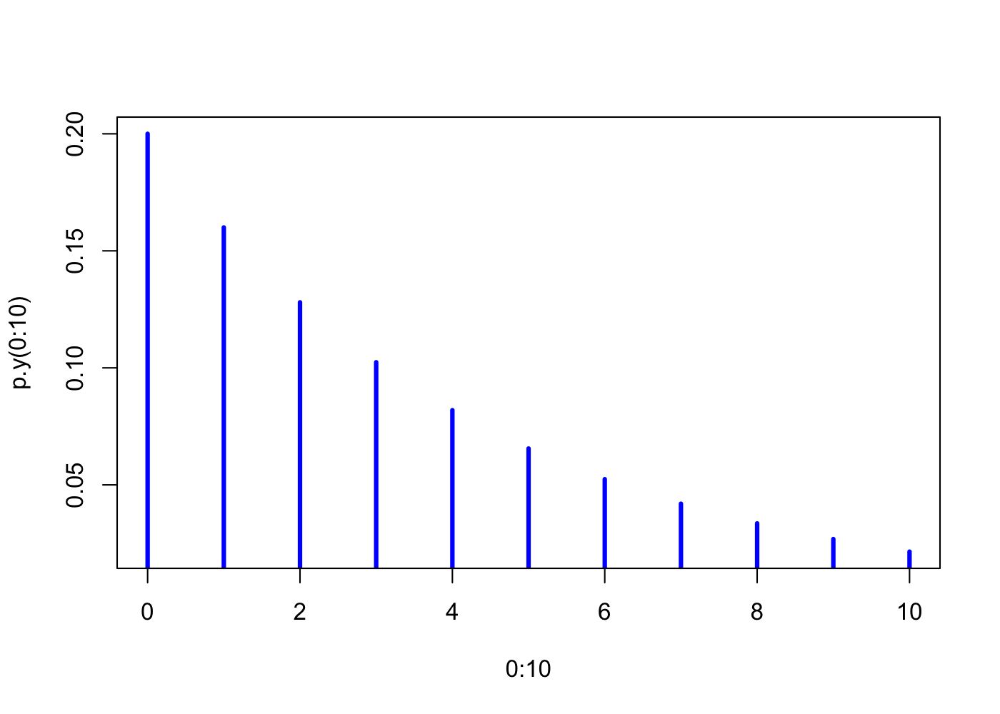
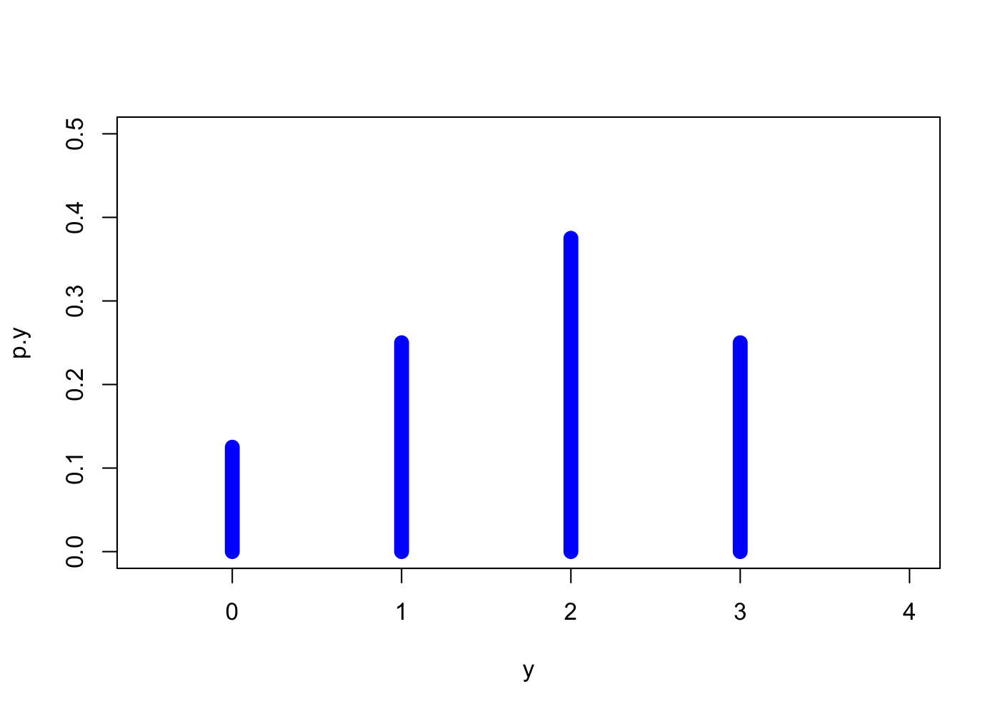
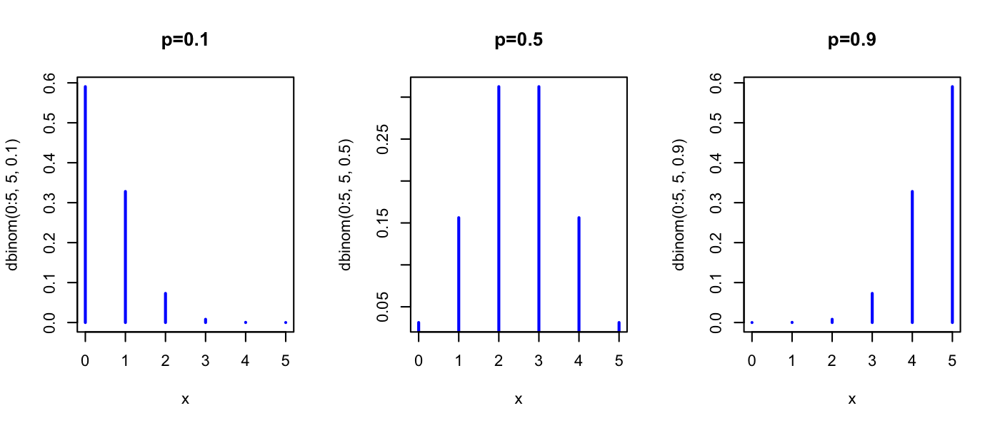
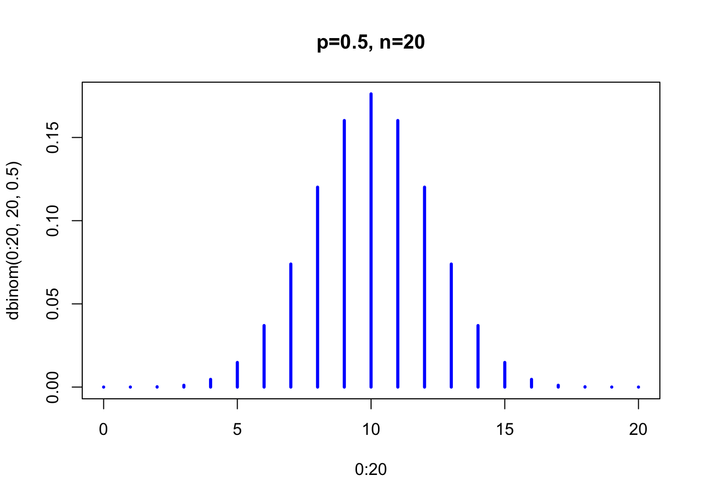
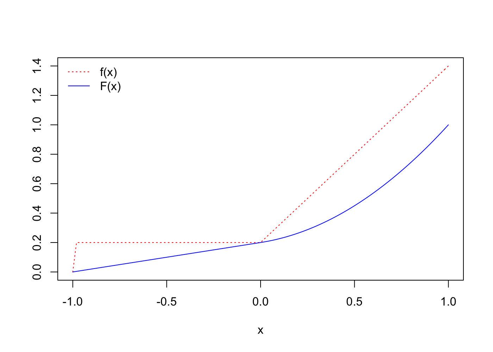
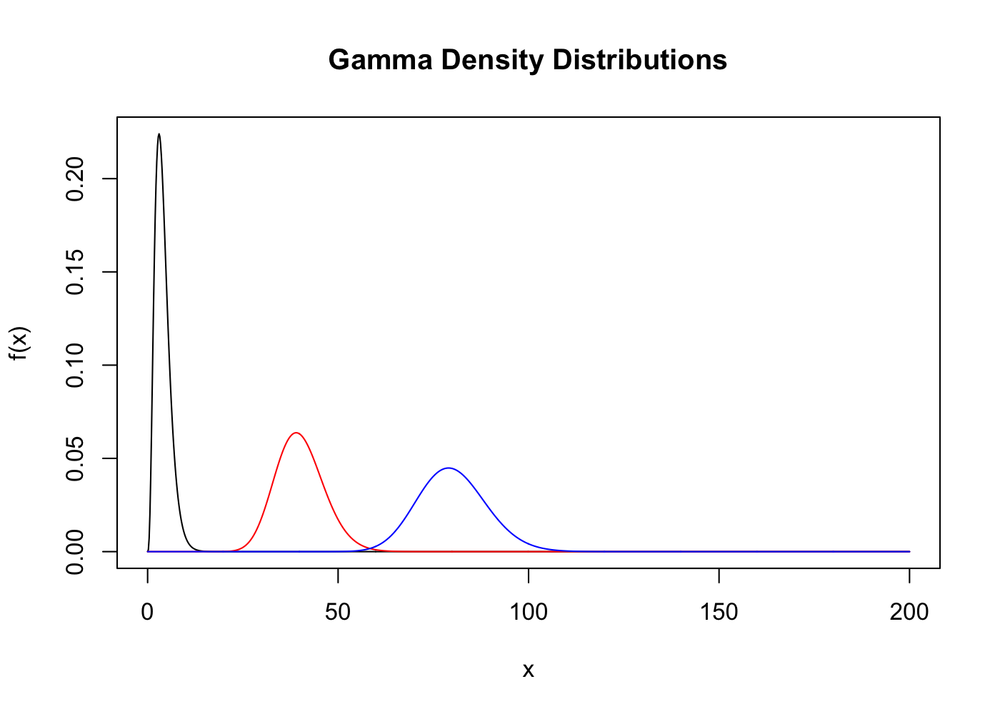
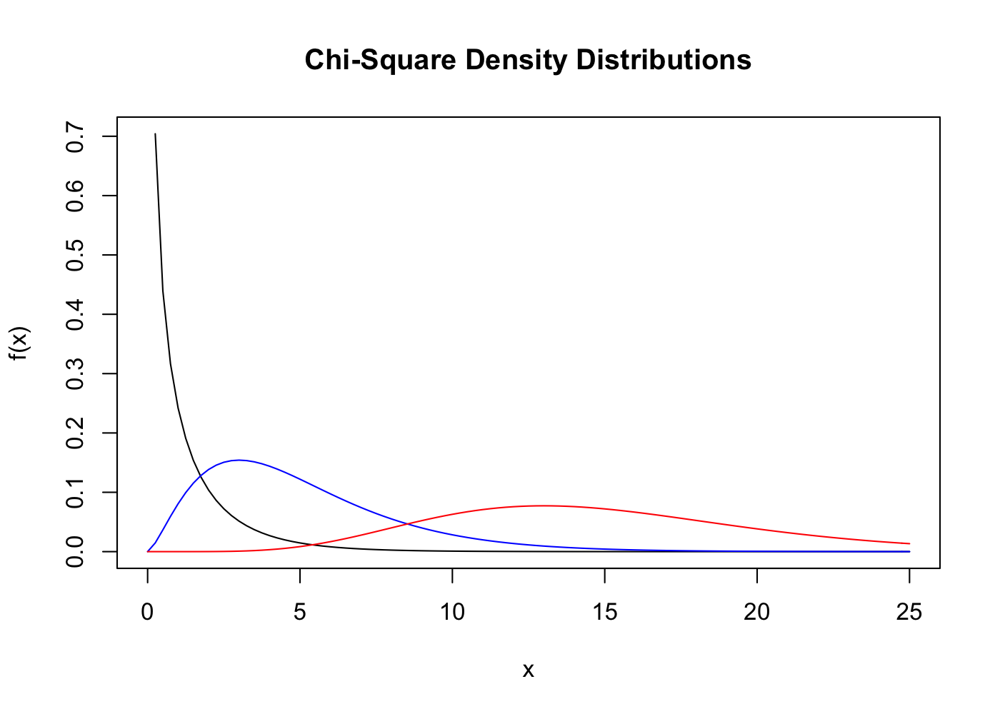
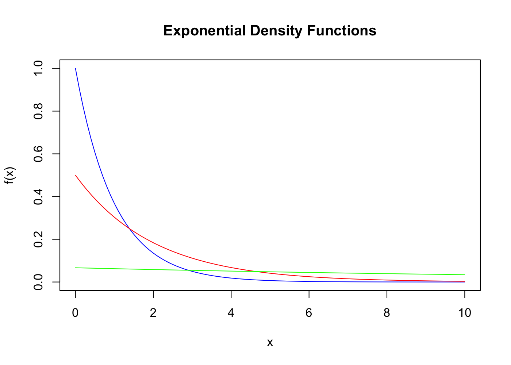
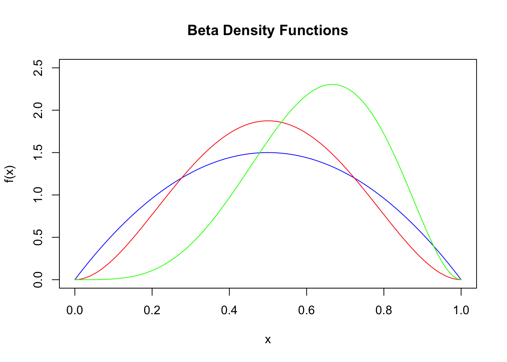

# Class Notes


## Birthday problem from class 


```r
birthday <- function(n){(choose(365,n) * factorial(n)/(365^n))}
birthday(30)
```

```
## [1] 0.2936838
```


```r
# coffee example from page 54.
library(gtools)
S <- permutations(3, 3, letters[24:26])
A <- S[S %in% "xyz" | S %in% "xzy" | S %in% "zxy"]
B <- S[S %in% "xyz" | S %in% "xzy"]
C <- S[S %in% "yxz" | S %in% "zxy"]
D <- S[S %in% "yzx" | S %in% "zyx"]
p.A <- length(A)/length(S); p.B <- length(B)/length(S)
p.C <- length(C)/length(S); p.D <- length(D)/length(S)
```

## Chapter.Section 3.2,  example 3.1


```r
# y can take on values of 0, 1, or 2 ONLY
p.y <- function(y){
  choose(3, y) * choose(3, 2 - y) * (1/choose(6,2))
}
p.y(0:2)
```

```
## [1] 0.2 0.6 0.2
```

```r
# Number 3.6, page 90
A <- combn(1:5, 2) # lists all the possible draws from the urn
A
```

```
##      [,1] [,2] [,3] [,4] [,5] [,6] [,7] [,8] [,9] [,10]
## [1,]    1    1    1    1    2    2    2    3    3     4
## [2,]    2    3    4    5    3    4    5    4    5     5
```

```r
# part A
for(i in 2:5){
  l <- length(which(A[2,] == i))
  print(l/10) #probs for 2, 3, 4, 5 respectively
}
```

```
## [1] 0.1
## [1] 0.2
## [1] 0.3
## [1] 0.4
```

```r
# part B
s <- apply(A, 2, sum) # all possible sums
s
```

```
##  [1] 3 4 5 6 5 6 7 7 8 9
```

```r
for(i in 3:9){
  l <- length(which(s == i))
  names(l) <- paste0("P(Y=",i,")")
  print(l/10)
}
```

```
## P(Y=3) 
##    0.1 
## P(Y=4) 
##    0.1 
## P(Y=5) 
##    0.2 
## P(Y=6) 
##    0.2 
## P(Y=7) 
##    0.2 
## P(Y=8) 
##    0.1 
## P(Y=9) 
##    0.1
```


```r
# 3.7, 3 balls & 3 bowls, probability of one empty bowl
library(gtools)
s <- permutations(3, 3,v=0:2, repeats.allowed = F) 
s # possibilities where there is one empty bowl
```

```
##      [,1] [,2] [,3]
## [1,]    0    1    2
## [2,]    0    2    1
## [3,]    1    0    2
## [4,]    1    2    0
## [5,]    2    0    1
## [6,]    2    1    0
```


```r
# 3.9, accounting error and auditor
library(gtools)
s <- permutations(2, 3, letters[c(5,14)], repeats.allowed = TRUE)
s # possible sample space where "e"=error and "n"=no error
```

```
##      [,1] [,2] [,3]
## [1,] "e"  "e"  "e" 
## [2,] "e"  "e"  "n" 
## [3,] "e"  "n"  "e" 
## [4,] "e"  "n"  "n" 
## [5,] "n"  "e"  "e" 
## [6,] "n"  "e"  "n" 
## [7,] "n"  "n"  "e" 
## [8,] "n"  "n"  "n"
```

```r
# 3.10, we can write a function for this one
# we start right after a rental happened.  So the probability
# of renting on the first day after a rental occured is 0.2
p.y <- function(y){
  0.2*0.8^y
}
p.y(0:10)
```

```
##  [1] 0.20000000 0.16000000 0.12800000 0.10240000 0.08192000 0.06553600
##  [7] 0.05242880 0.04194304 0.03355443 0.02684355 0.02147484
```

```r
plot(0:10, p.y(0:10), type = "h", col="blue", lwd=3)
```



## 3.3 The Expected Value of a Random Variable or a Function of a Random Variable  

### Definition 3.4:

Let Y be a **discrete** random variable... 

$$E(Y) = \sum_{y}yp(y)$$

### Theorem 3.2:  

$$E[g(Y)] = \sum_{all y}g(y)p(y)$$  

### Definition 3.5: 

$$V(Y) = E[(Y - \mu^2)] = E[Y^2] - 2 \mu E[Y] + \mu^2 = E[Y^2] - \mu^2$$  


```r
E <- function(y,p.y){sum(y*p.y)} #E[Y]
V <- function(y,p.y){sum(y^2*p.y) - sum(y*p.y)^2} #E[V]
# Example 3.2, page 94
y <- 0:3
p.y <- c(1/8, 1/4, 3/8, 1/4)
mu <- sum(y*p.y)
mu
```

```
## [1] 1.75
```

```r
variance <- sum((y-mu)^2*p.y)
variance
```

```
## [1] 0.9375
```

```r
sig <- sqrt(variance)
sig
```

```
## [1] 0.9682458
```

```r
# a plot of the data
plot(y, p.y, type="h", ylim=c(0,0.5), xlim = c(-0.5, 4), lwd=10, col="blue")
```




```r
# using Theorem 3.6 to find the variance of Y from example 3.2
sum(y^2*p.y) - mu^2 
```

```
## [1] 0.9375
```

```r
identical(sum(y^2*p.y) - mu^2, variance) #same result as variance
```

```
## [1] TRUE
```

### Example 3.4 


```r
Ca <- function(t){13*t + .3*t^2}
Cb <- function(t){11.6*t + .432*t^2}
Ca(c(10, 20))
```

```
## [1] 160 380
```

```r
Cb(c(10, 20))
```

```
## [1] 159.2 404.8
```


```r
# 3.12
y <- 1:4 #values for Y
p.y <- seq(0.4, 0.1, by=-0.1) #p(Y)
sum(y * p.y) #E[Y]
```

```
## [1] 2
```

```r
sum(y^2*p.y) - 1 #E[Y^2 - 1]
```

```
## [1] 4
```

```r
sum((1/y)*p.y) #E[1/Y]
```

```
## [1] 0.6416667
```

```r
sum(y^2 * p.y) - sum(y * p.y)^2 #E[V]
```

```
## [1] 1
```


```r
# 3.13
y <- c(1,2,-1)
p.y <- c(0.25, 0.25, 0.5)
sum(y * p.y) #E[Y]
```

```
## [1] 0.25
```

```r
sum(y^2*p.y) - sum(y*p.y)^2 #E[V]
```

```
## [1] 1.6875
```


```r
# 3.14
y <- 3:13
p.y <- c(.03,.05,.07,.1,.14,.2,.18,.12,.07,.03,.01)
sum(y * p.y) #E[Y]
```

```
## [1] 7.9
```

```r
sqrt(sum(y^2*p.y) - sum(y*p.y)^2) #E[sqrt(Y)]
```

```
## [1] 2.174856
```

```r
sum(p.y) - (p.y[1] + p.y[11]) #p(2sd < Y < 2sd)
```

```
## [1] 0.96
```


```r
# 3.17
y <- 0:2
p.y <- c(6/27, 18/27, 3/27)
E(y, p.y); sqrt(V(y,p.y)) #E[Y] & sqrt(E[V])
```

```
## [1] 0.8888889
```

```
## [1] 0.5665577
```

```r
E(y,p.y) + 1.133115
```

```
## [1] 2.022004
```


```r
# 3.21
y <- 21:26
p.y <- c(.05,.2,.3,.25,.15,.05)
E(y,p.y)
```

```
## [1] 23.4
```

```r
V(y,p.y)
```

```
## [1] 1.54
```

```r
8*pi*E(y^2, p.y)
```

```
## [1] 13800.39
```


```r
# 3.23
y <- c(15,5,-4)
p.y <- c(8/52, 8/52,36/52)
E(y,p.y)
```

```
## [1] 0.3076923
```


```r
# 3.25
permutations(3, 2, repeats.allowed = T) #sample space
```

```
##       [,1] [,2]
##  [1,]    1    1
##  [2,]    1    2
##  [3,]    1    3
##  [4,]    2    1
##  [5,]    2    2
##  [6,]    2    3
##  [7,]    3    1
##  [8,]    3    2
##  [9,]    3    3
```

## 3.4  Binomial Distribution

```r
# 3.38
y <- 3:4
sum(dbinom(y, 4, 1/3))
```

```
## [1] 0.1111111
```

```r
# or
sum(choose(4,y) * (1/3)^y * (2/3)^(4-y)) # same result
```

```
## [1] 0.1111111
```


```r
# 3.39
y <- 0:2
sum(dbinom(y, 4, .2))
```

```
## [1] 0.9728
```

```r
# or
sum(choose(4,y) * (.2)^y * (.8)^(4-y)) # same result
```

```
## [1] 0.9728
```


```r
# 3.41
y <- 10:15
sum(dbinom(y, 15, 1/5))
```

```
## [1] 0.0001132257
```

```r
# or
sum(choose(15,y) * (1/5)^y * (4/5)^(15-y)) # same result
```

```
## [1] 0.0001132257
```


```r
# 3.42 part A
y <- 10:15
sum(dbinom(y, 15, 1/4))
```

```
## [1] 0.000794949
```

```r
# or
sum(choose(15,y) * (1/4)^y * (3/4)^(15-y)) # same result
```

```
## [1] 0.000794949
```

```r
# part B
sum(dbinom(y, 15, 1/3))
```

```
## [1] 0.008504271
```

```r
# or
sum(choose(15,y) * (1/3)^y * (2/3)^(15-y)) # same result
```

```
## [1] 0.008504271
```


```r
# 3.46
x <- 0:5
par(mfrow=c(1,3))
plot(x,dbinom(0:5, 5, .1), lwd=2, col="blue", type = "h", main = "p=0.1")
plot(x,dbinom(0:5, 5, .5), lwd=2, col="blue", type = "h", main = "p=0.5")
plot(x,dbinom(0:5, 5, .9), lwd=2, col="blue", type = "h", main = "p=0.9")
```




```r
# 3.47
plot(0:20, dbinom(0:20, 20, 0.5), col="blue", lwd=3, type="h", 
     main = "p=0.5, n=20")
```




```r
# writing a hypergeometric function
h <- function(y,r,n,N){
  (choose(r,y) * choose(N-r, n-y)) / choose(N,n) 
}
```

## Chapter 4  


```r
## Exercise 4.18  
# f is the pdf, g is the cdf
f <- function(x){ # this is the probability density function
return(ifelse(x <= -1, 0, 
        ifelse((x > -1) & (x <=0), 0.2, 
              ifelse((x > 0) & (x <= 1), 0.2 + 1.2 * x, 0))))
  }
g <- function(x){ # this is the CDF
return(ifelse(x <= -1, 0, 
       ifelse((x > -1) & (x <=0), 0.2*(1 + x), 
              ifelse((x > 0) & (x <= 1), 0.2 * (1 + x + 3 * x^2), 1))))
} 
curve(f(x), -1, 1, lty=3, col="red", ylab="") # plot the pdf
curve(g(x), -1, 1, col="blue", add=TRUE) # plot the cdf
legend("topleft", legend = c("f(x)", "F(x)"), lty=c(3,1), # add a legend
       col=c("red", "blue"), bty="n")
```




## 5.2  


```r
# Figure 5.1
library(plotly)
```

```
## Loading required package: ggplot2
```

```
## 
## Attaching package: 'plotly'
```

```
## The following object is masked from 'package:ggplot2':
## 
##     last_plot
```

```
## The following object is masked from 'package:stats':
## 
##     filter
```

```
## The following object is masked from 'package:graphics':
## 
##     layout
```

```r
df <- data.frame(x = rep(1:6, 6), y = c(rep(1,6), rep(2,6), rep(3,6), 
                                        rep(4,6), rep(5,6), rep(6,6)))
df$z <- rep(1/36, 36)
plot_ly(df, x = ~x, y = ~y, z = ~z)
```

```
## No trace type specified:
##   Based on info supplied, a 'scatter3d' trace seems appropriate.
##   Read more about this trace type -> https://plot.ly/r/reference/#scatter3d
```

```
## No scatter3d mode specifed:
##   Setting the mode to markers
##   Read more about this attribute -> https://plot.ly/r/reference/#scatter-mode
```

```
## Warning in arrange_impl(.data, dots): '.Random.seed' is not an integer
## vector but of type 'NULL', so ignored
```

<!--html_preserve--><div id="htmlwidget-4b813b18b5039b645984" style="width:1400px;height:1000px;" class="plotly html-widget"></div>
<script type="application/json" data-for="htmlwidget-4b813b18b5039b645984">{"x":{"layout":{"margin":{"b":40,"l":60,"t":25,"r":10},"scene":{"xaxis":{"title":"x"},"yaxis":{"title":"y"},"zaxis":{"title":"z"}},"xaxis":{"domain":[0,1]},"yaxis":{"domain":[0,1]}},"config":{"modeBarButtonsToRemove":["sendDataToCloud"]},"base_url":"https://plot.ly","source":"A","data":[{"x":[1,2,3,4,5,6,1,2,3,4,5,6,1,2,3,4,5,6,1,2,3,4,5,6,1,2,3,4,5,6,1,2,3,4,5,6],"y":[1,1,1,1,1,1,2,2,2,2,2,2,3,3,3,3,3,3,4,4,4,4,4,4,5,5,5,5,5,5,6,6,6,6,6,6],"z":[0.0277777777777778,0.0277777777777778,0.0277777777777778,0.0277777777777778,0.0277777777777778,0.0277777777777778,0.0277777777777778,0.0277777777777778,0.0277777777777778,0.0277777777777778,0.0277777777777778,0.0277777777777778,0.0277777777777778,0.0277777777777778,0.0277777777777778,0.0277777777777778,0.0277777777777778,0.0277777777777778,0.0277777777777778,0.0277777777777778,0.0277777777777778,0.0277777777777778,0.0277777777777778,0.0277777777777778,0.0277777777777778,0.0277777777777778,0.0277777777777778,0.0277777777777778,0.0277777777777778,0.0277777777777778,0.0277777777777778,0.0277777777777778,0.0277777777777778,0.0277777777777778,0.0277777777777778,0.0277777777777778],"type":"scatter3d","mode":"markers","marker":{"fillcolor":"rgba(31,119,180,1)","color":"rgba(31,119,180,1)","line":{"color":"transparent"}}}]},"evals":[],"jsHooks":[]}</script><!--/html_preserve-->

```r
# the dots are at a height of 1/36
```


```r
# Example 5.1  
library(gtools)
a <- permutations(3, 2, 0:2, repeats.allowed = T)
b <- permutations(3, 2, 1:3, repeats.allowed = T)
```


```r
# normal distribution function: 
f <- function(x, mu=0, s=1){
  (1/(s*sqrt(2*pi))) * exp(-(1/(2*s^2))*(x - mu)^2)
}
integrate(f, -1, 1)$value # probability that x is between -1 and 1
```

```
## [1] 0.6826895
```

```r
1 - (pnorm(-1) + 1 - pnorm(1)) # same as above
```

```
## [1] 0.6826895
```

## 4.6 Gamma Distribution  


```r
# exercise 4.84  
curve(dgamma(x, shape=4, scale=1/1), 0, 200, n=1000, ylab="f(x)",
      main = "Gamma Density Distributions")
curve(dgamma(x, shape=40, scale=1/1), add=TRUE, col="red", n=1000)
curve(dgamma(x, shape=80, scale=1/1),add=TRUE, col="blue", n=1000)
```



### Chi-square Distribution


```r
curve(dchisq(x, 1), ylab = "f(x)", main = "Chi-Square Density Distributions",
      xlim=c(0, 25))
curve(dchisq(x, 5), add = TRUE, col = "blue")
curve(dchisq(x, 15), add = TRUE, col = "red")
```



### Exponential Distribution  


```r
curve(dexp(x,1), 0, 10, col = "blue", ylab = "f(x)",
      main = "Exponential Density Functions")
curve(dexp(x,1/2), add=TRUE, col="red")
curve(dexp(x,1/15), add=TRUE, col="green")
```




## 4.7 Beta Distribution  


```r
curve(dbeta(x,2,2), 0, 1, col = "blue", ylim=c(0, 2.5), ylab = "f(x)",
      main = "Beta Density Functions")
curve(dbeta(x,3,3), 0, 1, col = "red", add=TRUE)
curve(dbeta(x,5,3), 0, 1, col = "green", add=TRUE)
```




## 4.11  Mixed Distributions  


```r
f <- function(x){
  x * (1/100) * exp(-x/100)
}
# here is the answer to 4.157 
integrate(f, 0, 200)$value + (1 - pexp(200, 1/100)) * 200
```

```
## [1] 86.46647
```

## Independece of two random variables


```r
# exercise 
f <- function(x,y){
  (choose(4,x) * choose(3,y) * choose(2, 3 - x - y))/choose(9,3)
}
# use this function to generate all the probabilities for the problem.
```

