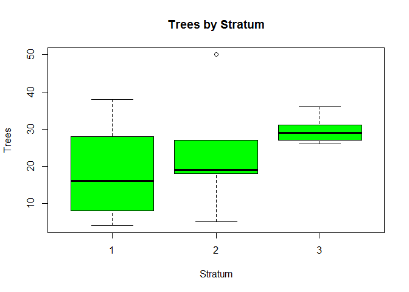
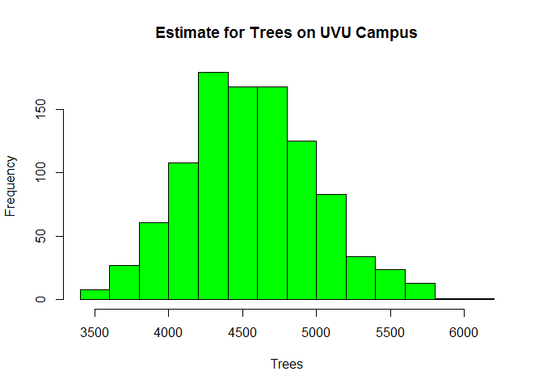

# Project 3
Cody Frisby  
November 30, 2015  

This is an exercise using resampling that I thought would be fun.  This is being done in addition to the original project three.  


Here is a summary of my data from project 3.


```
## Source: local data table [3 x 5]
## 
##   Stratum     mean        sd     N      Tao
##     (int)    (dbl)     (dbl) (dbl)    (dbl)
## 1       1 18.25000 12.080090    59 1076.750
## 2       2 23.00000 15.019987    66 1518.000
## 3       3 29.66667  3.614784    67 1987.667
```

And here is a plot of the data by stratum.

 


Now I am going to resample from each stratum individually.  Then I will combine the all the resampled data and look at the results. 


```r
a <- trees[Stratum == 1]
b <- trees[Stratum == 2]
c <- trees[Stratum == 3]
#I will get estimates on the bound by bootstrapping the data without Strata
na <- length(a$Trees)
rfs <- 1000
xa <- a$Trees 
A <- matrix(sample(xa, na * rfs, replace = TRUE), rfs, na)
Tao_1 <- apply(A, 1, mean) * 59

nb <- length(b$Trees)
rfs <- 1000
xb <- b$Trees 
B <- matrix(sample(xb, nb * rfs, replace = TRUE), rfs, nb)
Tao_2 <- apply(B, 1, mean) * 66

nc <- length(c$Trees)
rfs <- 1000
xc <- c$Trees 
C <- matrix(sample(xc, nc * rfs, replace = TRUE), rfs, nc)
Tao_3 <- apply(C, 1, mean) * 67
# I did the above threes times.  One for each stratum.
D <- cbind(Tao_1, Tao_2, Tao_3)
D <- as.data.frame(D)
D$Tao <- D$Tao_1 + D$Tao_2 + D$Tao_3
#Now we have a column that estimates trees using the strata data.
```

This is a view of the result


```r
head(D)
```

```
##      Tao_1 Tao_2    Tao_3      Tao
## 1 1393.875  1749 2032.333 5175.208
## 2 1084.125  1463 2021.167 4568.292
## 3 1076.750  1309 1898.333 4284.083
## 4 1106.250  1210 2166.333 4482.583
## 5 1298.000  1793 1931.833 5022.833
## 6 1194.750  2343 2132.833 5670.583
```

```r
tail(D)
```

```
##         Tao_1 Tao_2    Tao_3      Tao
## 995  1106.250  2222 2088.167 5416.417
## 996  1246.375  1265 1976.500 4487.875
## 997   656.375  1771 1864.833 4292.208
## 998  1032.500  1397 2021.167 4450.667
## 999   877.625  1254 2021.167 4152.792
## 1000  892.375  2101 2032.333 5025.708
```


 


```r
mean(D$Tao)
```

```
## [1] 4558.317
```

```r
quantile(D$Tao, c(0.025, 0.975))
```

```
##     2.5%    97.5% 
## 3765.436 5483.185
```
