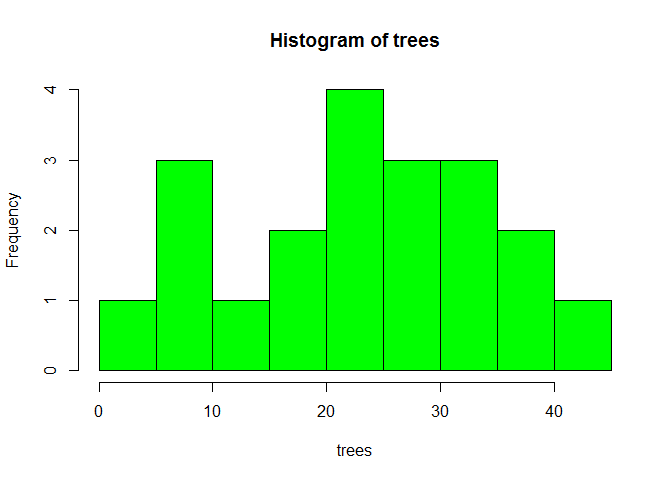
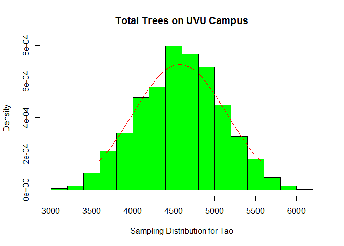

# STAT4200 Project2
Cody Frisby  
October 22, 2015  
Project 2 for STAT 4200 at UVU in Fall 2015 I was asked to extimate the total number of trees on UVU's main campus.  We were to divide campus into 200 equal sized plots and then draw a random sample of size 20 and then go and count the trees in our 20 samples.
Using google maps  I saved an image of the main UVU campus.  I then used windows paint to remove the areas that were not part of the main UVU campus.  This image was 1328 x 848 pixels.  Using an open source free application called ImageMagick  I divided the image into equal sized rectangles.  After removing all the images that were only white space (the boarders of the image) 196 “pieces” of UVU main campus remained.  

Using R software  I then took a random sample of size 20 from these 196 files.  The size of the individual rectangles were 53 x 59 pixels.  To the best of my ability I drew a rectangle of that same size on my main map image of the 20 random samples.  I then went to campus, and using the landmarks on the image below, made the best approximation of which trees were in my sample and I counted them.
Here's my data:

```r
trees <- read.csv("Data.csv")
trees <- trees$No..of.Trees
trees
```

```
##  [1] 29 22 23 17  0 27 29  8 38  8 17 34  6 14 25 35 25 31 37 45
```

The mean and standard deviation of my data:


```r
mean(trees)
```

```
## [1] 23.5
```

```r
sd(trees)
```

```
## [1] 12.0241
```

And here is a histogram of the data:

 

And for the estimation of the total:


```r
mean(trees)*196
```

```
## [1] 4606
```

There are a approximately 4606 trees on UVU's main campus.
Now I'd like to experiment with bootstrapping our data so that we can build some confidence intervals for the Total number of trees on UVU's campus.
First let's check if the data can be considered normal.


```r
shapiro.test(trees)
```

```
## 
## 	Shapiro-Wilk normality test
## 
## data:  trees
## W = 0.9755, p-value = 0.8631
```

Looks like we can assume normality, although this is not necessary for what we are about to do.


```r
n <- 20
B <- 1000
tx <- matrix(sample(trees, n * B, replace = TRUE), B, n)
x <- apply(tx, 1, mean)*196
quantile(x, c(0.025, 0.975))
```

```
##     2.5%    97.5% 
## 3595.865 5556.600
```

A 95% confidnece interval for the Total is displayed above.  We estimated this by bootstrapping our original data 1000 times taking samples of size 20 each of those 1000 times.

And here's how the estimate for Tao would look.  We now expect the real Total to be somewhere in this interval.

 
